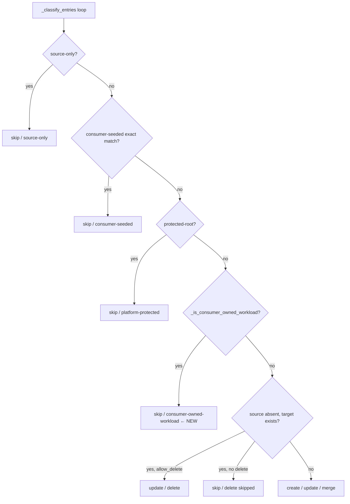

# Architecture

## Context
- Work item: 2026-04-26-issue-207-apps-prune-exclusion
- Owner: bonos
- Date: 2026-04-26

## Stack and Execution Model
- Backend stack profile: python_plus_fastapi_pydantic_v2
- Frontend stack profile: vue_router_pinia_onyx
- Test automation profile: pytest_vitest_playwright_pact
- Agent execution model: specialized-subagents-isolated-worktrees

## Problem Statement
- What needs to change and why: The upgrade planner's `_classify_entries()` function treats `infra/gitops/platform/base/apps/` as a fully blueprint-managed directory. When a consumer renames or adds workload manifests, those consumer files are absent from the blueprint source tree. With `BLUEPRINT_UPGRADE_ALLOW_DELETE=true` the planner enqueues `OPERATION_DELETE` for them, destroying consumer-owned deployment definitions.
- Scope boundaries: `scripts/lib/blueprint/upgrade_consumer.py` — `_classify_entries()` only. No contract schema changes (that is issue #206). No changes to how `kustomization.yaml` in that directory is managed.
- Out of scope: General consumer ownership claim mechanism (#206), upstream source contract schema changes, prune policy for any directory other than `base/apps/`.

## Bounded Contexts and Responsibilities
- Context A — Blueprint upgrade planner (`upgrade_consumer.py`): Responsible for deriving a plan of file actions (create/update/skip/delete) for each managed path. Must respect the consumer domain boundary for workload manifests.
- Context B — Consumer repo (`infra/gitops/platform/base/apps/`): Owns all non-kustomization YAML manifests in this directory. The `kustomization.yaml` remains blueprint-managed because it declares the resource list the smoke assertion reads.

## High-Level Component Design
- Domain layer: `_is_consumer_owned_workload(relative_path)` — pure predicate with no I/O. Returns True for any `.yaml` file under `infra/gitops/platform/base/apps/` except `kustomization.yaml`.
- Application layer: `_classify_entries()` — adds one early-exit guard using the predicate, before the `allow_delete` delete branch. Appends a `skip / none` entry with `ownership="consumer-owned-workload"`.
- Infrastructure adapters: none changed.
- Presentation/API/workflow boundaries: none changed.

## Integration and Dependency Edges
- Upstream dependencies: `blueprint/contract.yaml` — `required_paths_when_enabled` defines which directories become `conditional_entries` and therefore managed roots.
- Downstream dependencies: `upgrade_consumer.py` plan output consumed by `upgrade_consumer apply`; reconcile report generation.
- Data/API/event contracts touched: none. The `ownership` field in `UpgradeEntry` gains a new value `"consumer-owned-workload"` — this is a string enum in practice and backward-compatible.

## Non-Functional Architecture Notes
- Security: No credential handling. No file system writes occur for skipped entries. Predicate is pure and has no side effects.
- Observability: The existing plan summary table already counts `action=skip` entries. No new logging needed; the `reason` field on the skip entry is human-readable in plan output.
- Reliability and rollback: The change is additive — it adds a new skip class before an existing delete branch. Rolling back means removing four lines of code.
- Monitoring/alerting: No metrics changed.

## Risks and Tradeoffs
- Risk 1: If a future blueprint release adds a real managed manifest under `base/apps/` with a name that is not `kustomization.yaml`, it would be silently skipped. Mitigation: issue #206 will introduce an explicit contract mechanism to delineate consumer-vs-blueprint ownership precisely; this fix is documented as a bridge until then.
- Tradeoff 1: Using a path-prefix predicate rather than the `consumer_seeded` mechanism (which requires explicit contract listing) gives zero-config protection for any consumer manifest. The tradeoff is that blueprint cannot reclaim management of any `.yaml` in that directory (other than `kustomization.yaml`) without a contract schema change — which is the correct outcome per domain boundaries.
