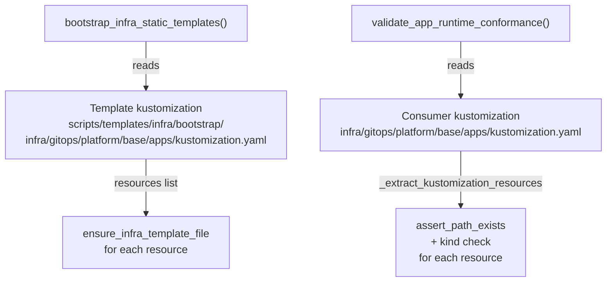

# Architecture

## Context
- Work item: issue-208-dynamic-workload-derivation
- Owner: bonos
- Date: 2026-04-26

## Stack and Execution Model
- Backend stack profile: python_plus_bash_scripts (Python script + Bash script; no FastAPI/Pydantic runtime)
- Frontend stack profile: none
- Test automation profile: pytest (unit tests only; no Playwright/Pact required)
- Agent execution model: specialized-subagents-isolated-worktrees

## Problem Statement
- What needs to change and why: Two blueprint-provided files maintain hardcoded lists of app workload manifest filenames that duplicate the template kustomization (`scripts/templates/infra/bootstrap/infra/gitops/platform/base/apps/kustomization.yaml`). When a consumer renames workloads, only the kustomization is updated; the hardcoded lists diverge silently. The mismatch surfaces only in `generated-consumer-smoke` CI with no local pre-commit signal. The template kustomization is already the canonical source of which app manifests exist; both consumers should read from it at runtime.
- Scope boundaries: `scripts/bin/infra/bootstrap.sh` · `bootstrap_infra_static_templates()` and `scripts/lib/blueprint/template_smoke_assertions.py` · `validate_app_runtime_conformance()`.
- Out of scope: contract.yaml schema changes (#206), prune exclusion for base/apps/ (#207), other workload enumeration paths, any consumer-side changes.

## Bounded Contexts and Responsibilities
- Context A — Bootstrap (Bash): `bootstrap_infra_static_templates()` MUST derive the list of app manifests to ensure from the infra template kustomization at `$(bootstrap_templates_root "infra")/infra/gitops/platform/base/apps/kustomization.yaml` using `sed` parsing, not from a hardcoded list embedded in the script.
- Context B — Smoke Validation (Python): `validate_app_runtime_conformance()` MUST derive the list of app manifest paths to assert from the consumer repo's `infra/gitops/platform/base/apps/kustomization.yaml` using `_extract_kustomization_resources()` (stdlib-only), not from a hardcoded list.

## High-Level Component Design
- Domain layer: None — blueprint tooling, not business logic.
- Application layer: None.
- Infrastructure adapters: Template kustomization at `scripts/templates/infra/bootstrap/infra/gitops/platform/base/apps/kustomization.yaml` is the single canonical source of truth for which app manifests exist in a bootstrap context. Consumer kustomization at `infra/gitops/platform/base/apps/kustomization.yaml` is the source of truth for smoke validation.
- Presentation/API/workflow boundaries: `bootstrap_infra_static_templates()` (Bash call site) and `validate_app_runtime_conformance()` (Python call site) are the only two affected call sites.

## Integration and Dependency Edges
- Upstream dependencies: Template kustomization YAML file at `scripts/templates/infra/bootstrap/infra/gitops/platform/base/apps/kustomization.yaml`.
- Downstream dependencies: Consumer repos via `make infra-bootstrap` (bootstrap path) and `blueprint-template-smoke` (smoke validation path).
- Data/API/event contracts touched: None.

## Non-Functional Architecture Notes
- Security: No new secrets or sensitive data accessed. Only local YAML files in the blueprint source tree or consumer repo are read. No network calls.
- Observability: When the template kustomization cannot be found, `bootstrap.sh` MUST log FATAL and halt via `log_fatal`. When it cannot be found or parsed in `template_smoke_assertions.py`, an `AssertionError` with a descriptive message MUST be raised.
- Reliability and rollback: Rollback = revert the PR. No state is mutated outside the two affected scripts and their test files.
- Monitoring/alerting: No new monitoring required. The `generated-consumer-smoke` CI job is the primary regression gate.

## Risks and Tradeoffs
- Risk 1: `_extract_kustomization_resources()` is a stdlib-only regex parser; it will not handle YAML anchors, multi-line scalars, or unusual indentation. Mitigation: the kustomization files are always blueprint-controlled minimal YAML using `resources:` list format; a stdlib parser is sufficient and matches what the reference implementation used.
- Risk 2: The `sed` pattern in `bootstrap.sh` matches only lines ending in `.yaml`. Mitigation: Kubernetes manifest files always use `.yaml` extension; this is a safe constraint.
- Tradeoff 1: stdlib-only parsing in `_extract_kustomization_resources()` avoids a PyYAML dependency for this function, keeping the test surface lightweight and the implementation portable.

## Diagrams

