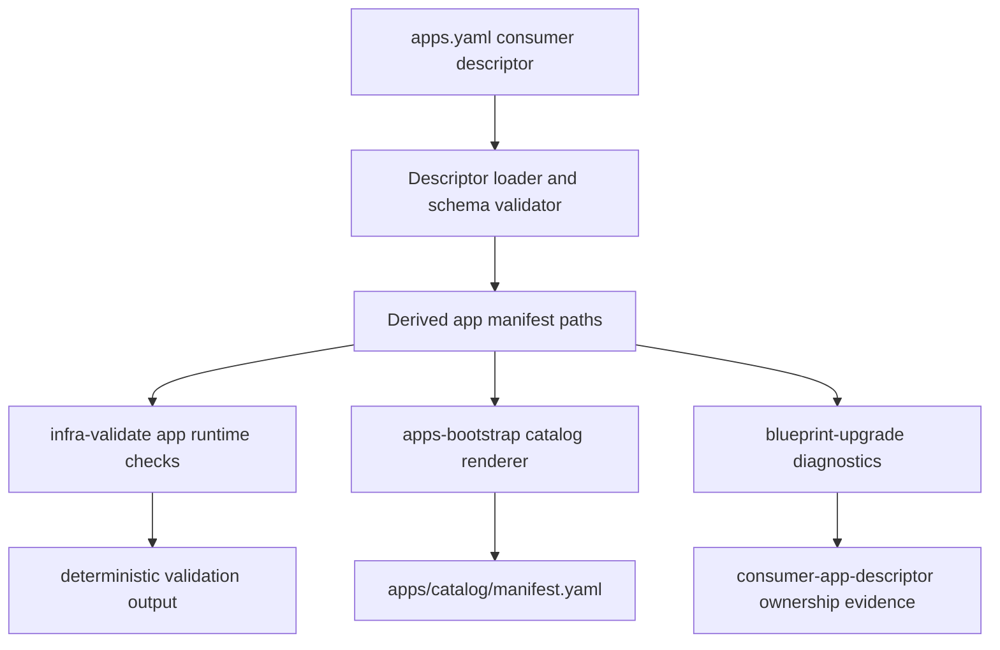

# Architecture

## Context
- Work item: 2026-04-27-consumer-app-descriptor
- Owner: Sergi Bono
- Date: 2026-04-27

## Stack and Execution Model
- Backend stack profile: python_plus_bash_scripts (blueprint contract/schema, init, upgrade, validation, and app catalog tooling)
- Frontend stack profile: none
- Test automation profile: pytest
- Agent execution model: specialized-subagents-isolated-worktrees

## Problem Statement
- What needs to change and why: The current app runtime path stack protects consumer-renamed manifests through a mix of `consumer_seeded` path ownership, a `base/apps/` bridge guard, and kustomization-reference scanning. That prevents destructive upgrades, but it does not give blueprint tooling an authoritative consumer-owned app metadata source for team ownership, service ports, health checks, catalog rendering, or preflight diagnostics.
- Scope boundaries: Add `apps.yaml` as a consumer-seeded descriptor; validate descriptor schema and derived manifest paths; feed descriptor values into app catalog rendering and app runtime validation; update upgrade diagnostics and docs.
- Out of scope: new HTTP APIs, OpenAPI/Pact contracts, non-convention manifest filenames, #167 dry-run mode, #168 incremental upgrade mode, and source-only seed advisory.

## Bounded Contexts and Responsibilities
- Context A - Consumer app declaration: `apps.yaml` is owned by the generated consumer after init. It records logical app names and app metadata.
- Context B - Blueprint contract validation: `infra-validate` and app runtime validators read `apps.yaml`, enforce schema rules, and verify derived manifest/kustomization consistency.
- Context C - App catalog rendering: `apps-bootstrap` uses descriptor records as the input for `apps/catalog/manifest.yaml` workload and runtime delivery sections.
- Context D - Upgrade planning and postcheck: upgrade tooling reports descriptor-owned app manifests as consumer app descriptor paths and keeps existing prune guards as fallback protection.

## High-Level Component Design
- Domain layer: app descriptor model with app name, team, service port, health check path, workload kind, and deterministic manifest derivation.
- Application layer: descriptor loader and validator used by contract validation, app catalog renderer, template smoke assertions, and upgrade diagnostics.
- Infrastructure adapters: safe YAML loader, filesystem checks for `infra/gitops/platform/base/apps`, kustomization resource parser, and existing template rendering.
- Presentation/API/workflow boundaries: `apps.yaml`, validation stderr, `apps/catalog/manifest.yaml`, upgrade plan/apply/postcheck artifacts, and consumer documentation.

Caption: The descriptor becomes the single consumer-owned input for app metadata, while generated and validation surfaces derive from it.

## Integration and Dependency Edges
- Upstream dependencies: `blueprint/contract.yaml` ownership classes, `scripts/templates/consumer/init`, app runtime GitOps contract, app catalog scaffold contract, and existing upgrade prune guard stack.
- Downstream dependencies: `make blueprint-init-repo`, `make infra-validate`, `make apps-bootstrap`, `make apps-smoke`, `make blueprint-upgrade-consumer`, `make blueprint-upgrade-consumer-postcheck`, generated-consumer docs.
- Data/API/event contracts touched: config contract only. No HTTP API, OpenAPI, Pact, or event contract changes.

## Non-Functional Architecture Notes
- Security: app names are restricted to safe DNS-style identifiers and cannot produce paths outside `infra/gitops/platform/base/apps`.
- Observability: validation and upgrade diagnostics include app name, derived path, and mismatched kustomization resource.
- Reliability and rollback: one-cycle fallback keeps existing kustomization-derived behavior for consumers that lack `apps.yaml`; rollback is reverting the descriptor PR and leaving current guards intact.
- Monitoring/alerting: no runtime alert changes. Operational signal is local validation output and upgrade artifacts.

## Risks and Tradeoffs
- Risk 1: Consumers with custom manifest naming outside the `{name}-deployment.yaml` and `{name}-service.yaml` convention need a later schema extension; mitigation is explicit exclusion in v1 descriptor scope.
- Risk 2: Existing catalog rendering has hardcoded baseline assumptions; mitigation is tests proving descriptor values replace hardcoded workload IDs in rendered output.
- Tradeoff 1: A separate `apps.yaml` adds a file, but avoids making generated `apps/catalog/manifest.yaml` both source input and output.
