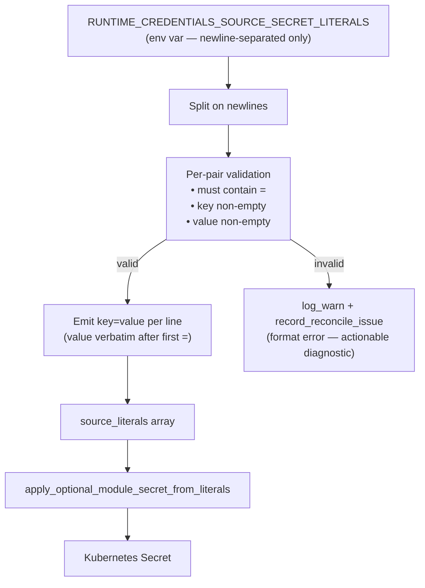

# Architecture

## Context
- Work item: 2026-04-28-issue-234-literal-pairs-newline-format
- Owner: bonos
- Date: 2026-04-28

## Stack and Execution Model
- Backend stack profile: python_plus_fastapi_pydantic_v2
- Frontend stack profile: vue_router_pinia_onyx
- Test automation profile: pytest_vitest_playwright_pact
- Agent execution model: specialized-subagents-isolated-worktrees

## Problem Statement
- What needs to change and why: `parse_literal_pairs()` in `reconcile_eso_runtime_secrets.sh` uses `IFS=',' read -r -a raw_pairs` to split `RUNTIME_CREDENTIALS_SOURCE_SECRET_LITERALS`. Any value containing a comma (e.g., base64 data URIs: `data:;base64,<payload>`) causes the parser to produce a malformed third token with no `=` sign, returning exit code 1 and recording a reconcile issue. The source Kubernetes secret is never created, leaving all ExternalSecrets NotReady and breaking ArgoCD sync for all app namespaces.
- Scope boundaries: `parse_literal_pairs()` function in `scripts/bin/platform/auth/reconcile_eso_runtime_secrets.sh`; documentation in `docs/platform/consumer/runtime_credentials_eso.md` and its bootstrap template; tests in `tests/infra/test_runtime_credentials_eso.py`.
- Out of scope: the `apply_optional_module_secret_from_literals` and `render_optional_module_secret_manifests` functions (unaffected — accept variadic `key=value` args); the `RUNTIME_CREDENTIALS_SOURCE_SECRET_LITERALS` variable name; escaping mechanisms for the comma-separated format.

## Bounded Contexts and Responsibilities
- Parser context (`parse_literal_pairs`): owns delimiter strategy — accept only newline-separated input; reject comma-separated input with `log_warn` diagnostic; emit one `key=value` per line; validate `key` and `value` are non-empty.
- Caller context (`reconcile_eso_runtime_secrets.sh`): reads parsed output line-by-line into `source_literals` array; invokes `apply_optional_module_secret_from_literals`; emits reconcile issue on parse failure.

## High-Level Component Design
- Domain layer: `RUNTIME_CREDENTIALS_SOURCE_SECRET_LITERALS` env var — user-supplied key=value pairs (newline-separated only).
- Application layer: `parse_literal_pairs()` — format validation + comma-detection heuristic for deprecated-format rejection + per-pair validation → normalized `key=value\n` stream.
- Infrastructure adapters: `apply_optional_module_secret_from_literals` → `render_optional_module_secret_manifests` → Kubernetes Secret YAML → `kubectl apply`.
- Presentation/API/workflow boundaries: no change — this is an internal shell function.

## Integration and Dependency Edges
- Upstream dependencies: env var `RUNTIME_CREDENTIALS_SOURCE_SECRET_LITERALS` set by consumer scripts or CI/CD.
- Downstream dependencies: `source_literals` array → `apply_optional_module_secret_from_literals` → `render_optional_module_secret_manifests` → Kubernetes Secret.
- Data/API/event contracts touched: `RUNTIME_CREDENTIALS_SOURCE_SECRET_LITERALS` format contract (documented in `runtime_credentials_eso.md`).

## Non-Functional Architecture Notes
- Security: value content must never be truncated or split — internal commas in values (base64 data URIs, JWTs, connection strings) must pass through verbatim to the base64-encoded Kubernetes secret data field. The `${pair#*=}` expansion strips the shortest matching prefix from the left through the first `=`, leaving the remainder of the value intact for per-pair value extraction; the fix is entirely in the delimiter strategy.
- Observability: `record_reconcile_issue` call-site is preserved; only the error message string is updated to reference the newline-separated-only format.
- Reliability and rollback: Option B (newline-only) is a breaking change. Consumers using comma-separated format must migrate their serializer. `log_warn` on parse failure (FR-002) ensures the migration need is visible even when `RUNTIME_CREDENTIALS_REQUIRED=false`.
- Monitoring/alerting: no new metrics; existing `reconcile_issue_total` metric emitted on parse failure remains in place.

## Risks and Tradeoffs
- Risk 1: Consumers using comma-separated format with simple values (no commas in values) will now receive a parse failure. Mitigation: `log_warn` on failure provides a clear actionable diagnostic; documentation states migration is required.
- Tradeoff 1: clean breaking change removes all delimiter ambiguity at the cost of requiring consumer migration.

## Mermaid Diagram

*Caption: parse_literal_pairs() newline-only parsing strategy and downstream flow to Kubernetes Secret creation.*
