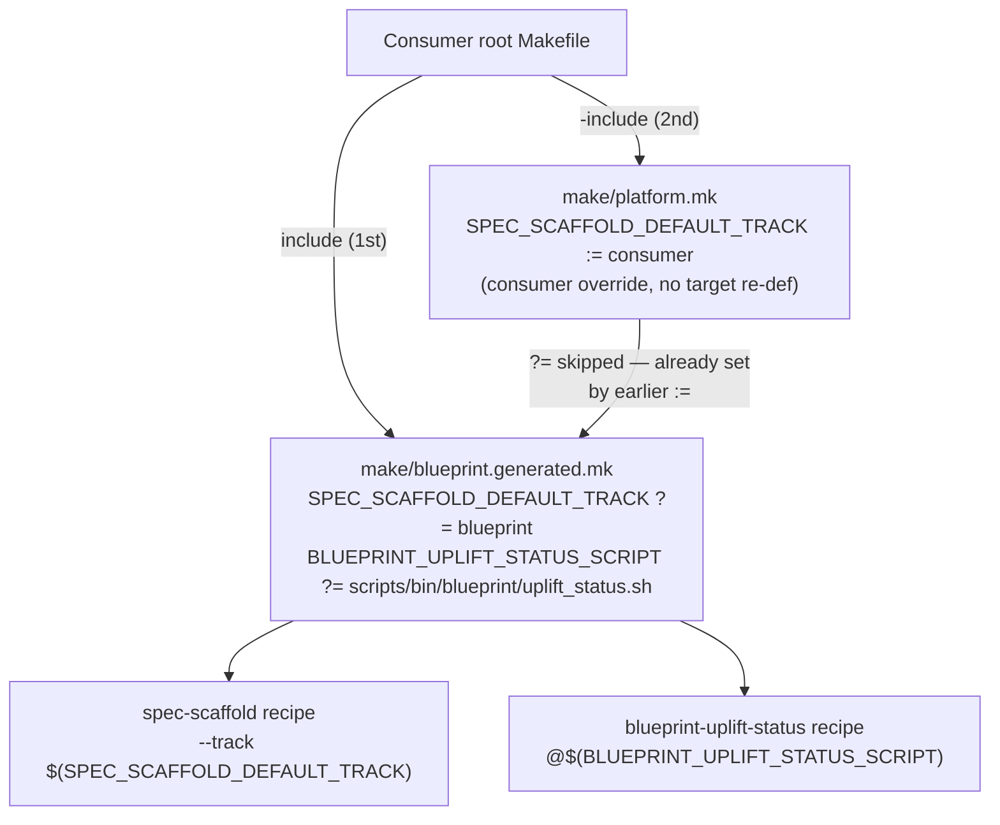

# Architecture

## Context
- Work item: 2026-04-30-issue-241-make-override-warnings
- Owner: blueprint maintainer
- Date: 2026-04-30

## Stack and Execution Model
- Backend stack profile: not applicable — tooling-only (Makefile template + pytest contract test)
- Frontend stack profile: not applicable
- Test automation profile: pytest (tests/blueprint/test_quality_contracts.py)
- Agent execution model: specialized-subagents-isolated-worktrees

## Problem Statement
- What needs to change and why: GNU Make emits "overriding commands" warnings when a consumer re-defines a target that already exists in an included file (`blueprint.generated.mk`). The two commonly overridden targets are `spec-scaffold` (consumers default `--track` to `consumer`) and `blueprint-uplift-status` (consumers redirect to a consumer-owned enrichment script). GNU Make provides no per-target warning suppression; the fix must eliminate the need for full target re-definition by exposing consumer-settable `?=` variables that cover the customisable parts of each recipe.
- Scope boundaries: `scripts/templates/blueprint/bootstrap/make/blueprint.generated.mk.tmpl` (template source of truth) and the rendered `make/blueprint.generated.mk`. A new contract test in `tests/blueprint/test_quality_contracts.py` verifies the variables are present in both files.
- Out of scope: other Make targets, include order changes, global warning suppression.

## Bounded Contexts and Responsibilities
- Blueprint tooling context (`make/blueprint.generated.mk`, `scripts/templates/blueprint/bootstrap/make/blueprint.generated.mk.tmpl`): owns the variable declarations and target recipe bodies. Exposes override points via `?=` so consumers can customise without structural conflict.
- Consumer platform context (`make/platform.mk`): consumer-owned, included after `blueprint.generated.mk`. Sets override-point variable values with `:=` when non-default behaviour is required. No target re-definition needed.
- Contract test context (`tests/blueprint/test_quality_contracts.py`): verifies the override-point variable declarations are present in both template and rendered file; acts as the regression gate.

## High-Level Component Design
- Domain layer: not applicable
- Application layer: not applicable
- Infrastructure adapters: not applicable
- Presentation/API/workflow boundaries: GNU Make include order — `blueprint.generated.mk` included before `platform.mk` in the consumer root `Makefile`. The `?=` (conditional assignment) evaluated at blueprint-include time sets the default; consumer `:=` evaluated at platform-include time (later) overrides it.

## Integration and Dependency Edges
- Upstream dependencies: GNU Make `?=` semantics (standard since GNU Make 3.81)
- Downstream dependencies:
  - consumers that currently re-define `spec-scaffold` or `blueprint-uplift-status` in `platform.mk` — they can switch to variable override on next blueprint upgrade adoption
  - `make blueprint-render-makefile` must be run after template edit to regenerate `make/blueprint.generated.mk`
- Data/API/event contracts touched: Make/CLI contract (two new consumer-settable variables added)

## Non-Functional Architecture Notes
- Security: no impact — variables name internal script paths and track labels; no secret or privilege boundary involved
- Observability: no impact — no log, metric, or trace path created or modified
- Reliability and rollback: fully backward compatible; consumers not setting the variables see identical behavior; rollback is revert of the two-line diff in each file
- Monitoring/alerting: not applicable

## Risks and Tradeoffs
- Risk 1: consumer sets `SPEC_SCAFFOLD_DEFAULT_TRACK` to an invalid track name → `spec_scaffold.py` fails with a clear error; no silent failure introduced
- Tradeoff 1: the override-point surface is intentionally minimal (two targets); other targets with consumer override needs require separate work items — this avoids over-engineering and keeps the change reviewable

## Architecture Decision

Caption: Consumer root Makefile includes blueprint before platform. Blueprint `?=` sets defaults; consumer `platform.mk` overrides with `:=` — no target re-definition, no override warning.
