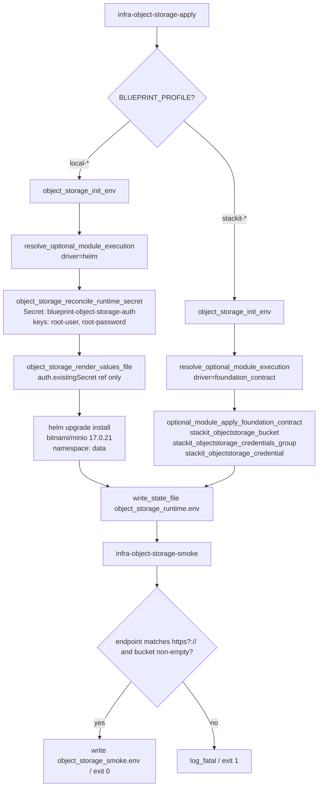
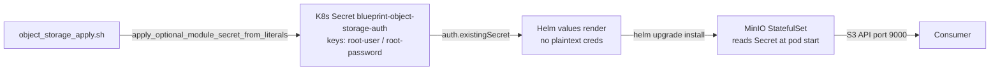

# Architecture

## Context
- Work item: issue-248-object-storage-module (object-storage dual-lane implementation)
- Owner: sbonoc
- Date: 2026-05-06

## Stack and Execution Model
- Backend stack profile: python_plus_fastapi_pydantic_v2 (tests only)
- Frontend stack profile: none
- Test automation profile: pytest_vitest_playwright_pact
- Agent execution model: specialized-subagents-isolated-worktrees

## Problem Statement
- What needs to change and why: The `infra/cloud/stackit/terraform/modules/object-storage/main.tf` is a 7-line stub with no provider resources. The local lane is wired in `module_execution.sh` and the bin scripts, but MinIO credentials are passed as plaintext into the Helm values render instead of being Secret-backed. There are no automated tests. The standalone Terraform module must be implemented, credentials must be Secret-backed (security requirement), and tests must be written.
- Scope boundaries: `scripts/lib/infra/object_storage.sh`, `scripts/bin/infra/object_storage_apply.sh`, `scripts/bin/infra/object_storage_destroy.sh`, `scripts/bin/infra/bootstrap.sh`, `infra/cloud/stackit/terraform/modules/object-storage/`, `infra/local/helm/object-storage/values.yaml` (seed template), `blueprint/modules/object-storage/module.contract.yaml`, `docs/platform/modules/object-storage/README.md`, `tests/infra/modules/object-storage/`.
- Out of scope: Renaming outputs to S3-standard names; multi-bucket provisioning; ESO `ExternalSecret`/`SecretStore` wiring (consumer-side); migrating foundation inline resources to call the standalone module.

## Bounded Contexts and Responsibilities
- Context A — Infra provisioning layer (this module): creates the storage service (MinIO Helm or STACKIT managed), reconciles the Kubernetes credential Secret, produces the runtime state file.
- Context B — Foundation layer (unchanged): continues to manage inline `stackit_objectstorage_*` resources for the foundation deployment path. The standalone module is additive; no Terraform state migration.
- Context C — Consumer layer (out of scope): ESO `SecretStore`/`ExternalSecret` wiring into consumer namespaces; consumer-owned bucket lifecycle.

## High-Level Component Design
- Domain layer: none (infra provisioning, not domain logic)
- Application layer: wrapper scripts in `scripts/bin/infra/object_storage_*.sh`; library functions in `scripts/lib/infra/object_storage.sh`
- Infrastructure adapters: Helm (local MinIO); Terraform `foundation_contract` driver (STACKIT); `apply_optional_module_secret_from_literals` (K8s Secret reconcile)
- Presentation/API/workflow boundaries: Make targets `infra-object-storage-{plan,apply,smoke,destroy}`; runtime state file `artifacts/infra/object_storage_runtime.env`

## Integration and Dependency Edges
- Upstream dependencies: `scripts/lib/infra/module_execution.sh` (driver resolution); `scripts/lib/infra/fallback_runtime.sh` (Secret reconcile helpers); `scripts/lib/infra/versions.sh` (version pins); `scripts/lib/infra/stackit_foundation_outputs.sh` (STACKIT output resolver)
- Downstream dependencies: MinIO Helm chart `bitnami/minio@17.0.21`; STACKIT Terraform provider resources `stackit_objectstorage_bucket`, `stackit_objectstorage_credentials_group`, `stackit_objectstorage_credential`
- Data/API/event contracts touched: `artifacts/infra/object_storage_runtime.env` schema (adding `region` key pending Q-1); `blueprint/modules/object-storage/module.contract.yaml` (adding `OBJECT_STORAGE_REGION` output pending Q-1)

## Non-Functional Architecture Notes
- Security: Credentials MUST NOT appear in rendered values file or bootstrap template. Secret reconciled out-of-band via `apply_optional_module_secret_from_literals`. STACKIT provider credential is admin-level; masked in logs.
- Observability: `start_script_metric_trap` emitted per script. State file path logged on success. Smoke logs pass/fail line.
- Reliability and rollback: Helm uninstall and Secret delete are both idempotent (`--ignore-not-found`). Terraform destroy is provider-idempotent. Re-running apply after partial failure is safe.
- Monitoring/alerting: none — infra provisioning scripts; no runtime monitoring surface.

## Risks and Tradeoffs
- Risk 1: STACKIT `stackit_objectstorage_credential` is admin-level (same risk as opensearch credential). If STACKIT restricts credential scope, the standalone module may need per-bucket credential scoping — deferred to a separate work item.
- Risk 2: Bitnami MinIO chart 17.x `auth.existingSecret` key names (`root-user`, `root-password`) must be verified against the chart templates; if the chart version bumps to 18.x or later, key names may change.
- Tradeoff 1: Additive standalone Terraform module (does not replace foundation inline resources) avoids state migration risk but creates two code paths for STACKIT object storage. Accepted per ADR — the module is a library artifact for standalone use; foundation stays inline.
- Tradeoff 2: Keeping current naming convention (Option A) rather than renaming to S3-standard avoids breaking consumer `ExternalSecret` refs but diverges from issue #248 naming — accepted pending Q-1 sign-off.

## Dual-Lane Provisioning Flow

*Caption: Dual-lane apply flow — local lane reconciles a Kubernetes Secret before Helm install; STACKIT lane delegates to the foundation_contract driver.*

## Secret-Backed Credentials Pattern

*Caption: Secret reconcile pattern — credentials flow through a Kubernetes Secret, never through the rendered values file, matching the rabbitmq/opensearch precedents.*
