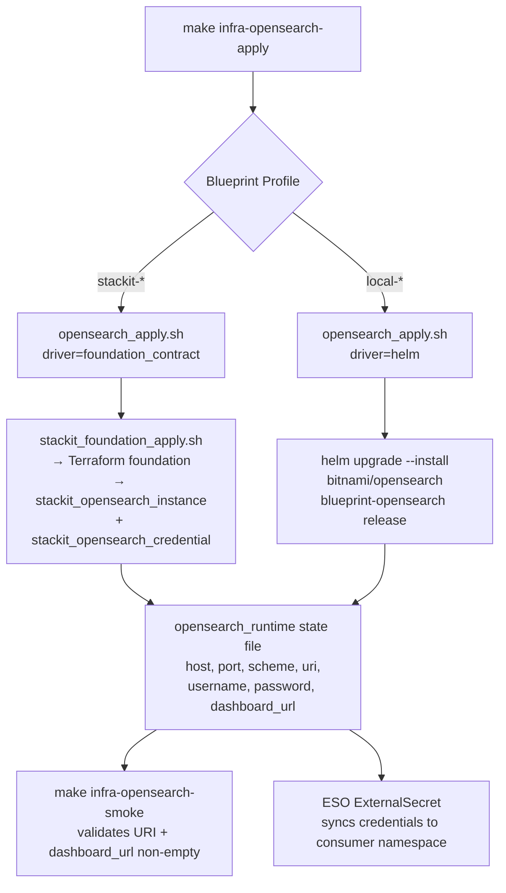
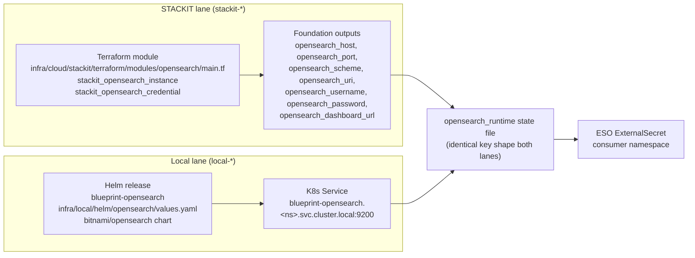

# Architecture

## Context
- Work item: issue-248-opensearch-module (specs/2026-05-06-issue-248-opensearch-module)
- Owner: Platform Engineer
- Date: 2026-05-06

## Stack and Execution Model
- Backend stack profile: python_plus_fastapi_pydantic_v2 (for test automation and lib scripts)
- Frontend stack profile: none — infrastructure-only
- Test automation profile: pytest_vitest_playwright_pact
- Agent execution model: specialized-subagents-isolated-worktrees

## Problem Statement
- What needs to change and why: The opensearch optional module has a working STACKIT lane (via `foundation_contract` driver) but a `noop` local lane. `infra/cloud/stackit/terraform/modules/opensearch/main.tf` is a 7-line stub with no provider resources. Consumers cannot independently manage OpenSearch on local Docker Desktop; dhe-marketplace currently bundles OpenSearch inside the OpenMetadata Helm release as a workaround. This work item implements: (1) the standalone Terraform module for STACKIT, and (2) a Bitnami Helm local lane so OpenSearch can be provisioned independently on both environments.
- Scope boundaries: opensearch module only. Changes confined to `infra/cloud/stackit/terraform/modules/opensearch/`, `infra/local/helm/opensearch/`, `scripts/lib/infra/opensearch.sh`, `scripts/lib/infra/module_execution.sh`, `scripts/lib/infra/versions.sh`, `scripts/bin/infra/opensearch_smoke.sh`, `tests/infra/modules/opensearch/`, and `docs/platform/modules/opensearch/README.md`.
- Out of scope: other modules, consumer repos, OpenMetadata Helm refactoring, blueprint contract.yaml changes (unless Q-1 resolves to Option B).

## Bounded Contexts and Responsibilities
- **Provisioning context (STACKIT lane):** `infra/cloud/stackit/terraform/modules/opensearch/main.tf` — standalone Terraform module using `stackit_opensearch_instance` + `stackit_opensearch_credential` resources. The foundation layer already embeds equivalent resources; the module is implemented as a library module (can be used standalone or called by foundation). Output contract is identical to the foundation outputs.
- **Provisioning context (local lane):** `infra/local/helm/opensearch/values.yaml` — Bitnami OpenSearch chart, single-node, dev-sized. The `opensearch_apply.sh` routes to `helm` driver via `module_execution.sh` when `is_local_profile`.
- **Script/library context:** `scripts/lib/infra/opensearch.sh` — resolves host/port/scheme/username/password from profile. Currently routes all local resolution to placeholder values; updated to return K8s service host and Helm chart credentials for local profile.
- **Test context:** `tests/infra/modules/opensearch/test_contract.py` — verifies contract output presence in state file after apply.
- **Documentation context:** `docs/platform/modules/opensearch/README.md` — updated with dual-lane usage examples.

## High-Level Component Design

*Lane-routing flowchart: `infra-opensearch-apply` dispatches to foundation_contract (STACKIT) or helm (local) based on active Blueprint Profile; both lanes write to the same `opensearch_runtime` state file shape.*

*Output contract: both lanes write to `opensearch_runtime` with the same key set; consumers use `OPENSEARCH_URI` without branching on environment.*

## Integration and Dependency Edges
- Upstream dependencies: STACKIT Terraform provider (`stackit_opensearch_instance`, `stackit_opensearch_credential` — confirmed present in provider); Bitnami OpenSearch Helm chart (`bitnami/opensearch` — confirmed available).
- Downstream dependencies: consumer repos (dhe-marketplace) consume `opensearch_runtime` state via ESO `ExternalSecret`; `apps-openmetadata-local-apply` currently bundles its own OS (consumer-side follow-up to adopt this module's local lane).
- Data/API/event contracts touched: `opensearch_runtime` state file schema (additive: port, scheme, uri, dashboard_url now populated in local lane where previously placeholder/noop).

## Non-Functional Architecture Notes
- Security: `OPENSEARCH_PASSWORD` is sensitive; state file write uses `write_state_file` which is disk-local; password MUST NOT appear in log output. The `opensearch_apply.sh` metric line MUST NOT include password in tag values.
- Observability: existing `start_script_metric_trap "infra_opensearch_apply"` covers success/failure metric emission; no new instrumentation needed.
- Reliability and rollback: STACKIT instance uses `lifecycle { create_before_destroy = true }` — version bump triggers parallel create before the old instance is removed. Local Helm rollback: `helm rollback blueprint-opensearch`; full destroy: `infra-opensearch-destroy` target.
- Monitoring/alerting: no new signals introduced; existing foundation-level STACKIT monitoring covers managed instance health.

## Risks and Tradeoffs
- Risk 1: `stackit_opensearch_credential` may not produce admin-level credentials (Q-2 open question). If STACKIT restricts credential scope, the per-app role/user creation pattern documented in issue #248 cannot work. Stop condition: post on issue #248 and await maintainer direction.
- Risk 2: Bitnami `bitnamilegacy/opensearch` image availability. Mitigation: pin to latest-stable multi-arch tag; document the `legacy` namespace as a naming quirk (same pattern as postgres/rabbitmq).
- Risk 3: If Q-1 resolves to Option B (dual-lane naming), the `module_execution.sh` routing logic, makefile template, module contract YAML, and all existing tests referencing `infra-opensearch-plan` must be updated — this is a larger scope change.
- Tradeoff 1: Implementing the Terraform module as a standalone module (not immediately wired into the foundation as a `module` block) avoids Terraform state migration risk. The foundation continues to manage the resources inline; the module is available for standalone or future-refactor use.
