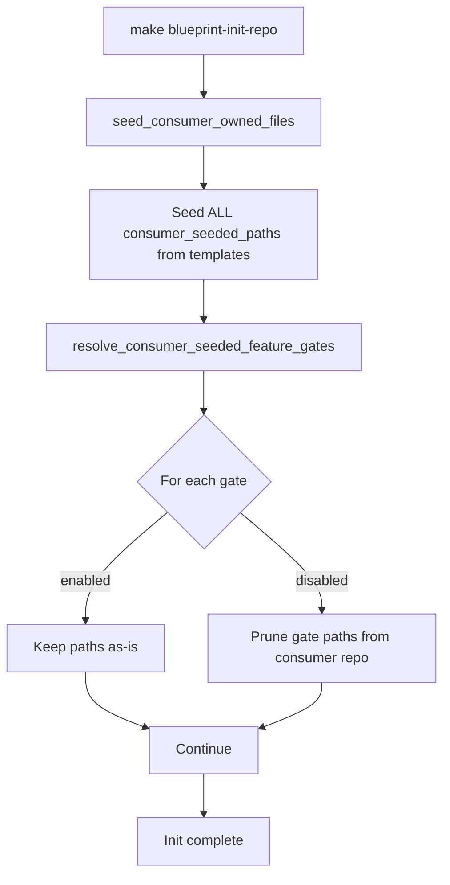

# Architecture — Generalize Consumer-Seeded Feature Gates

## Context

The blueprint's init engine (`make blueprint-init-repo`) seeds a fixed set of files into every
consumer repo via `consumer_seeded_paths`. Once seeded, those files are permanently consumer-owned
— the upgrade engine hard-skips the entire `consumer_seeded` class forever.

Two separate bespoke mechanisms exist for conditional init-time file management:

1. **`optional_modules`** — gates infra/Terraform/Helm/ArgoCD scaffold paths. Seeded paths are in
   `conditional_scaffold`. Not relevant here; these are blueprint-managed resources, not
   consumer-owned.

2. **`app_catalog_scaffold_contract`** — gates `feature_gated` paths (`apps/catalog/`,
   `apps/catalog/manifest.yaml`, `apps/catalog/versions.lock`) and validates domain-specific
   manifest markers, test-lane targets, and docs paths. Its path-pruning logic lives in
   `init_repo_contract.py:resolve_app_catalog_scaffold_contract()`.

Neither mechanism addresses the new need: **optionally seeding a subset of `consumer_seeded` paths
based on a feature flag**. The Claude AI integration (PR #252) introduced two GH Actions workflow
files (`.github/workflows/claude.yml`, `.github/workflows/claude-code-review.yml`) that should be
consumer-seeded but only when the consumer opts in.

Adding a second bespoke resolver alongside `resolve_app_catalog_scaffold_contract` would duplicate
the same env-var-gated pruning pattern a second time.

## Decision

Introduce a **generic `consumer_seeded_feature_gates` list** in `blueprint/contract.yaml`. Each
entry declares one gate: an ID, enable flag, default state, description, and the list of
`consumer_seeded` paths to prune when the gate is disabled.

The init engine resolves all gates at init time and prunes disabled-gate paths after the normal
`consumer_seeded` seeding pass — identical to the app_catalog pruning flow, but generic.

The `app_catalog_scaffold_contract` section remains unchanged. It gates `feature_gated` paths (not
`consumer_seeded`) and carries domain-specific validation (manifest markers, test lanes, docs
paths) that has no analog in the new generic mechanism.

## Bounded Context

This change is scoped entirely to the **blueprint init subsystem**:

- `blueprint/contract.yaml` — schema addition (new top-level `consumer_seeded_feature_gates` list)
- `scripts/lib/blueprint/init_repo_contract.py` — new resolver + updated seeding function
- `scripts/bin/blueprint/validate_contract.py` — new structural validator for the gates list
- `scripts/templates/consumer/init/.github/workflows/` — two new `.tmpl` files
- `tests/blueprint/` — unit tests

No changes to:
- Upgrade engine (`upgrade_consumer.py`) — the paths are in `consumer_seeded`, already hard-skipped
- `app_catalog_scaffold_contract` validation — orthogonal domain
- `optional_modules` — orthogonal scope

## Module Structure

```
blueprint/contract.yaml
  └─ consumer_seeded_feature_gates:         ← NEW generic list
       - id: claude_ai_integration          ← first gate (Claude workflows)
         enable_flag: CLAUDE_AI_ENABLED
         enabled_by_default: false
         description: ...
         consumer_seeded_paths_when_enabled:
           - .github/workflows/claude.yml
           - .github/workflows/claude-code-review.yml

scripts/lib/blueprint/init_repo_contract.py
  └─ resolve_consumer_seeded_feature_gates()  ← NEW: reads list, returns [(id, enabled, paths)]
  └─ seed_consumer_owned_files()              ← UPDATED: prune disabled-gate paths after seeding

scripts/bin/blueprint/validate_contract.py
  └─ _validate_consumer_seeded_feature_gates()  ← NEW: structural validator

scripts/templates/consumer/init/.github/workflows/
  └─ claude.yml.tmpl                ← NEW
  └─ claude-code-review.yml.tmpl    ← NEW
```

## Flow



Caption: Init-time seeding flow showing where gate resolution inserts the conditional prune step
after the fixed consumer_seeded seeding pass.

## Diagram Type Rationale

`flowchart TD` — control flow within the init script is the primary concern; no cross-service
interactions or state machines involved.

## ADR

`docs/blueprint/architecture/decisions/ADR-2026-05-07-generalize-consumer-seeded-feature-gates.md`
— Status: proposed
