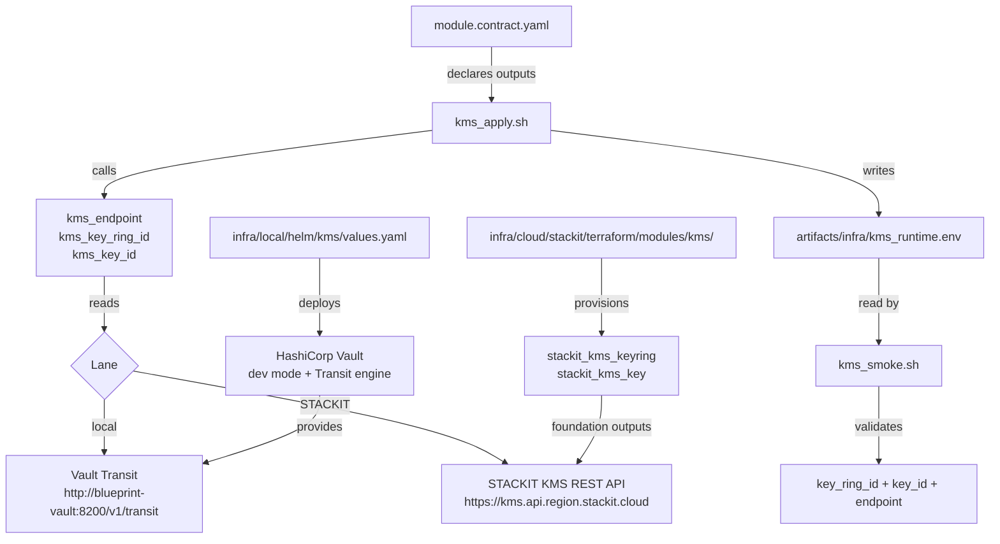

# Architecture

## Context
- Work item: `specs/2026-05-07-issue-248-kms-module/`
- Owner: bonos
- Date: 2026-05-07

## Stack and Execution Model
- Backend stack profile: python_plus_fastapi_pydantic_v2
- Frontend stack profile: none
- Test automation profile: pytest_vitest_playwright_pact
- Agent execution model: specialized-subagents-isolated-worktrees

## Problem Statement
- What needs to change and why: The kms module has two gaps relative to the established optional-module pattern: (1) the STACKIT standalone Terraform module is a 7-line stub with no resources, and (2) the local lane is a contract no-op stub — developers have no KMS-equivalent locally, blocking the future data buyer encryption-at-rest feature in dhe-marketplace. Additionally, `KMS_ENDPOINT` is missing from `module.contract.yaml`, so consumers have no lane-agnostic way to discover the KMS API address. This work item fills both gaps and adds the missing output.
- Scope boundaries: infra module layer only — `scripts/lib/infra/kms.sh`, `scripts/lib/infra/module_execution.sh`, `scripts/bin/infra/kms_{plan,apply,smoke,destroy}.sh`, `infra/cloud/stackit/terraform/modules/kms/`, `infra/local/helm/kms/values.yaml`, `blueprint/modules/kms/module.contract.yaml`, and `docs/platform/modules/kms/README.md`.
- Out of scope: foundation Terraform changes (foundation already provisions KMS correctly), consumer applications, ESO wiring changes, key rotation period (provider limitation), HA Vault configuration.

## Bounded Contexts and Responsibilities

- **Infra module lib** (`scripts/lib/infra/kms.sh`): owns all KMS-aware shell functions; `kms_endpoint()`, `kms_render_values_file()`, `kms_reconcile_runtime_secret()`, and `kms_enable_vault_transit()` are added here following the existing function naming convention.
- **Module execution resolver** (`scripts/lib/infra/module_execution.sh`): owns the driver dispatch table; the `kms:plan|apply` and `kms:destroy` local-profile cases MUST be updated from `noop` to `helm` driver.
- **Infra apply script** (`scripts/bin/infra/kms_apply.sh`): owns the `write_state_file` call; MUST be extended to include the new `endpoint` key and a `helm` driver case for local lane.
- **Infra plan script** (`scripts/bin/infra/kms_plan.sh`): MUST add a `helm` driver case that writes the plan state artifact on local profile.
- **Infra destroy script** (`scripts/bin/infra/kms_destroy.sh`): MUST add a `helm` driver case that uninstalls the Vault release.
- **Infra smoke script** (`scripts/bin/infra/kms_smoke.sh`): owns smoke validation logic; MUST validate `key_ring_id`, `key_id`, and `endpoint` as non-empty.
- **STACKIT Terraform module** (`infra/cloud/stackit/terraform/modules/kms/`): owns the STACKIT provider resources for isolated KMS provisioning; mirrors the foundation pattern.
- **Local Helm values** (`infra/local/helm/kms/values.yaml`): owns Vault dev-mode chart configuration; `fullnameOverride: "blueprint-vault"` for predictable in-cluster hostname.
- **Module contract** (`blueprint/modules/kms/module.contract.yaml`): the single source of truth for produced outputs; MUST be updated to include `KMS_ENDPOINT`.
- **Test layer** (`tests/infra/modules/kms/`): owns automated validation of all the above.

## High-Level Component Design

The flowchart shows dual-lane execution: `kms_apply.sh` driver dispatch selects the local Vault Transit path or the STACKIT KMS path based on `BLUEPRINT_PROFILE`, and both lanes write the same five-key state artifact consumed by the smoke check.

- Domain layer: none — pure infrastructure provisioning; no domain logic.
- Application layer: none.
- Infrastructure adapters: `stackit_kms_keyring` + `stackit_kms_key` (STACKIT lane); HashiCorp Vault Helm chart in dev mode with Transit secrets engine (local lane).
- Presentation/API/workflow boundaries: none.

## Integration and Dependency Edges

- Upstream dependencies:
  - STACKIT provider v0.88.0: `stackit_kms_keyring`, `stackit_kms_key` resources (confirmed from foundation layer implementation).
  - `scripts/lib/infra/stackit_foundation_outputs.sh`: `stackit_foundation_output_value_or_default` used by `kms_key_ring_id()` and `kms_key_id()` on STACKIT lane (existing pattern, no changes).
  - HashiCorp Vault Helm chart (`hashicorp/vault`): local-lane provisioning; dev mode; Transit secrets engine enabled post-install.
  - `scripts/lib/infra/module_execution.sh`: driver dispatch table; local-profile kms cases changed from `noop` to `helm`.
- Downstream dependencies:
  - Consumer applications: read `KMS_ENDPOINT` and `KMS_KEY_ID` via ESO-synced env vars to perform envelope encryption/decryption against the KMS API.
  - Other modules (postgres, opensearch, object-storage): may reference `KMS_KEY_ID` from Terraform outputs for at-rest encryption configuration in a future work item.
- Data/API/event contracts touched: `module.contract.yaml` `outputs.produced` (additive change — `KMS_ENDPOINT` added; no existing outputs renamed or removed).

## Non-Functional Architecture Notes

- Security: Vault root token in dev mode MUST NOT be stored in plaintext in `values.yaml`; `kms_reconcile_runtime_secret()` writes it to a K8s Secret in `KMS_NAMESPACE`; `kms_render_values_file()` reads the token from `KMS_VAULT_ROOT_TOKEN` env var (defaulting to a dev-only sentinel). On STACKIT lane no token management is needed — access is via STACKIT provider credentials. The `stackit_kms_key` resource `key_id` output is a reference identifier (not a secret); no sensitive outputs are added.
- Observability: all four scripts already register with `start_script_metric_trap`; no metric emitter changes required. The new `endpoint` state file key lands in the runtime env artifact and is visible in any state file audit.
- Reliability and rollback: Terraform module includes `lifecycle { create_before_destroy = true }` on the `stackit_kms_keyring` resource, preventing silent destroy/recreate during name changes. STACKIT KMS key deletion is provider-managed (scheduled deletion, not immediate) — matches the existing foundation destroy semantics. Local-lane Vault dev mode is ephemeral; a destroy + apply cycle recreates the key, which is acceptable for local development.
- Monitoring/alerting: no changes to alerting; `KMS_ENDPOINT` in the state file enables operators to verify which KMS API the consumer is pointed at.

## Risks and Tradeoffs

- Risk 1: Vault Transit engine enablement requires a `kubectl exec` or Vault CLI call post-Helm-install; if the Vault pod is not ready when `kms_enable_vault_transit()` runs, the call will fail. Mitigation: `kms_enable_vault_transit()` uses a k8s wait/retry before calling the Vault API — same pattern as other local-lane post-install steps.
- Risk 2: STACKIT KMS REST API endpoint URL format (`https://kms.api.<region>.stackit.cloud`) is inferred from STACKIT API naming conventions; the exact URL MUST be verified against STACKIT API documentation before implementation completes. The function is isolated in `kms.sh` and easy to update without contract or consumer impact.
- Tradeoff 1: Vault dev mode is ephemeral (in-memory storage) — keys are lost on pod restart. The alternative (standalone mode with raft storage) adds PersistentVolumeClaim provisioning and significantly more chart complexity. For local dev, ephemeral is correct: no real data is encrypted locally, and a destroy + apply cycle is the documented recovery path.
