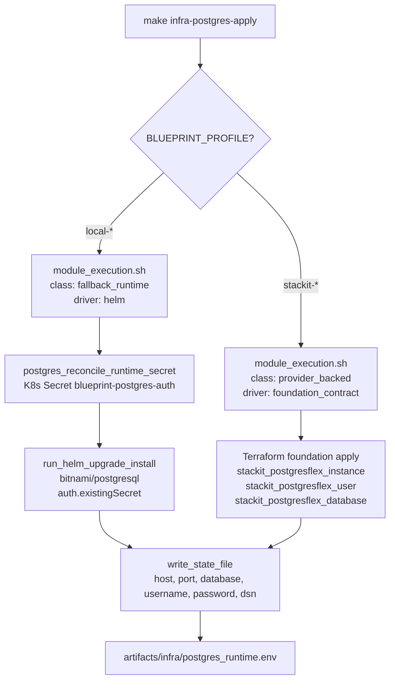

# Architecture

## Context
- Work item: Issue #248 — Postgres module dual-lane implementation (Bitnami PostgreSQL local + STACKIT Terraform `stackit_postgresflex_*` module)
- Owner: sbonoc
- Date: 2026-05-07

## Stack and Execution Model
- Backend stack profile: none — infra-only
- Frontend stack profile: none — infra-only
- Test automation profile: pytest_shell_contract
- Agent execution model: specialized-subagents-isolated-worktrees

## Problem Statement
- What needs to change and why: The postgres module has a working execution scaffold (bin scripts, lib, Helm values) but is missing four correctness properties established by the opensearch and object-storage modules: (1) wrong execution class (`provider_backed` on local lane, should be `fallback_runtime`), (2) plaintext credentials in rendered Helm values (security gap), (3) stub-only STACKIT Terraform module (non-functional STACKIT lane), (4) no automated test coverage.
- Scope boundaries: `scripts/lib/infra/postgres.sh`, `scripts/bin/infra/postgres_{plan,apply,smoke,destroy}.sh`, `scripts/bin/infra/bootstrap.sh`, `scripts/lib/infra/module_execution.sh`, `infra/local/helm/postgres/values.yaml`, `scripts/templates/infra/bootstrap/infra/local/helm/postgres/values.yaml`, `infra/cloud/stackit/terraform/modules/postgres/`, `docs/platform/modules/postgres/README.md`, test files.
- Out of scope: Foundation Terraform layer (already implements postgres correctly), make target changes, ESO manifest changes, consumer repo adoption.

## Bounded Contexts and Responsibilities
- Local lane context: Bitnami `postgresql` Helm chart (`bitnami/postgresql`) deployed to `data` namespace; credentials stored in K8s Secret `blueprint-postgres-auth` created by `postgres_reconcile_runtime_secret` before helm upgrade; Secret key `password` holds the postgres password.
- STACKIT lane context: Standalone Terraform module (`infra/cloud/stackit/terraform/modules/postgres/`) declares `stackit_postgresflex_instance` + `stackit_postgresflex_user` + `stackit_postgresflex_database`; consumed by the foundation layer via module reference; outputs flow through `stackit_foundation_output_value_or_default` in `postgres.sh`.

## High-Level Component Design

Diagram caption: Dual-lane apply flow — local lane (left) reconciles a K8s Secret before helm upgrade; STACKIT lane (right) delegates to the Terraform foundation layer. Both write the same 6-key runtime state file.

- Domain layer: `postgres.sh` — credential resolution, DSN construction, Secret lifecycle
- Application layer: `postgres_apply.sh` / `postgres_destroy.sh` / `postgres_smoke.sh` — orchestration, state file writes, smoke validation
- Infrastructure adapters: Bitnami `postgresql` Helm chart (local); `stackit_postgresflex_*` Terraform resources (STACKIT)
- Presentation/API/workflow boundaries: none — infra-only

## Integration and Dependency Edges
- Upstream dependencies: `module_execution.sh` (execution class routing), `fallback_runtime.sh` (apply_optional_module_secret_from_literals, delete_optional_module_secret), `state.sh` (write_state_file), `stackit_foundation_outputs.sh` (STACKIT output resolution), `versions.sh` (version pins)
- Downstream dependencies: ESO `ExternalSecret` for postgres runtime credentials reads state file or Secret; consumer apps read `POSTGRES_HOST`, `POSTGRES_PORT`, `POSTGRES_DB_NAME`, `POSTGRES_USER`, `POSTGRES_PASSWORD`, `POSTGRES_DSN` from ESO-synced secret.
- Data/API/event contracts touched: `module.contract.yaml` — no schema changes; state file gains six canonical keys; `blueprint-postgres-auth` Secret is the new credential delivery path for local lane.

## Non-Functional Architecture Notes
- Security: Credentials removed from Helm values template bindings; `postgres_render_values_file()` binds only `POSTGRES_CREDENTIAL_SECRET_NAME` (the Secret name, not the credential itself). The Secret is created by `postgres_reconcile_runtime_secret` using `apply_optional_module_secret_from_literals` — same pattern as opensearch and object-storage.
- Observability: `start_script_metric_trap` is already present in all four bin scripts (existing scaffold); no changes to metric emission.
- Reliability and rollback: Destroy is idempotent via `--ignore-not-found` on helm uninstall and Secret deletion tolerating absence. Rollback: revert the PR; the K8s Secret `blueprint-postgres-auth` can be deleted manually if needed.
- Monitoring/alerting: no new alerting; existing `start_script_metric_trap` framework emits invocation metrics.

## Risks and Tradeoffs
- Risk 1: `auth.existingSecret` requires the K8s Secret to exist before pod starts. Mitigated by ordering: `postgres_reconcile_runtime_secret` is called before `run_helm_upgrade_install`.
- Risk 2: `stackit_postgresflex_database.owner` must reference an existing user — the module enforces this via `depends_on = [stackit_postgresflex_user.postgres]`.
- Tradeoff 1: The standalone Terraform module (`infra/cloud/stackit/terraform/modules/postgres/`) deliberately mirrors the foundation layer parameters (version, replicas, flavor, storage, ACL) to give standalone consumers full configurability; this duplicates some defaults but keeps the module self-contained.
