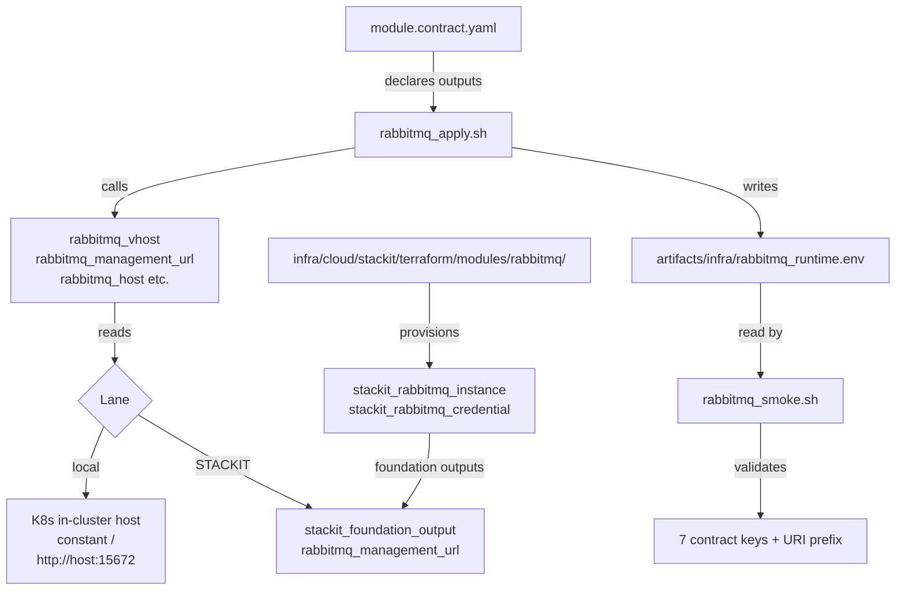

# Architecture

## Context
- Work item: `specs/2026-05-07-issue-248-rabbitmq-module/`
- Owner: bonos
- Date: 2026-05-07

## Stack and Execution Model
- Backend stack profile: python_plus_fastapi_pydantic_v2
- Frontend stack profile: none
- Test automation profile: pytest_vitest_playwright_pact
- Agent execution model: specialized-subagents-isolated-worktrees

## Problem Statement
- What needs to change and why: The rabbitmq module has several gaps compared to the established optional-module pattern: the STACKIT standalone Terraform module is a 7-line stub (no resources), two contract outputs (`RABBITMQ_VHOST`, `RABBITMQ_MANAGEMENT_URL`) are missing from `module.contract.yaml`, the corresponding shell helper functions do not exist, the runtime state file is missing these two keys, smoke validations are minimal (URI prefix only), and the module has no automated tests or documentation.
- Scope boundaries: infra module layer only — `scripts/lib/infra/rabbitmq.sh`, `scripts/bin/infra/rabbitmq_{apply,smoke}.sh`, `infra/cloud/stackit/terraform/modules/rabbitmq/`, `infra/cloud/stackit/terraform/foundation/outputs.tf`, `blueprint/modules/rabbitmq/module.contract.yaml`, and `docs/platform/modules/rabbitmq/README.md`.
- Out of scope: execution class changes (already correct), Helm values / credential secret pattern (already correct), `rabbitmq_render_values_file()` (already compliant), bootstrap template, consumer application code, vhost customisation, HA replica configuration.

## Bounded Contexts and Responsibilities

- **Infra module lib** (`scripts/lib/infra/rabbitmq.sh`): owns all rabbitmq-aware shell functions; the two new functions `rabbitmq_vhost()` and `rabbitmq_management_url()` live here following the existing function naming convention.
- **Infra apply script** (`scripts/bin/infra/rabbitmq_apply.sh`): owns the `write_state_file` call; must be extended to include `vhost` and `management_url` in the state artifact.
- **Infra smoke script** (`scripts/bin/infra/rabbitmq_smoke.sh`): owns smoke validation logic; must validate all seven contract keys including new `vhost` and `management_url`.
- **STACKIT Terraform module** (`infra/cloud/stackit/terraform/modules/rabbitmq/`): owns the STACKIT provider resources for isolated rabbitmq provisioning; mirrors the foundation pattern.
- **Foundation Terraform outputs** (`infra/cloud/stackit/terraform/foundation/outputs.tf`): must expose `rabbitmq_management_url` so the shell layer can read it via `stackit_foundation_output_value_or_default`.
- **Module contract** (`blueprint/modules/rabbitmq/module.contract.yaml`): the single source of truth for produced outputs; must be updated with the two new keys.
- **Test layer** (`tests/infra/modules/rabbitmq/`): owns automated validation of all the above.

## High-Level Component Design

- Domain layer: none — pure infrastructure provisioning; no domain logic.
- Application layer: none.
- Infrastructure adapters: `stackit_rabbitmq_instance` + `stackit_rabbitmq_credential` (STACKIT lane); Bitnami RabbitMQ Helm chart already provisioned (local lane, no changes).
- Presentation/API/workflow boundaries: none.

## Integration and Dependency Edges
- Upstream dependencies:
  - STACKIT provider: `stackit_rabbitmq_instance`, `stackit_rabbitmq_credential` resources (confirmed from foundation layer).
  - `infra/cloud/stackit/terraform/foundation/main.tf`: existing `stackit_rabbitmq_credential.foundation[0].management` attribute provides management URL.
  - `scripts/lib/infra/stackit_foundation_outputs.sh`: `stackit_foundation_output_value_or_default` function used by `rabbitmq_management_url()` on STACKIT lane.
  - Bitnami RabbitMQ Helm chart: existing local-lane provisioning, no changes; management plugin enabled by default on port 15672.
- Downstream dependencies:
  - ESO (External Secrets Operator): syncs `RABBITMQ_VHOST` and `RABBITMQ_MANAGEMENT_URL` from runtime state to consumer pod env vars after state file is written.
  - Consumer applications: read `RABBITMQ_VHOST` and `RABBITMQ_MANAGEMENT_URL` via ESO-synced env vars.
- Data/API/event contracts touched: `module.contract.yaml` `outputs.produced` (additive change — no breaking changes to existing outputs).

## Non-Functional Architecture Notes
- Security: the existing Helm values already use `existingPasswordSecret` — no plaintext credentials in rendered values. New functions `rabbitmq_vhost()` and `rabbitmq_management_url()` return non-sensitive values; no secret handling added. Foundation outputs for `rabbitmq_management_url` are non-sensitive (URL, not credential).
- Observability: all four scripts already register with `start_script_metric_trap`; no metric emitter changes required. The two new state file keys land in the runtime env artifact and are therefore visible in any state file audit.
- Reliability and rollback: Terraform module includes `lifecycle { create_before_destroy = true }` on instance resource. `stackit_rabbitmq_credential` depends on instance implicitly (provider handles ordering). Destroy is idempotent via existing `run_helm_uninstall` pattern; `rabbitmq_delete_runtime_secret` is already idempotent.
- Monitoring/alerting: no changes to alerting; the management URL added to the state file enables operators to reach the management UI without manual lookup.

## Risks and Tradeoffs
- Risk 1: The foundation Terraform `outputs.tf` must expose `rabbitmq_management_url` for the STACKIT lane shell function to read it. If this output is missing at apply time, `stackit_foundation_output_value_or_default` will return the provided default (empty string), and the smoke check on `management_url` will fail rather than silently produce a wrong value — this is the correct failure mode.
- Tradeoff 1: Naming the foundation output `rabbitmq_management_url` (rather than `rabbitmq_management`) introduces a naming difference from the Terraform provider attribute name (`management`). This is intentional — the shell convention uses `_url` suffix for URL-valued outputs to make the type clear to callers, and consistency across the blueprint layer takes precedence over mirroring provider attribute names exactly.
