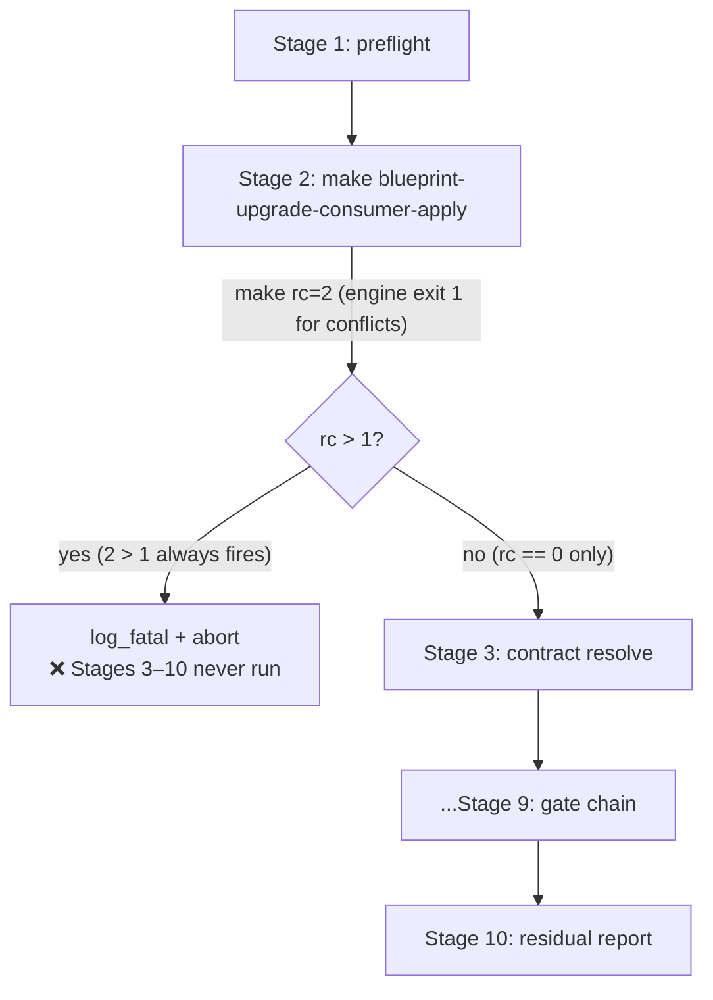
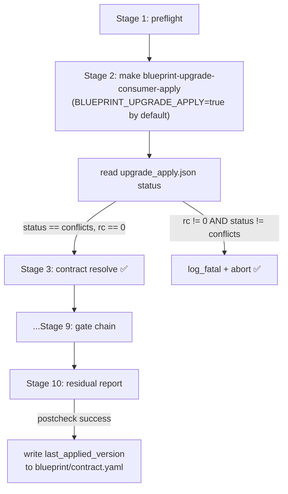
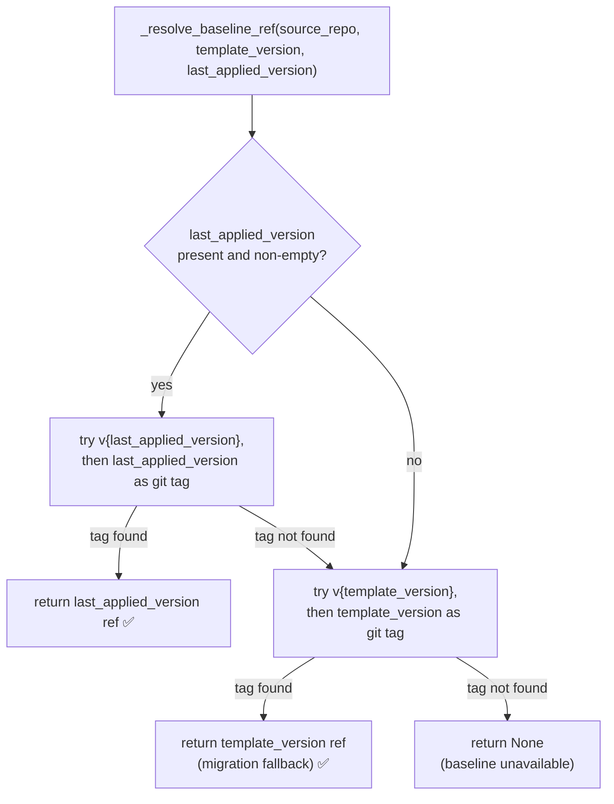

# Architecture

## Context
- Work item: specs/2026-05-12-issue-263-264-266-pipeline-engine-correctness
- Owner: Blueprint Maintainer
- Date: 2026-05-12

## Stack and Execution Model
- Backend stack profile: blueprint-tooling-python-bash (Python 3 stdlib + existing upgrade engine patterns)
- Frontend stack profile: none
- Test automation profile: pytest (tests/infra/)
- Agent execution model: single-agent

## Problem Statement
- What needs to change and why: Three independent correctness bugs in the scripted upgrade pipeline — all confirmed in a real consumer upgrade (sbonoc/dhe-marketplace v1.7.0 → v1.10.0) that produced 88 baseline-artefact conflicts and required manual stage invocation.
  1. **#263**: `_resolve_baseline_ref` reads `template_version` (set at init, never advanced) instead of the most recently applied version, producing baseline-unavailable conflicts for every upgrade hop after the first.
  2. **#264**: GNU make wraps any recipe `exit 1` as `exit 2`; the pipeline's `> 1` check fires for normal conflicts, aborting Stages 3–10.
  3. **#266**: `upgrade_consumer_pipeline.sh` never sets `BLUEPRINT_UPGRADE_APPLY=true`, so `upgrade_consumer.sh` defaults to plan-only; every first pipeline invocation is a silent no-op.
- Scope boundaries: `scripts/lib/blueprint/upgrade_consumer.py`, `scripts/lib/blueprint/upgrade_consumer_postcheck.py`, `scripts/lib/blueprint/upgrade_version_pin_diff.py`, `scripts/lib/blueprint/contract_schema.py`, `scripts/lib/blueprint/schemas/upgrade_apply.schema.json`, `scripts/bin/blueprint/upgrade_consumer_pipeline.sh`, `blueprint/contract.yaml`, `.agents/skills/blueprint-consumer-upgrade/SKILL.md`.
- Out of scope: conflict auto-resolution triage (#265/#271), finalize target (#267), source URL auto-clone (#269), test ownership contract (#270).

## Bounded Contexts and Responsibilities
- **Upgrade engine** (`upgrade_consumer.py`): plans and applies file mutations; owns the `upgrade_apply.json` artifact. After fix: exits 0 when conflicts are present; sets `status = "conflicts"`.
- **Contract schema** (`contract_schema.py` + `blueprint/contract.yaml`): defines the typed contract model including `TemplateBootstrapContract`. After fix: gains optional `last_applied_version` field.
- **Baseline resolver** (`_resolve_baseline_ref` in `upgrade_consumer.py` and `upgrade_version_pin_diff.py`): maps contract version field to a resolvable git tag. After fix: prefers `last_applied_version` over `template_version`.
- **Postcheck** (`upgrade_consumer_postcheck.py`): verifies post-apply convergence; owns the "committed upgrade" signal. After fix: writes `last_applied_version` to `blueprint/contract.yaml` on success.
- **Pipeline wrapper** (`upgrade_consumer_pipeline.sh`): orchestrates 10 stages. After fix: defaults `BLUEPRINT_UPGRADE_APPLY=true`; reads `upgrade_apply.json` status instead of make exit code for Stage 2 outcome.

## High-Level Component Design

### Before fixes (buggy state)

### After fixes (correct state)

### Baseline resolution logic

## Integration and Dependency Edges
- **Upstream**: `blueprint/contract.yaml` — gains `last_applied_version` optional field; all contract-reading scripts must handle its absence gracefully.
- **Downstream**: `upgrade_apply.json` schema — gains `"conflicts"` as a third valid `status` value; downstream readers of this artifact must handle the new value.
- **Postcheck → contract.yaml write path**: postcheck now writes `last_applied_version` in-place into `blueprint/contract.yaml`; consumers must commit this change as part of the upgrade commit.
- **Skill runbook**: `.agents/skills/blueprint-consumer-upgrade/SKILL.md` is a documentation artifact; update is doc-only, no runtime impact.

## Non-Functional Architecture Notes
- Security: `last_applied_version` is a semver ref string (e.g. `v1.10.0`); no credentials or paths are written. The postcheck write path reads the upgrade ref from `upgrade_apply.json` which is a local artifact already on disk.
- Observability: Stage 2 log line gains `status=<value>` from the artifact; engine emits existing metric mechanism with the new "conflicts" value. No new metric names or log formats introduced.
- Reliability and rollback: if postcheck fails, `last_applied_version` is never written; the next upgrade attempt still reads the old baseline (safe degradation). The `last_applied_version` field is optional — removing it from `blueprint/contract.yaml` fully reverts to the old behavior.
- Monitoring/alerting: no new alerts; the `blueprint_upgrade_apply_status_total` metric already tracked by operators gains the new "conflicts" dimension.

## Risks and Tradeoffs
- Risk 1: `make blueprint-upgrade-consumer-apply` callers that check exit code directly will see exit 0 when there are conflicts (previously exit 1 via make's exit 2). Mitigation: banner + docs update; callers should read `upgrade_apply.json` status (already the canonical source).
- Risk 2: postcheck writing to `blueprint/contract.yaml` requires the file to be parseable YAML. If contract load fails, postcheck already sets `contract_load_error` and blocks; the write is skipped. Mitigation: guarded by existing contract-load error path.
- Tradeoff 1: Option A (engine exits 0 for conflicts) is a semantically correct change that requires callers to check the artifact, not the exit code. This is a better long-term contract and consistent with artifact-driven pipeline design.
