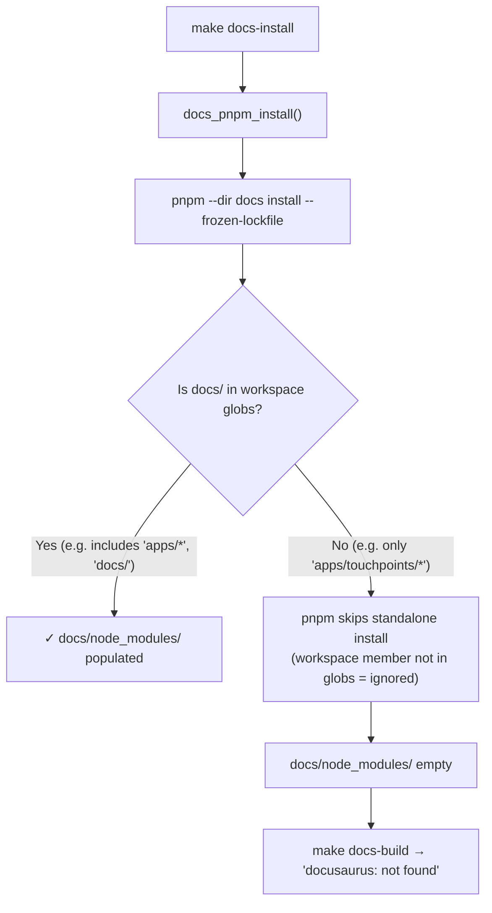
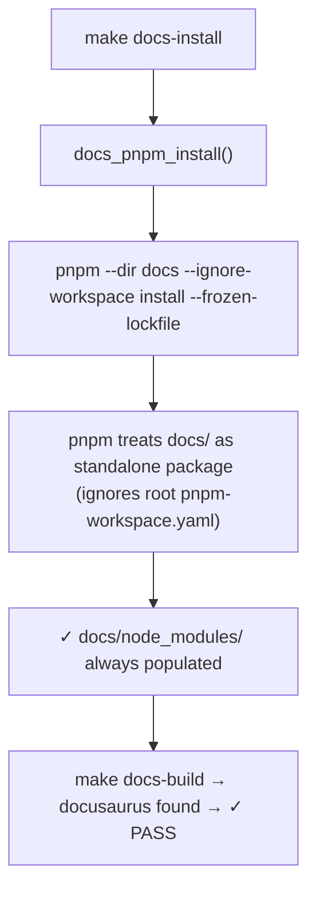
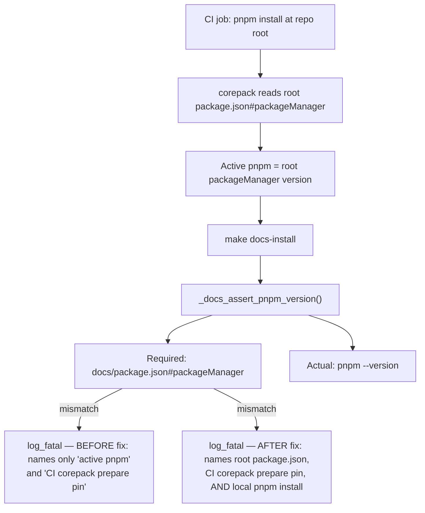

# Architecture

## Context
- Work item: `specs/2026-05-12-issue-272-273-v110-docs-hotfix`
- Owner: Platform Engineering
- Date: 2026-05-12

## Stack and Execution Model
- Backend stack profile: bash (pure shell script changes in `scripts/lib/docs/site.sh`)
- Frontend stack profile: none
- Test automation profile: pytest (content-level regression tests)
- Agent execution model: single-agent

## Problem Statement
- What needs to change and why: `scripts/lib/docs/site.sh` has two v1.10.0 regressions that block consumer docs builds. (1) `--ignore-workspace` was removed from three pnpm invocations, causing silent empty `docs/node_modules/` for any consumer whose `pnpm-workspace.yaml` excludes `docs/`. (2) The new strict pnpm version assertion emits an opaque error that does not identify the root cause — active pnpm version is set by whichever `packageManager` field corepack last activated (root `package.json`, docs `package.json`, or CI prepare action), and the error message names none of these explicitly.
- Scope boundaries: `scripts/lib/docs/site.sh` only. No new Make targets, no new scripts, no contract changes.
- Out of scope: pnpm alignment migration script, preflight drift detection quality hook, changes to the `python3 -c` inline parser.

## Bounded Contexts and Responsibilities
- Docs build context (`scripts/lib/docs/site.sh`): owns pnpm invocation flags and assertion behavior for the Docusaurus site. Blueprint-managed; propagated to consumers on upgrade.
- Consumer workspace context (`pnpm-workspace.yaml`): consumer-owned; determines which package directories pnpm treats as workspace members. Blueprint has no authority over this file.

## High-Level Component Design
- Domain layer: N/A — bash scripts do not have layered domain models.
- Application layer: `docs_pnpm_install`, `docs_pnpm_build`, `docs_pnpm_start` — these functions wrap pnpm CLI calls; they MUST pass `--ignore-workspace` to isolate `docs/` from the consumer's root workspace.
- Infrastructure adapters: `_docs_assert_pnpm_version` — reads `docs/package.json#packageManager` via a stdlib-only `python3 -c` one-liner and compares against `pnpm --version`. The error message is the only surface that changes.
- Presentation/API/workflow boundaries: none; output is `log_fatal` / `log_info` to stderr.

## Integration and Dependency Edges
- Upstream dependencies: pnpm CLI (external, consumer-installed), `docs/package.json` (blueprint-managed), `docs/pnpm-lock.yaml` (blueprint-managed).
- Downstream dependencies: `make docs-install` → `docs_pnpm_install`; `make docs-build` → `docs_pnpm_build`; `make docs-smoke` → `docs_pnpm_start`. These three Make targets are consumer-facing.
- Data/API/event contracts touched: none.

## Mermaid Diagrams

### Before fix: pnpm workspace resolution for `docs/` install

### After fix: `--ignore-workspace` restores standalone install contract

### pnpm version resolution: three sources of truth (#273)

*Caption (workspace resolution diagrams):* The `--ignore-workspace` flag is the contract boundary between the Docusaurus standalone workspace and the consumer's monorepo workspace. Without it, pnpm workspace resolution silently skips the standalone install when `docs/` is not a declared workspace member.

*Caption (version resolution diagram):* Three independent sources can set the active pnpm version; the improved error message names all three so consumers have an actionable remediation path.

## Non-Functional Architecture Notes
- Security: No changes to secret handling, authn/authz, or trust boundaries. pnpm install flags do not affect package signing or integrity verification.
- Observability: `log_fatal` output channel preserved. Error message text expanded; no metric or artifact schema changes.
- Reliability and rollback: Both changes are single-line edits to one file. Rollback = revert the file. No migration risk.
- Monitoring/alerting: none — docs build failures surface immediately in CI; no alert configuration needed.

## Risks and Tradeoffs
- Risk 1: The `lstrip('pnpm@')` approach in `_docs_assert_pnpm_version` strips individual characters (not a prefix); for versions starting with p, n, m, or @ it would strip incorrectly. Accepted for this hotfix: the actual version format `pnpm@X.Y.Z` always starts with a digit after stripping the 5-character literal prefix, and no known pnpm version starts with those characters. Tracked as a latent cleanup in the proposal section.
- Tradeoff 1: Not implementing the migration script (Option B for #273) means consumers must manually update 11+ files to align pnpm pins. This is the correct tradeoff for a hotfix; the migration script is parked for a follow-on.
