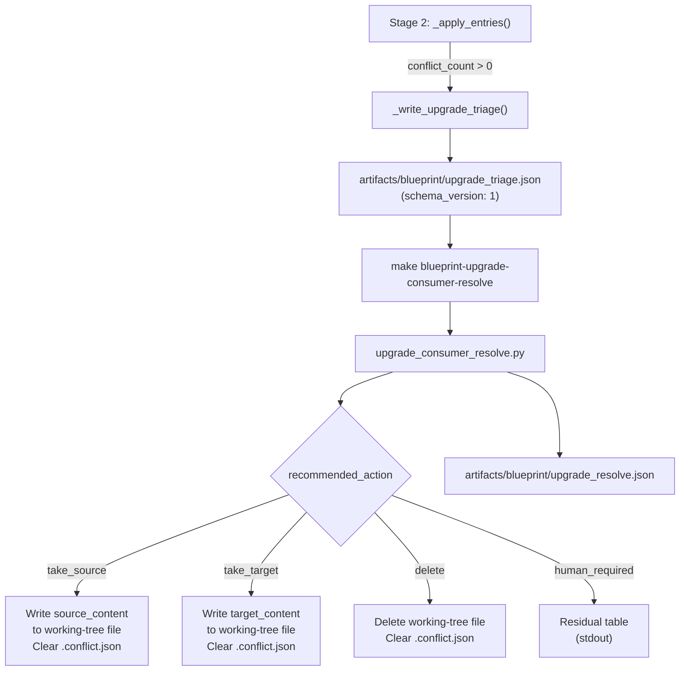

# Architecture

## Context
- Work item: `specs/2026-05-13-issue-265-271-conflict-resolution-ux/` — Issues #265 + #271
- Owner: blueprint platform team
- Date: 2026-05-13

## Stack and Execution Model
- Backend stack profile: blueprint-tooling-python-bash (Python 3 stdlib; no FastAPI/Pydantic)
- Frontend stack profile: none
- Test automation profile: pytest (tests/infra/)
- Agent execution model: single-agent

## Problem Statement
- What needs to change and why: Stage 2 (apply) of the upgrade pipeline produces one `.conflict.json` file per conflicting path. There is no aggregated triage manifest, no ownership classification, and no recommended action. Consumers and agents must walk every file individually, infer ownership from the path, and write one-off resolution scripts — 25 minutes of manual work for 88 conflicts in the real upgrade evidence. Two components are needed: (1) the engine must emit a structured triage manifest with per-conflict ownership classification and recommendation; (2) a resolve script must auto-apply the unambiguous rows and surface only the truly ambiguous ones.
- Scope boundaries: `upgrade_consumer.py` (triage emission), new `upgrade_consumer_resolve.py` (resolution logic), `blueprint.generated.mk` (new make target), `scripts/lib/blueprint/schemas/upgrade_triage.schema.json` (new schema), `blueprint-consumer-upgrade/SKILL.md` (docs update). Pipeline script and other stages are not modified.
- Out of scope: Issue #267 (`blueprint-upgrade-consumer-finalize`), Issue #269 (auto-clone source URL), Issue #270 (explicit consumer test ownership markers), interactive TUI, HTML report.

## Bounded Contexts and Responsibilities

- **Engine context** (`upgrade_consumer.py`): emits `upgrade_triage.json` after `_apply_entries`; derives `ownership_class` from the existing `UpgradeEntry.ownership` field and `recommended_action` from a deterministic mapping table; excludes `blueprint/contract.yaml`; writes diff summaries from per-file `.conflict.json` content.
- **Resolve context** (`upgrade_consumer_resolve.py`): reads `upgrade_triage.json`; applies `take_source`, `take_target`, `delete` rows; writes `upgrade_resolve.json`; prints residual table for `human_required` rows; supports `INTERACTIVE=true`, `--accept-source ALL`, `--accept-target ALL`, `--dry-run`.

## High-Level Component Design

- **Engine layer** (`upgrade_consumer.py`): existing `_apply_entries` → new `_write_upgrade_triage` called once after apply loop. Data: correlate each `ApplyResult` (conflict) with its source `UpgradeEntry` (by path) to get `ownership`; compute diff summaries using `difflib` on content from `.conflict.json`.
- **Schema layer** (`upgrade_triage.schema.json`): JSON Schema draft-07; versioned; validates `schema_version`, `conflicts[]` array with required per-entry fields; `recommended_action` enum: `["take_source", "take_target", "delete", "human_required"]`; `ownership_class` enum matching existing engine values plus `"unknown"` sentinel.
- **Resolve layer** (`upgrade_consumer_resolve.py`): standalone Python script; reads triage JSON; validates schema; applies actions; writes resolve JSON; handles `--dry-run`, `--interactive`, `--accept-source`, `--accept-target`. Shell wrapper `upgrade_consumer_resolve.sh` passes env/flags.
- **Make layer** (`blueprint.generated.mk`): new `blueprint-upgrade-consumer-resolve` target; delegates to `uv run python3 scripts/lib/blueprint/upgrade_consumer_resolve.py --repo-root .`.

## Integration and Dependency Edges

- **Upstream**: `_apply_entries` (existing) produces conflict results and `.conflict.json` files. `_write_upgrade_triage` reads these immediately after; no new I/O dependency at apply time.
- **Downstream**: `upgrade_consumer_resolve.py` reads `upgrade_triage.json` and per-file `.conflict.json` content. It writes the working-tree files (same as Stage 2 write path) and `upgrade_resolve.json`. The subsequent `make blueprint-upgrade-consumer-finalize` (#267, deferred) will consume `upgrade_resolve.json` to verify all conflicts are resolved before postcheck.
- **Data/API/event contracts touched**: new `upgrade_triage.json` artifact (schema v1); new `upgrade_resolve.json` artifact; `upgrade_apply.json` read but not modified.

## Non-Functional Architecture Notes

- **Security**: triage JSON contains no file contents — diff summaries only. This prevents inadvertent embedding of secrets (credentials, tokens) that may appear in upgraded config files. Secrets remain isolated in per-file `.conflict.json` under `artifacts/blueprint/conflicts/`, which is already in `.gitignore`.
- **Observability**: resolve script prints one `upgrade-resolve: <action> <path>` line per applied action. Output is grep-parseable. `upgrade_resolve.json` is the machine-readable audit trail.
- **Reliability and rollback**: `--dry-run` flag enables safe inspection before any write. Idempotency guarantees that a second resolve run after a partial failure is safe. Rollback: revert working-tree files; `.conflict.json` files are restored by re-running `make blueprint-upgrade-consumer-apply`.
- **Monitoring/alerting**: not applicable; offline tooling script.

## Risks and Tradeoffs

- **Risk 1 — Option A false positives on `blueprint-managed` catch-all**: files that are conceptually blueprint-owned but fall into the catch-all (not in `blueprint_managed_roots`) will appear as `human_required` instead of `take_source`. Mitigation: acceptable until Issue #270 ships explicit ownership markers; the 85/88 auto-resolve rate from the real evidence comes from `blueprint-managed-root` entries, not catch-all.
- **Tradeoff 1 — diff summary vs full diff in triage**: storing full diffs in the triage JSON would duplicate data already in `.conflict.json` files and increase manifest size. Diff summaries (+N -M lines) are sufficient for the residual table; full content is available via `.conflict.json`. Accepted.
- **Risk 2 — `blueprint/contract.yaml` exclusion**: if Stage 3 (contract resolver) fails and contract.yaml remains conflicted, it will not appear in the triage and the resolve target will not touch it. The consumer may be left with an unresolved contract file. Mitigation: Stage 3 emits its own resolution artifact and must be run before resolve; the pipeline ordering enforces this.
