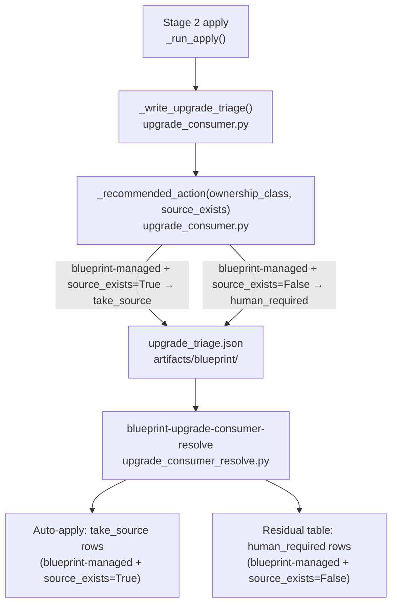

# Architecture

## Context
- Work item: issue-265-271-source-exists-inference
- Owner: sbonoc
- Date: 2026-05-13

## Bounded Context

This work item is scoped entirely to the upgrade engine's triage phase. No Stage 1 (plan), Stage 3 (contract resolver), or Stage 4+ pipeline stages are touched. No consumer-visible CLI flags, make target names, or JSON schema breaking changes are introduced.

**Two components are affected:**

1. **`scripts/lib/blueprint/upgrade_consumer.py`** — `_recommended_action()` and `_write_upgrade_triage()`: the action mapping for `blueprint-managed` catch-all entries is changed to depend on `source_exists`. The `source_exists` field is also added to each triage entry in `upgrade_triage.json`.

2. **`scripts/lib/blueprint/schemas/upgrade_triage.schema.json`** — `source_exists` added as an optional boolean property on the conflict entry object (schema version 1, non-breaking).

## Decision Points

### D-1: Inference location — `_recommended_action()` vs `_write_upgrade_triage()`

`_recommended_action(ownership_class)` currently takes only the ownership class string and cannot access `source_exists`. Two options:

- **Option A**: Add `source_exists: bool` as a second parameter to `_recommended_action()`. Keeps the logic co-located with the mapping, easy to test in isolation.
- **Option B**: Apply the override in `_write_upgrade_triage()` after calling `_recommended_action()`.

**Decision: Option A** — passing `source_exists` to `_recommended_action()` keeps the mapping logic in one place, and the function signature clearly documents both inputs that drive the decision. `_write_upgrade_triage()` is already long; adding branching there increases cognitive load.

### D-2: Schema version

Adding `source_exists` as a non-required optional property to the conflict entry is backward-compatible. Schema consumers that do not read `source_exists` are unaffected. **Decision: keep schema version 1.**

### D-3: `reason` field content for inferred entries

When `blueprint-managed` + `source_exists=True` → `take_source`, the `reason` field MUST identify the inference so operators and agents can audit why auto-resolution occurred. **Decision: set `reason` to `"source_exists=True; blueprint-managed ownership inferred (issue #270 consumer ownership markers shipped)"`.**

## Integration Edges

Caption: After this change, `blueprint-managed` entries with `source_exists=True` flow through as `take_source` and are auto-applied by the resolve target; only entries where `source_exists=False` remain as `human_required`.

## Operational Notes

- The `source_exists` field in `upgrade_triage.json` provides the audit trail. Operators and agents can verify why an entry was promoted from `human_required` to `take_source`.
- The `blueprint_managed_roots` contract setting defines which directories are blueprint-exclusive. Consumers MUST NOT create their own files in these directories — this is an existing governance constraint, not a new one introduced by this change.
