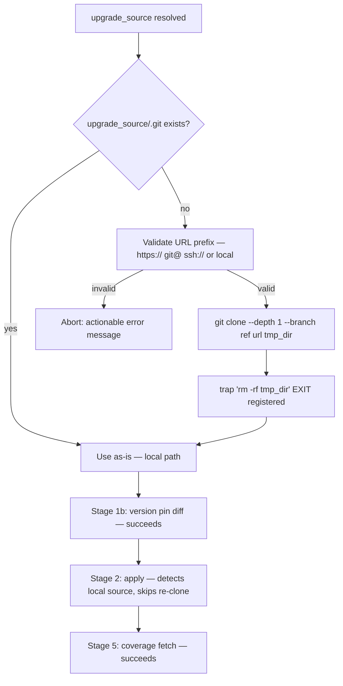
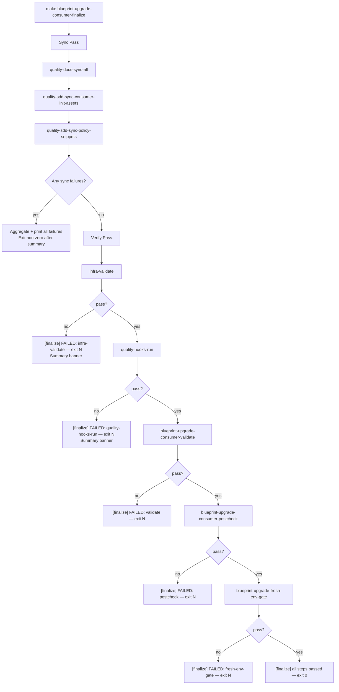

# Architecture

## Context
- Work item: 2026-05-13-issue-267-269-pipeline-finalize-auto-clone
- Owner: Platform Engineering
- Date: 2026-05-13

## Stack and Execution Model
- Backend stack profile: blueprint-tooling-bash (Bash scripts; existing make target orchestration; no new Python runtime)
- Frontend stack profile: none
- Test automation profile: pytest (existing infra test pattern under tests/infra/)
- Agent execution model: single-agent

## Problem Statement
- What needs to change and why: Two independent but complementary pipeline UX problems, both surfaced in the same real consumer upgrade (sbonoc/dhe-marketplace, v1.7.0 → v1.10.0): (1) `BLUEPRINT_UPGRADE_SOURCE` URL form causes Stage 1b to emit a warning and Stage 5 to fatal-exit because those stages call `subprocess.run(["git", ...], cwd=upgrade_source)` with a URL that is not a filesystem path. (2) After a successful apply, consumers must discover and run an implicit ordered sequence of sync and verify make targets, accumulating five fix→re-run cycles before the quality gate goes green.
- Scope boundaries: `scripts/bin/blueprint/upgrade_consumer_pipeline.sh` (URL normalization + finalize invocation); new `scripts/bin/blueprint/upgrade_consumer_finalize.sh`; `scripts/templates/blueprint/bootstrap/make/blueprint.generated.mk.tmpl` (new target declaration); `scripts/lib/blueprint/upgrade_consumer.py` (skip re-clone when source is already local); `.agents/skills/blueprint-consumer-upgrade/SKILL.md` (runbook update).
- Out of scope: Stages 3–7 pipeline internals; Python upgrade engine logic beyond the Stage 2 skip-clone optimization; Issue #167 dry-run mode; Issue #168 incremental mode.

## Bounded Contexts and Responsibilities
- Pipeline orchestration context (`upgrade_consumer_pipeline.sh`): resolves source URL to a local path exactly once before Stage 1b; invokes finalize as post-Stage-2 tail; remains the entry point for end-to-end upgrade runs.
- Finalize context (`upgrade_consumer_finalize.sh`): owns the deterministic sync+verify quality convergence cycle; callable standalone (after pipeline apply) or from the pipeline; two-pass structure (sync: aggregated, no fail-fast; verify: fail-fast with summary banner).
- Stage 2 engine context (`upgrade_consumer.py`): skip internal clone when `upgrade_source` is already a local `.git` directory; use the pre-cloned path directly for all git operations.

## High-Level Component Design
- Domain layer: upgrade pipeline stages (1–7 remain in pipeline), finalize quality cycle (sync pass + verify pass).
- Application layer: `upgrade_consumer_pipeline.sh` orchestrates; `upgrade_consumer_finalize.sh` owns quality convergence.
- Infrastructure adapters: `git clone --depth 1` for URL normalization; existing make targets (`quality-docs-sync-all`, `infra-validate`, etc.) for sync/verify.
- Presentation/API/workflow boundaries: make target `blueprint-upgrade-consumer-finalize` as the consumer-facing CLI entry point.

## URL Normalization Flow

Caption: Pipeline URL normalization resolves the source to a local `.git` directory exactly once before Stage 1b; Stage 2 and Stage 5 operate on the local path unconditionally.

## Finalize Two-Pass Structure

Caption: Finalize sync pass aggregates all failures; verify pass fails fast on first target; both passes emit per-step `[finalize]` log lines.

## Integration and Dependency Edges
- Upstream dependencies: `upgrade_consumer_pipeline.sh` invokes `upgrade_consumer_finalize.sh` via the new make target; `upgrade_consumer.py` receives a local-path source from the pipeline.
- Downstream dependencies: `upgrade_consumer_finalize.sh` delegates to existing make targets (`quality-docs-sync-all`, `infra-validate`, `blueprint-upgrade-consumer-validate`, `blueprint-upgrade-consumer-postcheck`, `blueprint-upgrade-fresh-env-gate`); no new downstream code introduced.
- Data/API/event contracts touched: make target contract (new `blueprint-upgrade-consumer-finalize` target added to `blueprint.generated.mk.tmpl`).

## Non-Functional Architecture Notes
- Security: URL validation before `git clone` prevents shell-metacharacter injection; validation is an allowlist of safe URL prefixes (`https://`, `git@`, `ssh://`) plus local path prefixes.
- Observability: `[finalize] <step>: <status>` log lines per step via `log_info`/`log_error`; same metric pattern as existing pipeline stages.
- Reliability and rollback: auto-clone tmp dir is registered with EXIT trap immediately after creation; rollback of a failed upgrade via `git checkout` continues to work because finalize does not modify tracked source files.
- Monitoring/alerting: no new alerting; finalize exit code is the observable signal.

## Risks and Tradeoffs
- Risk 1: shallow clone (`--depth 1`) may miss tags or refs if Stage 5 (coverage fetch) needs to `git show <ref>:<path>` for a ref not in the shallow history. Mitigation: Stage 5 uses `git show $upgrade_ref:$path` and `--depth 1` clones the branch at `$upgrade_ref`, so the ref is present in the shallow clone. If a future stage needs ancestry traversal, the clone depth can be deepened without breaking backward compatibility.
- Tradeoff 1: standalone `make blueprint-upgrade-consumer-finalize` is only meaningful after Stages 3–7 have been run (i.e., after the pipeline apply). If invoked on a fresh working tree, sync targets may find nothing to do (idempotent) but postcheck will fail because the reconcile artifacts do not exist. This limitation is documented in the script usage block and is acceptable for the intended use case.
