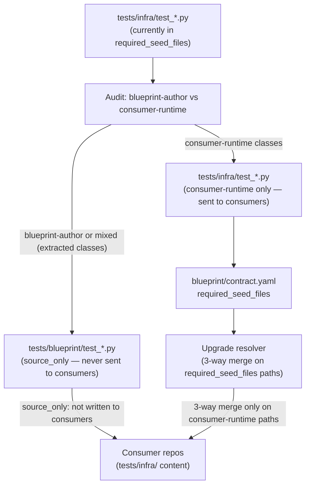

# Architecture

## Bounded Context

This work item is scoped entirely to the blueprint's test taxonomy and upgrade contract machinery. No runtime provisioning, HTTP routes, or consumer-visible behaviour changes.

**Two components are affected:**

1. **Test file layout** — The `tests/infra/` directory currently contains both blueprint-author tests (asserting against `blueprint/modules/`, `scripts/lib/blueprint/`) and consumer-runtime tests (asserting against the consumer's running infrastructure). After this change, blueprint-author tests live exclusively under `tests/blueprint/` (already `source_only`).

2. **`blueprint/contract.yaml` `required_seed_files`** — The list of `tests/infra/` paths delivered to generated-consumer repos. Fully-relocated files are removed; partially-split files retain only their consumer-runtime entries.

## Test File Audit — Initial Classification

The following 16 `tests/infra/test_*.py` files are currently in `required_seed_files`. Classification will be finalised during implementation; this table records the pre-implementation assessment:

| File | Preliminary classification | Rationale |
|---|---|---|
| `test_argocd_repo_contract_cli.py` | blueprint-author | Tests `scripts/lib/blueprint/contract_runtime_cli.py` internals |
| `test_async_message_contracts.py` | mixed | Consumer runtime uses async contracts; some assertions reference blueprint module YAML |
| `test_core_runtime_bootstrap.py` | consumer-runtime | Tests bootstrap behaviour consumers replicate |
| `test_optional_module_required_env_contract.py` | blueprint-author | Tests blueprint module env contract shape |
| `test_optional_modules.py` | blueprint-author | Asserts against `blueprint/modules/` content directly |
| `test_python_helper_extractions.py` | blueprint-author | Tests `scripts/lib/blueprint/` Python helpers |
| `test_root_dir_resolution.py` | blueprint-author | Tests blueprint root-dir resolution logic |
| `test_runtime_credentials_eso.py` | mixed | Some classes test consumer ESO behaviour; `RuntimeCredentialsEsoTests` references blueprint internals |
| `test_runtime_identity_contract_cli.py` | consumer-runtime | Tests runtime identity CLI used by consumers |
| `test_sdd_asset_checker.py` | blueprint-author | Tests blueprint SDD governance tooling |
| `test_smoke_status_diagnostics.py` | consumer-runtime | Tests consumer smoke/status diagnostic behaviour |
| `test_stackit_layers.py` | blueprint-author | Tests blueprint STACKIT layer abstractions |
| `test_state_artifact_contract.py` | blueprint-author | Tests blueprint state artifact schema |
| `test_tooling_contracts.py` | mixed | `ToolingContractsTests` is consumer-facing; `PostgresContractKeyParityTests` asserts against `blueprint/modules/postgres/module.contract.yaml` |
| `test_version_contract_checker.py` | blueprint-author | Tests blueprint version contract checker script |
| `test_workload_health_check.py` | consumer-runtime | Tests consumer workload health check behaviour |

**Implementation task:** confirm or revise this table by running `grep -rn "blueprint/modules"` on each file and auditing import chains.

## Integration Edges

Caption: After relocation, the upgrade resolver only 3-way-merges consumer-runtime test files. Blueprint-author tests flow through `source_only` and are never delivered to consumer repos.

## Design Decisions

### D-1: Use existing `source_only` classification — no new contract field

`tests/blueprint/` is already in `ownership_path_classes.source_only`. Relocating blueprint-author tests there requires no new contract mechanism. Adding a per-file `source_only` override for `tests/infra/` paths (Option 2 from the issue) would paper over the taxonomy problem without fixing it.

### D-2: Split mixed files rather than wholesale-move them

Files with both blueprint-author and consumer-runtime test classes are split: blueprint-author classes move to `tests/blueprint/`, consumer-runtime classes stay in `tests/infra/`. This avoids removing consumer-facing test coverage from consumer repos.

### D-3: Consumer repos with stale copies of relocated files are not actively cleaned

The upgrade engine stops writing relocated files to consumer repos (they are removed from `required_seed_files`). Stale copies in existing consumer repos remain untouched; they do not cause failures because they reference blueprint-internal artefacts that may or may not be present. Consumers can delete them manually or on re-init. Active cleanup (delete-on-upgrade) is not in scope for this work item.

## Operational Notes

- Blueprint maintainers adding new test files should follow the rule: if the test asserts against `blueprint/modules/`, `scripts/lib/blueprint/`, `scripts/bin/blueprint/`, or any other blueprint-authoring artefact, it belongs in `tests/blueprint/`.
- The contract assertion added by FR-005 enforces this rule automatically at commit time.
