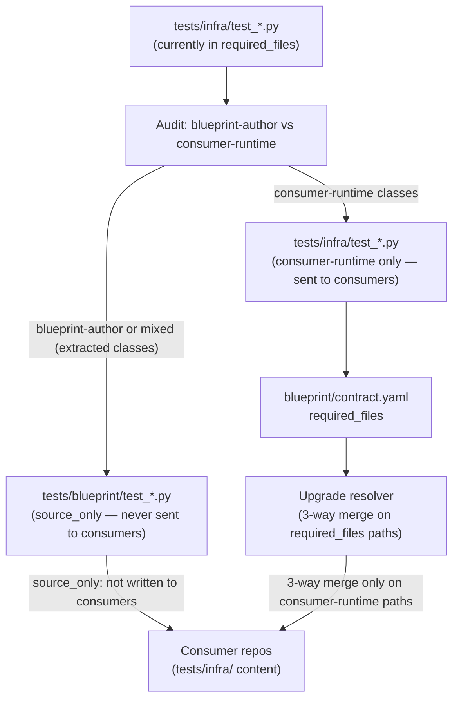

# Architecture

## Context
- Work item: issue-270-test-ownership-contract
- Owner: sbonoc
- Date: 2026-05-13

## Bounded Context

This work item is scoped entirely to the blueprint's test taxonomy and upgrade contract machinery. No runtime provisioning, HTTP routes, or consumer-visible behaviour changes.

**Two components are affected:**

1. **Test file layout** — The `tests/infra/` directory currently contains both blueprint-author tests (asserting against `blueprint/modules/`, `scripts/lib/blueprint/`) and consumer-runtime tests (asserting against the consumer's running infrastructure). After this change, blueprint-author tests live exclusively under `tests/blueprint/` (already `source_only`).

2. **`blueprint/contract.yaml` `required_files`** — The list of `tests/infra/` paths delivered to generated-consumer repos (field is `spec.repository.required_files`). Fully-relocated files are removed; partially-split files retain only their consumer-runtime entries.

## Test File Audit — Final Classification (T-000)

The following 16 `tests/infra/test_*.py` files are in `spec.repository.required_files`. Classification was finalised by auditing imports and running `grep -n 'blueprint/modules\|scripts/lib/blueprint\|scripts/bin/blueprint'` on each file.

**Classification rule:** blueprint-author if the file contains references to `blueprint/modules/`, `scripts/lib/blueprint/`, or `scripts/bin/blueprint/`.

| File | Final classification | Blueprint reference found | Action |
|---|---|---|---|
| `test_argocd_repo_contract_cli.py` | consumer-runtime | none (tests `scripts/lib/infra/`) | no change |
| `test_async_message_contracts.py` | **blueprint-author** | `scripts/bin/blueprint/` refs (1 class) | move to `tests/blueprint/` |
| `test_core_runtime_bootstrap.py` | consumer-runtime | none | no change |
| `test_optional_module_required_env_contract.py` | **blueprint-author** | imports `scripts.lib.blueprint.contract_schema`, `scripts.lib.blueprint.init_repo_contract` | move to `tests/blueprint/` |
| `test_optional_modules.py` | consumer-runtime | none (`blueprint-` prefix in K8s names only — not a path ref) | no change |
| `test_python_helper_extractions.py` | **blueprint-author** | `scripts/lib/blueprint/` refs | move to `tests/blueprint/` |
| `test_root_dir_resolution.py` | **blueprint-author** | `scripts/bin/blueprint/` refs | move to `tests/blueprint/` |
| `test_runtime_credentials_eso.py` | consumer-runtime | none (tests `scripts/lib/infra/runtime_identity_contract.py`) | no change |
| `test_runtime_identity_contract_cli.py` | consumer-runtime | none | no change |
| `test_sdd_asset_checker.py` | consumer-runtime | none (`scripts/bin/quality/` only — not `scripts/bin/blueprint/`) | no change |
| `test_smoke_status_diagnostics.py` | consumer-runtime | none | no change |
| `test_stackit_layers.py` | consumer-runtime | none | no change |
| `test_state_artifact_contract.py` | consumer-runtime | none (tests `scripts/lib/infra/`) | no change |
| `test_tooling_contracts.py` | **mixed** | `scripts/lib/blueprint/` in `ToolingContractsTests`; `blueprint/modules/postgres/` in `PostgresContractKeyParityTests` | split: move 2 blueprint-author classes to `tests/blueprint/`; keep 5 consumer-runtime classes |
| `test_version_contract_checker.py` | consumer-runtime | none (tests `scripts/lib/platform/`) | no change |
| `test_workload_health_check.py` | consumer-runtime | none | no change |

**Net result:** 4 files fully relocated, 1 file split, 11 files unchanged → `required_files` shrinks by 4 entries (16 → 12).

**Split detail for `test_tooling_contracts.py`:**
- → `tests/blueprint/test_tooling_contracts.py`: `ToolingContractsTests` (+ module-level helpers it uses), `PostgresContractKeyParityTests`
- → `tests/infra/test_tooling_contracts.py` (stays in `required_files`): `PlatformPythonHelperGuardTests`, `AppProjectNamespacePolicyTests`, `SddPlaceholderGuardTests`, `RuntimeAuthBestEffortTests`, `AppDockerfileAndRuntimeTests`

## Integration Edges

Caption: After relocation, the upgrade resolver only 3-way-merges consumer-runtime test files. Blueprint-author tests flow through `source_only` and are never delivered to consumer repos.

## Design Decisions

### D-1: Use existing `source_only` classification — no new contract field

`tests/blueprint/` is already in `ownership_path_classes.source_only`. Relocating blueprint-author tests there requires no new contract mechanism. Adding a per-file `source_only` override for `tests/infra/` paths (Option 2 from the issue) would paper over the taxonomy problem without fixing it.

### D-2: Split mixed files rather than wholesale-move them

Files with both blueprint-author and consumer-runtime test classes are split: blueprint-author classes move to `tests/blueprint/`, consumer-runtime classes stay in `tests/infra/`. This avoids removing consumer-facing test coverage from consumer repos.

### D-3: Consumer repos with stale copies of relocated files are not actively cleaned

The upgrade engine stops writing relocated files to consumer repos (they are removed from `required_files`). Stale copies in existing consumer repos remain untouched; they do not cause failures because they reference blueprint-internal artefacts that may or may not be present. Consumers can delete them manually or on re-init. Active cleanup (delete-on-upgrade) is not in scope for this work item.

## Operational Notes

- Blueprint maintainers adding new test files should follow the rule: if the test asserts against `blueprint/modules/`, `scripts/lib/blueprint/`, `scripts/bin/blueprint/`, or any other blueprint-authoring artefact, it belongs in `tests/blueprint/`.
- The contract assertion added by FR-005 enforces this rule automatically at commit time.
