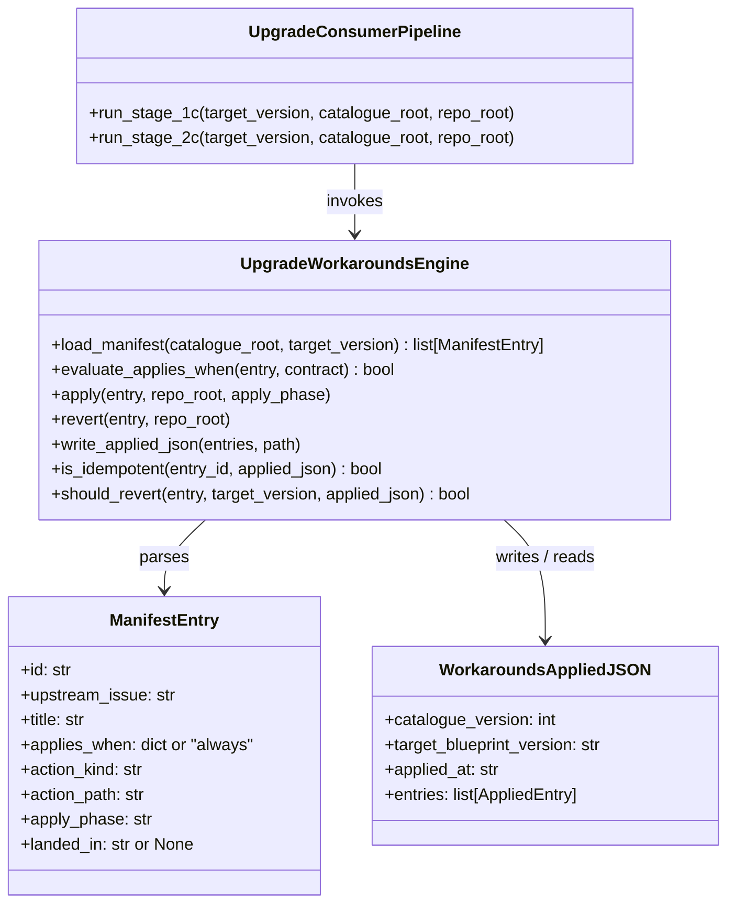
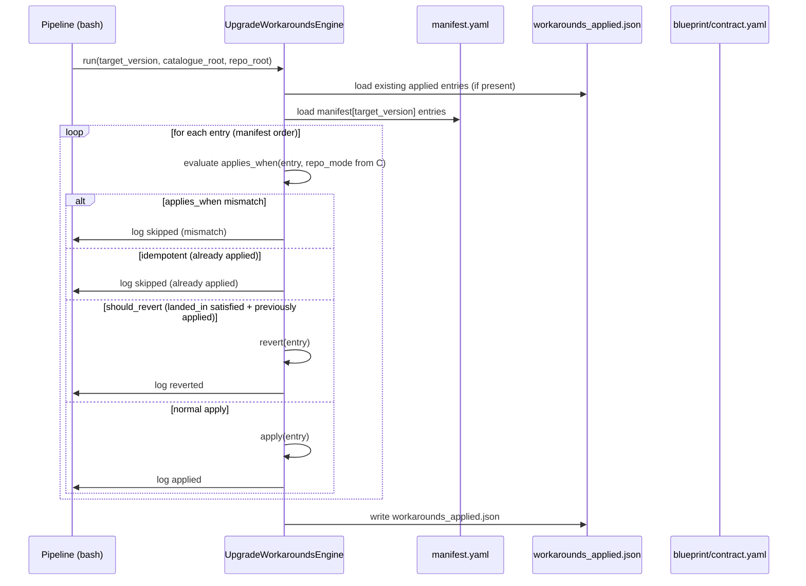
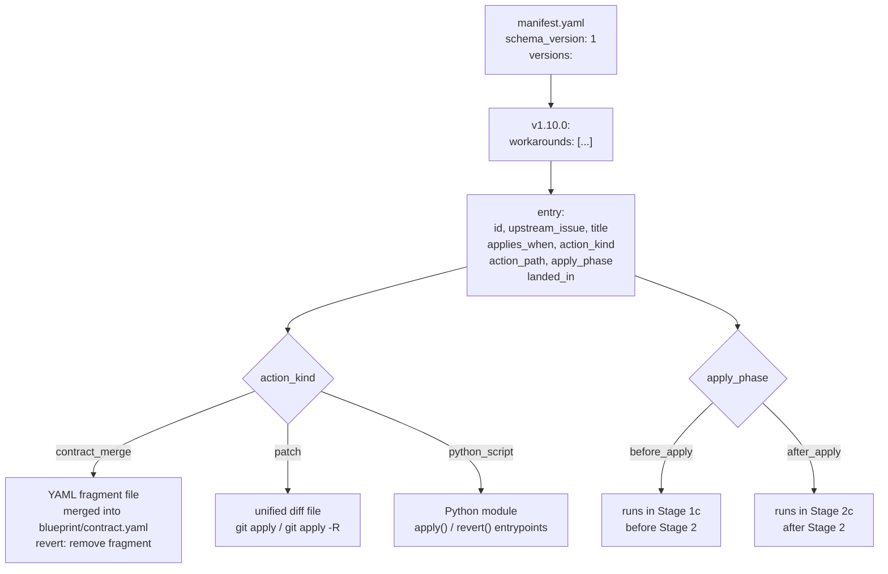

# Architecture

## Context
- Work item: issue-268-consumer-workarounds-catalogue
- Owner: blueprint engineering

## Bounded Contexts

### 1. Workaround Catalogue (blueprint-owned)
Canonical location: `.agents/skills/blueprint-consumer-upgrade/workarounds/`
Owner: blueprint authors (this repo).
Propagated to consumers on upgrade as part of the blueprint-managed skill tree.
Contains: `manifest.yaml` (root version index) and `v<N>/` directories with action files.

### 2. Pipeline Stage 1c (pipeline shell script)
Canonical location: `scripts/bin/blueprint/upgrade_consumer_pipeline.sh` — new sub-stage inserted between Stage 1b and Stage 2.
Invokes the Python workaround engine, passes target version and consumer repo root, writes the applied artefact.

### 3. Workaround Engine (Python library)
Canonical location: `scripts/lib/blueprint/upgrade_workarounds.py`.
Responsibilities: manifest loading, schema validation, `applies_when` evaluation, action dispatch (`contract_merge`, `patch`, `python_script`), idempotency check, revert logic, JSON artefact write.

### 4. Consumer Upgrade Artefacts (consumer-owned at runtime)
`artifacts/blueprint/workarounds_applied.json` — written by Stage 1c; read on the next upgrade run to decide revert eligibility.
`blueprint/contract.yaml` — mutated by `contract_merge` workarounds; its `repo_mode` field is the primary `applies_when` discriminator.

## Integration Edges

```
upgrade_consumer_pipeline.sh
  └─ Stage 1  (preflight: clean tree, valid ref, parseable contract)
  └─ Stage 1b (version pin diff — non-blocking)
  └─ Stage 1c (workaround apply/revert) ← NEW
       └─ upgrade_workarounds.py
            ├─ reads:  .agents/skills/blueprint-consumer-upgrade/workarounds/manifest.yaml
            ├─ reads:  artifacts/blueprint/workarounds_applied.json  (if present)
            ├─ reads:  blueprint/contract.yaml  (repo_mode for applies_when evaluation)
            ├─ writes: artifacts/blueprint/workarounds_applied.json
            └─ mutates consumer files per action_kind (apply_phase: before_apply)
  └─ Stage 2  (apply with delete)
  └─ Stage 2c (post-apply patch workarounds — apply_phase: after_apply) ← CONDITIONAL ON Q-1
  └─ Stages 3–10 (existing — unchanged)
```

## Key Design Decisions

### D-1: Catalogue lives in the skill tree (not in `scripts/`)
Rationale: `.agents/skills/` is blueprint-managed and propagated to consumers on upgrade. Placing the catalogue there means consumers always have the most recent catalogue after upgrading, without a separate sync step. Action files (Python scripts, unified diffs, YAML fragments) are co-located with the manifest.

### D-2: Single root `manifest.yaml` as the version index
Rationale: A single file is easier to validate, diff, and review than a glob of per-version manifests. Per-version *action* files live in `v<N>/` subdirectories referenced by `action_path`.

### D-3: Python library module (`upgrade_workarounds.py`) for all engine logic
Rationale: Shell handles stage chaining; all stateful logic (manifest parsing, idempotency check, JSON artefact, action dispatch) lives in Python for unit testability. Pattern follows `upgrade_pipeline_preflight.py` and `upgrade_consumer_resolve.py`.

### D-4: `apply_phase` field resolves the Stage-1c-vs-2c ordering problem (pending Q-1 confirmation)
Rationale: `before_apply` workarounds (consumer-owned files, e.g. `contract_merge` entries for `blueprint/contract.yaml`) run before Stage 2. `after_apply` workarounds (blueprint-managed files, e.g. `patch` on `scripts/lib/blueprint/*.py`) run after Stage 2 so Stage 2 does not overwrite the patch. Ordering is explicit in the manifest rather than implicit in the action kind, preserving forward-compatibility if new action kinds are added.

### D-5: Idempotency via `workarounds_applied.json` presence check
Rationale: Before applying any workaround, the engine checks if its id is already listed with `status: applied`. If so, it logs and exits without re-mutating. Allows Stage 1c to be re-run safely after a partial failure.

### D-6: Revert only when `landed_in` is satisfied AND entry was previously applied
Rationale: Revert is not attempted when `landed_in` is null (fix not yet tagged) or when the workaround id is absent from `workarounds_applied.json` (never applied in this consumer repo). Prevents spurious reversions on fresh consumers.

### D-7: `env_var` action kind excluded from initial scope
Rationale: Modifying `.envrc` creates persistent consumer environment state that is hard to revert reliably. No concrete v1.10.0 workaround requires it. Revisit if a future defect demands it.

## Component Diagram



## Sequence Diagram: Stage 1c — apply / revert decision loop



Caption: Revert check takes precedence over apply. Mismatch and idempotency checks are evaluated first to avoid unnecessary work.

## Manifest Schema Flow



Caption: Each catalogue entry declares both `action_kind` (what to do) and `apply_phase` (when in the pipeline to do it).

## ADR Reference
ADR path: `docs/blueprint/architecture/decisions/ADR-issue-268-consumer-workarounds-catalogue.md`
ADR status: proposed
