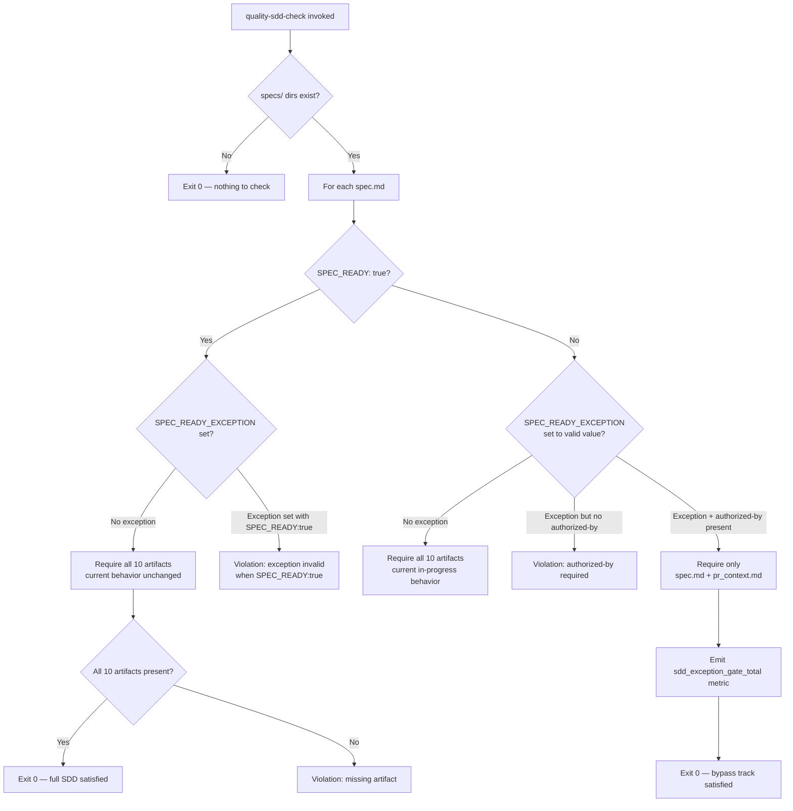

# Architecture

## Context
- Work item: issue #275 — lightweight SDD bypass track via SPEC_READY_EXCEPTION field
- Owner: blueprint maintainer
- Date: 2026-05-14

## Stack and Execution Model
- Backend stack profile: none
- Frontend stack profile: none
- Test automation profile: pytest
- Agent execution model: single-agent

## Problem Statement
- What needs to change and why: `check_sdd_assets.py` enforces a uniform 10-artifact SDD contract for every `specs/` directory. Non-feature change types (bug fix, refactor, upgrade, chore) are disproportionately burdened; the only current options are governance theater (10 stub artifacts) or ungoverned shortcuts (no spec at all). A field-gated bypass track reduces the required artifact set to `{spec.md, pr_context.md}` while preserving the audit trail via `authorized-by`.
- Scope boundaries: `check_sdd_assets.py`, `spec.md` scaffold template, `AGENTS.md` policy documentation.
- Out of scope: `check_spec_pr_ready.py` (already phase-gated), CI YAML workflows, consumer-repo `AGENTS.md` bootstrap-template propagation.

## Bounded Contexts and Responsibilities
- Context A — `spec.md` as exception declaration surface: the `SPEC_READY_EXCEPTION` and `authorized-by` fields in the Spec Readiness Gate section are the single source of truth for bypass-track status. No other artifact or environment variable governs the exception.
- Context B — `check_sdd_assets.py` as the enforcement surface: the only code that enforces artifact-existence requirements. Reads exception fields from each `spec.md`; applies reduced checks when exception is valid; emits metric; raises violation when `authorized-by` is absent.

## High-Level Component Design
- Domain layer: `SPEC_READY_EXCEPTION` + `authorized-by` fields in `spec.md` — declarative exception assertion.
- Application layer: `check_sdd_assets.py` — reads exception fields; branches gate logic; emits metric.
- Infrastructure adapters: none — the checker reads files from the local filesystem; no network or external service calls.
- Presentation/API/workflow boundaries: `make quality-sdd-check` → `check_sdd_assets.py`; no new CLI flags or make targets.

## Integration and Dependency Edges
- Upstream dependencies: `spec.md` scaffold template (updated to include new fields with `none` defaults).
- Downstream dependencies: `quality-hooks-fast` → `quality-sdd-check` → `check_sdd_assets.py`; metric output consumed by CI log parsers.
- Data/API/event contracts touched: `spec.md` Spec Readiness Gate section format (additive, backward-compatible).

## Gate Evaluation Flow (Before and After)

*Caption: Gate evaluation decision tree. Left branch is the unchanged full-SDD path; right branch is the new bypass track entered only when both `SPEC_READY_EXCEPTION` and `authorized-by` are valid.*

## Non-Functional Architecture Notes
- Security: `authorized-by` provides a human-readable audit trail recorded in git history; no machine authentication or secrets are introduced.
- Observability: `[METRIC] name=sdd_exception_gate_total value=1 type=<type> authorized_by=<handle>` follows the existing blueprint structured log metric format; no parser changes required.
- Reliability and rollback: setting `SPEC_READY_EXCEPTION: none` (or removing the field) immediately restores full-SDD validation; no migration step required.
- Monitoring/alerting: exception metric is visible in CI job logs; no new alerting required.

## Risks and Tradeoffs
- Risk 1: Exception-path specs skip machine-verifiable traceability (no `traceability.md` / `graph.json`). Mitigation: `pr_context.md` Requirement Coverage section is required and documents the evidence in prose; code review provides human verification.
- Tradeoff 1: `authorized-by` is a convention field (not cryptographically verified). An author could self-authorize. This is acceptable: the field creates a visible accountability trail in git history and CI logs; policy enforcement is via team process and code review.
