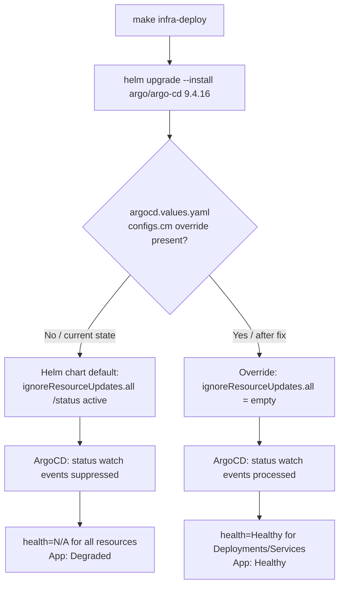

# Architecture

## Context
- Work item: issue-277-argocd-health-na
- Owner: sbonoc
- Date: 2026-05-14

## Stack and Execution Model
- Backend stack profile: none
- Frontend stack profile: none
- Test automation profile: pytest
- Agent execution model: single-agent

## Problem Statement
- What needs to change and why: The argo-cd Helm chart 9.4.16 ships a default `configs.cm` entry `resource.customizations.ignoreResourceUpdates.all: | jsonPointers: - /status` that suppresses all Kubernetes `.status` watch events across every resource type. In ArgoCD v3.x the health evaluator depends on these events to compute resource health; when they are suppressed, all resources remain at `health=N/A` indefinitely, causing the `platform-local-core` Application to report `Health: Degraded` even when every pod is running and ready. The blueprint's `argocd.values.yaml` does not currently override this key, so the Helm chart default takes effect. The fix is a single-key override that sets the value to empty string, restoring health evaluation.
- Scope boundaries: `infra/local/helm/core/argocd.values.yaml` and its bootstrap template only. Local lane exclusively.
- Out of scope: Cloud-lane ArgoCD topology, chart version bump, per-resource-type health customizations.

## Bounded Contexts and Responsibilities
- Context A — Blueprint infra config: owns `infra/local/helm/core/argocd.values.yaml` and `scripts/templates/infra/bootstrap/infra/local/helm/core/argocd.values.yaml`. Responsible for overriding Helm chart defaults that are incompatible with the local runtime profile.
- Context B — ArgoCD runtime: receives the `configs.cm` ConfigMap values via `helm upgrade --install` and applies them to health evaluation. No change required in this context; only blueprint-managed inputs change.

## High-Level Component Design
- Domain layer: N/A — no domain model code.
- Application layer: N/A.
- Infrastructure adapters: `infra/local/helm/core/argocd.values.yaml` — Helm values file that configures the ArgoCD `argocd-cm` ConfigMap.
- Presentation/API/workflow boundaries: N/A.

## Integration and Dependency Edges
- Upstream dependencies: argo-cd Helm chart 9.4.16 (argo/argo-cd) — blueprint reads its defaults; this fix overrides one key.
- Downstream dependencies: `core_runtime_bootstrap.sh` reads `argocd.values.yaml` and passes it to `helm upgrade --install`; ArgoCD's `argocd-cm` ConfigMap is regenerated on the next `make infra-deploy`.
- Data/API/event contracts touched: ArgoCD watch event processing for `.status` fields — restored to default (process all status updates).

## Non-Functional Architecture Notes
- Security: No change. No secrets or RBAC surfaces touched.
- Observability: This fix IS the observability improvement — ArgoCD health status becomes meaningful after the override is applied.
- Reliability and rollback: Reversible by removing the `configs.cm.resource.customizations.ignoreResourceUpdates.all` key from the values file and running `make infra-deploy`. No persistent state is affected.
- Monitoring/alerting: ArgoCD health rollup can be used for alerting once health=N/A is resolved.

## Risks and Tradeoffs
- Risk 1: Removing the all-resource `/status` suppression may increase reconciliation CPU on clusters with many active controllers. Mitigation: this is local Docker Desktop only; resource pressure is not a concern at this scale.
- Tradeoff 1: Setting the key to empty string disables ALL ignoreResourceUpdates for the `all` scope. Per-resource-type entries (argoproj.io_Application, argoproj.io_Rollout, HPA annotations) that the Helm chart also ships remain active via chart defaults and continue to reduce annotation churn for those specific types.

## Diagrams

Caption: After `make infra-deploy` with the fix applied, ArgoCD processes `.status` watch events normally and health evaluation produces correct results.
