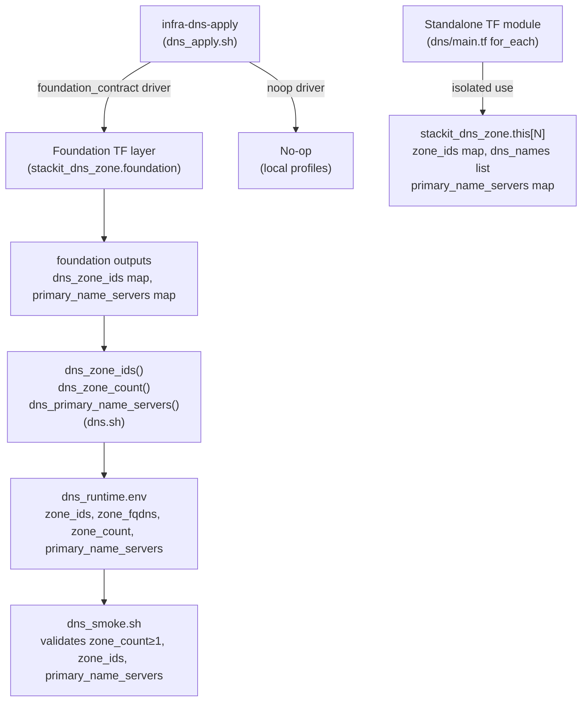

# Architecture

## Context
- Work item: 2026-05-17-issue-248-dns-module
- Owner: sbonoc
- Date: 2026-05-17

## Stack and Execution Model
- Backend stack profile: n/a — tooling/infrastructure-only change
- Frontend stack profile: n/a — tooling/infrastructure-only change
- Test automation profile: pytest
- Agent execution model: specialized-subagents-isolated-worktrees

## Problem Statement
- What needs to change and why: `infra/cloud/stackit/terraform/modules/dns/main.tf` is a stub with no `stackit_dns_zone` resource. The module cannot be used standalone for DNS zone provisioning. Additionally, the original single-zone design is insufficient — consumers provision N zones per environment (app zone, auth zone, observability zone). The shell layer needs multi-zone helpers and smoke needs to validate zone_count.
- Scope boundaries: Standalone TF module (multi-zone `for_each`), shell layer updates (zone_ids/zone_count/primary_name_servers helpers), smoke check strengthening, and test contract. All four DNS scripts and the `dns.sh` library are already in place.
- Out of scope: DNS record management, local-lane equivalent, external-DNS module, domain contract JSON pattern. Q-1 resolved (primary_name_server added per zone). Q-2 resolved (DNSSEC not configurable in v0.88.0; platform-managed).

## Bounded Contexts and Responsibilities

- **Standalone TF module** (`infra/cloud/stackit/terraform/modules/dns/`): Isolated provisioning context. Declares `stackit_dns_zone.this` as a `for_each` resource over `dns_zone_fqdns` (list). Zone display name: `{dns_naming_prefix}-dns-{sha1(fqdn)[0:8]}` (shell passes `{DNS_NAMING_PREFIX}-{active_stack}` as `dns_naming_prefix`). Exposes `zone_ids` (map), `dns_names` (list), and `primary_name_servers` (map) as outputs. No dependency on the foundation layer.
- **Shell layer** (`scripts/lib/infra/dns.sh`, `scripts/bin/infra/dns_*.sh`): Orchestration context. Reads zone contract from foundation outputs (STACKIT lane) or returns defaults (local lane). Writes `zone_ids`, `zone_fqdns`, `zone_count`, `primary_name_servers` to runtime state. Smoke validates zone_count ≥ 1, zone_ids non-empty, primary_name_servers non-empty.
- **Test contract** (`tests/infra/modules/dns/test_contract.py`): Quality context. Static assertions against TF module file structure (for_each, sha1 naming, plural outputs), shell function presence (dns_zone_ids, dns_zone_count, dns_primary_name_servers), state key presence, and smoke logic — no live infrastructure required.

## High-Level Component Design

_Foundation flow (left): apply.sh drives foundation TF and reads zone maps from outputs via multi-zone helpers. Standalone module (right): isolated direct provisioning of N zones via `for_each` without the foundation layer. Zone naming: `{DNS_NAMING_PREFIX}-{active_stack}-dns-{sha1(fqdn)[0:8]}`._

## Integration and Dependency Edges
- Upstream dependencies: `stackit_project_access` capability (confirmed via `dns_service_available` dependency in module.contract.yaml); STACKIT provider v0.88.0.
- Downstream dependencies: `public-endpoints` module references `DNS_ZONE_IDS` and `DNS_ZONE_FQDNS` for zone lookups; external-DNS references Gateway/Ingress hostnames for dynamic A/CNAME record creation.
- Data/API/event contracts touched: `artifacts/infra/dns_runtime.env` (keys: `zone_ids`, `zone_fqdns`, `zone_count`, `primary_name_servers`); `blueprint/modules/dns/module.contract.yaml` (outputs updated to DNS_ZONE_IDS, DNS_ZONE_COUNT, DNS_ZONE_FQDNS, DNS_PRIMARY_NAME_SERVERS; inputs updated to DNS_ZONE_FQDNS + DNS_NAMING_PREFIX).

## Non-Functional Architecture Notes
- Security: DNS zones carry no credentials. `zone_id` is a non-sensitive identifier. No secret store interaction required.
- Observability: Smoke check validates zone_count ≥ 1, zone_ids non-empty, primary_name_servers non-empty. Script output prefixed `[dns]`. Runtime state file is the operational artifact for operators.
- Reliability and rollback: `lifecycle { create_before_destroy = true }` MUST NOT be used on `stackit_dns_zone.this` — zone recreation requires coordinated record migration. Rollback is destroy + re-apply with confirmed record re-registration.
- Monitoring/alerting: No alerting additions. Smoke exit code is the operational health signal.

## Risks and Tradeoffs

- Risk 1 — Provider schema (resolved): Q-1 confirmed `primary_name_server` (single Computed FQDN per zone) is the only nameserver attribute in v0.88.0. Q-2 confirmed no DNSSEC attribute exists; DNSSEC is STACKIT platform-managed. Both resolutions are implemented.
- Risk 2 — DNS zone deletion is destructive: Unlike most resources, deleting a DNS zone that has live records propagated to external resolvers causes immediate resolution failures. The destroy sequence has no grace period. Consumers must be warned in the module README.
- Tradeoff 1 — Multi-zone `for_each` vs. single zone: The standalone module now mirrors the foundation's `for_each` pattern. Consumers pass `DNS_ZONE_FQDNS` as a space-separated list. Single-zone is a degenerate case (list with one element) — no API breakage for consumers who only need one zone.
