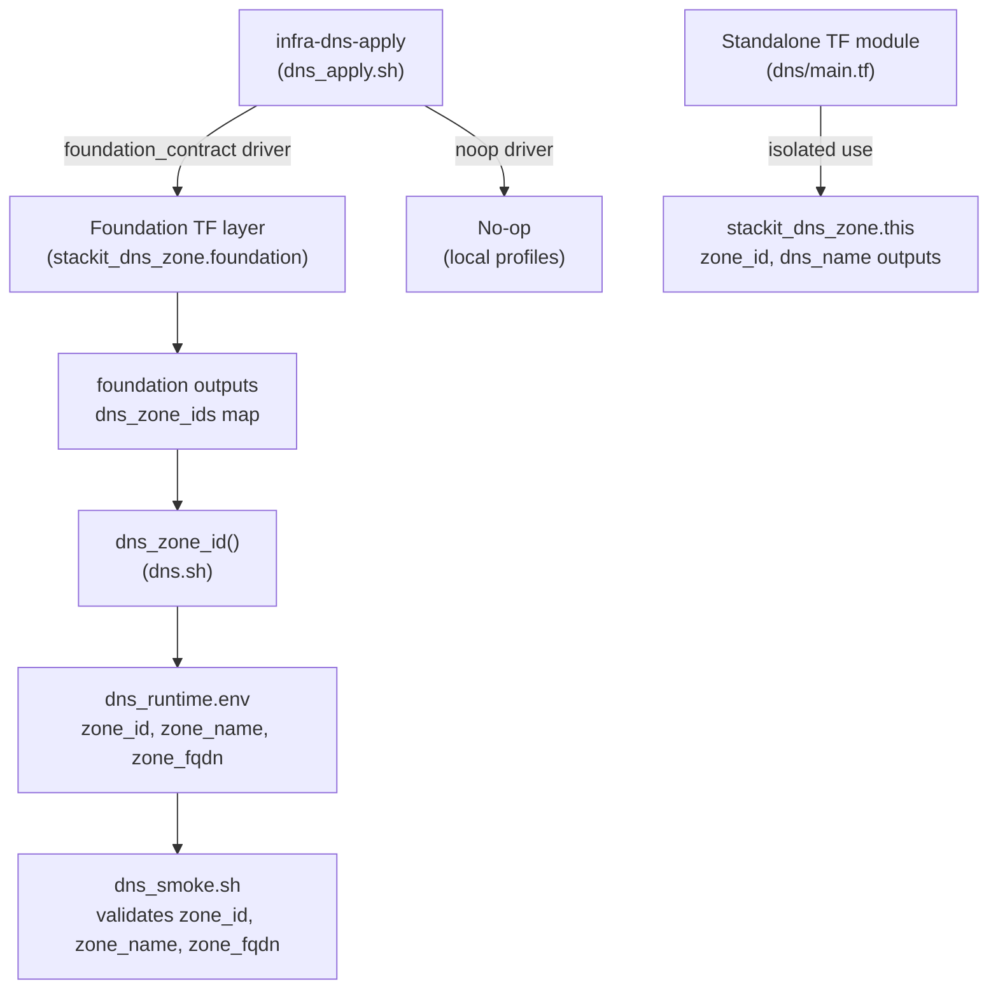

# Architecture

## Context
- Work item: 2026-05-17-issue-248-dns-module
- Owner: sbonoc
- Date: 2026-05-17

## Stack and Execution Model
- Backend stack profile: n/a — tooling/infrastructure-only change
- Frontend stack profile: n/a — tooling/infrastructure-only change
- Test automation profile: pytest
- Agent execution model: specialized-subagents-isolated-worktrees

## Problem Statement
- What needs to change and why: `infra/cloud/stackit/terraform/modules/dns/main.tf` is a 7-line stub with no `stackit_dns_zone` resource. The module cannot be used standalone for isolated DNS zone provisioning. Additionally, `dns_smoke.sh` validates only `zone_name`, leaving `zone_id` and `zone_fqdn` unchecked. No test contract file exists for the DNS module.
- Scope boundaries: Standalone Terraform module implementation, smoke check strengthening, and test contract. All four DNS scripts and the `dns.sh` library are already in place.
- Out of scope: DNS record management, local-lane equivalent, multi-zone provisioning, nameservers/DNSSEC TF attributes (pending Q-1/Q-2 resolution).

## Bounded Contexts and Responsibilities

- **Standalone TF module** (`infra/cloud/stackit/terraform/modules/dns/`): Isolated provisioning context. Declares one `stackit_dns_zone.this` resource. Accepts caller-supplied `stackit_project_id`, `dns_zone_name`, `dns_zone_fqdn`. Exposes `zone_id` and `dns_name` as outputs. No dependency on the foundation layer.
- **Shell layer** (`scripts/lib/infra/dns.sh`, `scripts/bin/infra/dns_*.sh`): Orchestration context. Already implemented. Reads zone contract from foundation outputs (STACKIT lane) or returns defaults (local lane). Writes `zone_id`, `zone_name`, `zone_fqdn` to runtime state. Smoke validates those keys are non-empty.
- **Test contract** (`tests/infra/modules/dns/test_contract.py`): Quality context. Static assertions against TF module file structure, state key presence, and smoke logic — no live infrastructure required.

## High-Level Component Design

_Foundation flow (left): apply.sh drives foundation TF and reads zone_id from the output map. Standalone module (right): isolated direct provisioning without the foundation layer._

## Integration and Dependency Edges
- Upstream dependencies: `stackit_project_access` capability (confirmed via `dns_service_available` dependency in module.contract.yaml); STACKIT provider v0.88.0.
- Downstream dependencies: `public-endpoints` module references `DNS_ZONE_ID` and `DNS_ZONE_FQDN` for CNAME/A record creation via ingress controller.
- Data/API/event contracts touched: `artifacts/infra/dns_runtime.env` (keys: `zone_id`, `zone_name`, `zone_fqdn`); `blueprint/modules/dns/module.contract.yaml` (outputs already declared — no change in this work item).

## Non-Functional Architecture Notes
- Security: DNS zones carry no credentials. `zone_id` is a non-sensitive identifier. No secret store interaction required.
- Observability: Smoke check validates three state keys. Script output prefixed `[dns]`. Runtime state file is the operational artifact for operators.
- Reliability and rollback: `lifecycle { create_before_destroy = true }` MUST NOT be used on `stackit_dns_zone.this` — zone recreation requires coordinated record migration. Rollback is destroy + re-apply with confirmed record re-registration.
- Monitoring/alerting: No alerting additions. Smoke exit code is the operational health signal.

## Risks and Tradeoffs

- Risk 1 — Provider schema uncertainty: `stackit_dns_zone` nameservers and DNSSEC attributes may or may not be available in v0.88.0. Foundation pattern omits them, which is strong evidence they are not used — but not conclusive. Q-1 and Q-2 must be resolved before SPEC_READY=true.
- Risk 2 — DNS zone deletion is destructive: Unlike most resources, deleting a DNS zone that has live records propagated to external resolvers causes immediate resolution failures. The destroy sequence has no grace period. Consumers must be warned in the module README.
- Tradeoff 1 — Single zone per module invocation vs. multi-zone: The foundation uses `for_each` to provision multiple zones. The standalone module provisions exactly one. This is simpler and sufficient for isolated use; multi-zone support is a future follow-up if needed.
