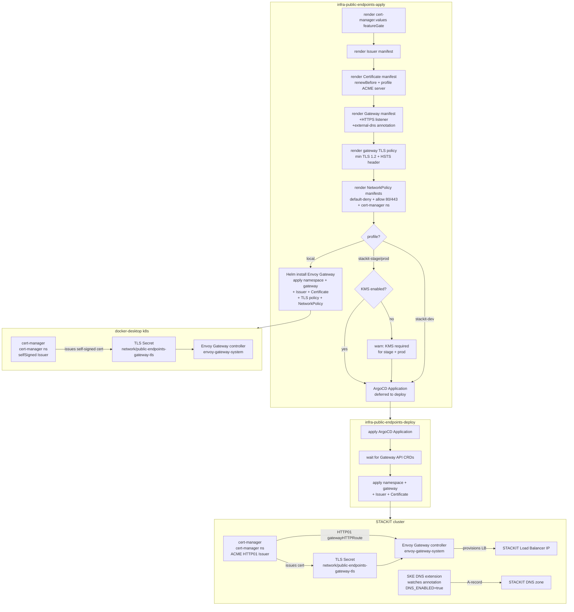

# Architecture

## Context
- Work item: 2026-05-17-issue-248-public-endpoints-module
- Owner: bonos
- Date: 2026-05-17

## Stack and Execution Model
- Backend stack profile: shell_plus_terraform_helm
- Frontend stack profile: none
- Test automation profile: pytest
- Agent execution model: specialized-subagents-isolated-worktrees

## Problem Statement
- What needs to change and why: The shared Gateway API edge currently exposes only an HTTP listener (port 80) with no TLS, no DNS automation, and no zero-trust security controls at the edge. Consumers need HTTPS for production workloads, automatic DNS record reconciliation, and platform-level security hardening so that after `infra-public-endpoints-apply`, the base domain resolves, TLS terminates at the Gateway, and the edge enforces minimum TLS version, HSTS, network isolation, and cert renewal.
- Scope boundaries: gateway manifest template (HTTPS listener + TLS policy + external-dns annotation), cert-manager feature gate, Issuer + Certificate rendering and apply (with profile-aware ACME server and `renewBefore`), gateway TLS policy manifest (TLS min version + HSTS), NetworkPolicy manifests for `network` namespace, AppProject edge whitelist updates, KMS module prod dependency check, module contract YAML, smoke validations, and test contract.
- Out of scope: standalone external-dns pod deployment, wildcard certs via DNS01, per-consumer Certificate management, HTTP→HTTPS redirect, STACKIT TF provider resources (stackit_provider_supported=false for public-endpoints).

## Bounded Contexts and Responsibilities
- **Platform edge context** (`network` namespace): Shared `GatewayClass` and `Gateway` managed by the public-endpoints module. The module owns the Issuer and platform-level Certificate in this namespace. Envoy Gateway controller runs in `envoy-gateway-system`.
- **Consumer route context** (app/data/security/etc. namespaces): Consumer apps create `HTTPRoute`, `Issuer`, and `Certificate` resources in their own namespaces, attaching to the shared Gateway via cross-namespace route attachment (`allowedRoutes.namespaces.from: All`).
- **DNS context**: STACKIT SKE DNS extension (provisioned by foundation TF when `DNS_ENABLED=true`) watches `external-dns.alpha.kubernetes.io/hostname` annotations on Gateway resources and reconciles A-records in the provisioned STACKIT DNS zones.
- **TLS issuance context**: cert-manager (core runtime, `cert-manager` namespace) processes `Issuer` and `Certificate` resources; creates HTTP01 challenge `HTTPRoute`s in the `network` namespace via the `gatewayHTTPRoute` solver; stores issued TLS certs as Kubernetes Secrets.

## High-Level Component Design

- **Domain layer**: cert-manager `Issuer` + `Certificate` CRDs; Gateway API `GatewayClass` + `Gateway` CRDs.
- **Application layer**: `public_endpoints.sh` (manifest rendering helpers — Issuer, Certificate, gateway TLS policy, NetworkPolicy), `public_endpoints_apply.sh` (orchestration + KMS prod warning), `public_endpoints_deploy.sh` (ArgoCD path), `public_endpoints_smoke.sh` (validation), `public_endpoints_destroy.sh` (Certificate → Issuer → gateway baseline ordering).
- **Infrastructure adapters**: Envoy Gateway Helm chart (controller); ArgoCD Application manifest (STACKIT deploy path); cert-manager core runtime (pre-existing).
- **Presentation/API/workflow boundaries**: `infra-public-endpoints-{plan,apply,deploy,smoke,destroy}` make targets; module contract YAML API surface.

## Integration and Dependency Edges
- **Upstream dependencies**: cert-manager core runtime (pre-existing, `core_runtime_bootstrap.sh`); Envoy Gateway controller (deployed by this module); Gateway API CRDs (installed by core bootstrap); DNS module (`DNS_ENABLED=true`) for SKE DNS extension to be active; foundation TF SKE cluster with `extensions.dns` wired; KMS module (`stackit-stage` and `stackit-prod` — required for Kubernetes Secret encryption at rest of TLS Secret and ACME account key; validates the security control in the last pre-production environment).
- **Downstream dependencies**: IAP module (attaches `SecurityPolicy` to shared Gateway); consumer HTTPRoutes (attach via cross-namespace `allowedRoutes`).
- **Data/API/event contracts touched**: `blueprint/modules/public-endpoints/module.contract.yaml` (new optional env vars); `appproject-edge.yaml` (expanded resource whitelist); `cert-manager.values.yaml` (feature gate addition); new rendered manifests: gateway TLS policy, NetworkPolicy (default-deny + allow).

## Non-Functional Architecture Notes
- **Security**: ACME private keys stored only as Kubernetes Secrets in `cert-manager` namespace; ACME email not written to state; namespace-scoped Issuer limits ACME account blast radius to `network` namespace. TLS 1.2 minimum enforced at the HTTPS listener (TLS 1.0/1.1 prohibited). HSTS `Strict-Transport-Security: max-age=31536000; includeSubDomains` served on all HTTPS responses — irreversible for 1 year after first client contact. NetworkPolicy defaults-deny the `network` namespace with explicit allows for public traffic (80/443) and cert-manager ACME challenge. TLS Secret readable only by Envoy Gateway controller SA (documented constraint). ACME server is profile-aware: staging for `stackit-dev`/`stackit-stage` (staging CA, not browser-trusted); production Let's Encrypt for `stackit-prod`. KMS module required for `stackit-stage` and `stackit-prod` to encrypt TLS Secret and ACME account key at rest in etcd; stage inclusion ensures the security control is validated before production promotion.
- **Observability**: Smoke validates all five contract keys (HTTPS listener, external-dns annotation, Issuer manifest, Certificate manifest, `cluster_issuer_name` in runtime state). cert-manager exposes `certificate_expiration_timestamp_seconds` Prometheus metric for expiry monitoring (opt-in, not wired in this work item).
- **Reliability and rollback**: Destroy deletes Certificate + Issuer before Gateway baseline; cert destruction invalidates active TLS sessions. Rollback: revert template changes and re-run apply; cert re-issuance takes up to 60s via HTTP01 challenge. DNS record TTL expiry (per zone TTL, typically 300s) must be accounted for after destroy.
- **Monitoring/alerting**: No new alerting. cert-manager's certificate expiry metric surfaces in observability module when enabled.

## Risks and Tradeoffs
- Risk 1: `gatewayHTTPRoute` HTTP01 challenge requires Envoy Gateway CRDs to be established before cert-manager places the challenge HTTPRoute. Mitigation: `public_endpoints_wait_for_gateway_api_crds` in the deploy phase already gates this; Certificate should be applied after gateway CRDs are confirmed.
- Risk 2: `ExperimentalGatewayAPISupport` feature gate is a breaking change to `cert-manager.values.yaml` — existing core bootstrap runs will pick up the new flag on next `infra-deploy`. Mitigation: the flag is additive and safe; cert-manager restarts gracefully with the new feature gate.
- Risk 3: HSTS header is effectively irreversible for the `max-age` duration (1 year). Removing the HTTPS listener after HSTS headers have been served will block all browser clients for up to 1 year. Mitigation: operators must plan HSTS expiry migration before removing the HTTPS listener; module README documents this as a destroy warning.
- Risk 4: NetworkPolicy in `network` namespace blocks direct pod-to-pod connections from other namespaces. Operator `kubectl port-forward` and debug pod access to Envoy proxy pods will be blocked from outside the `network` namespace. Mitigation: operators must use a pod within the `network` namespace for debugging; the policy can be temporarily relaxed during incident response.
- Risk 5: `stackit-stage` and `stackit-prod` deployments without KMS module proceed with a warning (non-fatal) — TLS Secret and ACME account key remain unencrypted at rest. Mitigation: treat the KMS warning as a hard blocker in both stage and prod runbooks; CI/CD pipeline should fail on warning for these profiles. Requiring KMS in stage ensures the setup is validated before production promotion.
- Tradeoff 1: Namespace-scoped `Issuer` (not `ClusterIssuer`) means each consumer namespace must create its own Issuer for consumer-specific certs. This is intentional — it matches the agentic-graphrag pattern and keeps cert lifecycle isolated per context.
- Tradeoff 2: Staging ACME server for `stackit-dev`/`stackit-stage` produces certificates not trusted by browsers. This is intentional — it prevents rate limit exhaustion on the production Let's Encrypt endpoint. Consumers must accept browser trust warnings in dev/stage environments or provision their own trusted certs.
