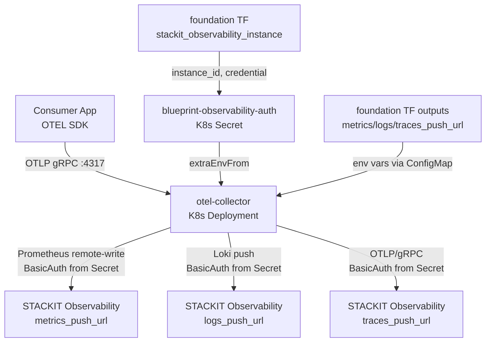
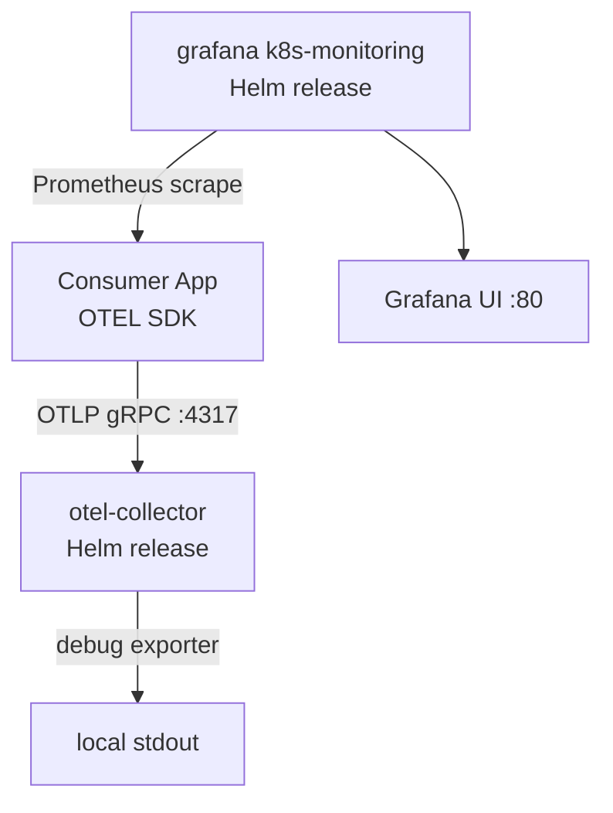
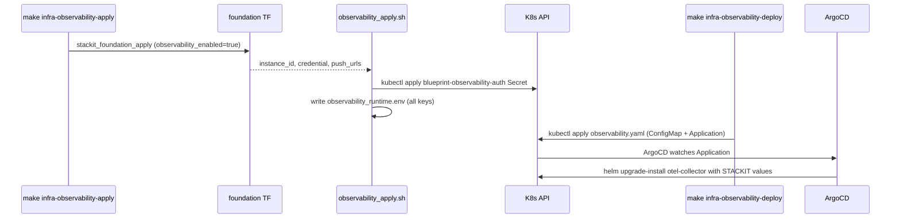

# Architecture

## Context
- Work item: issue-248-observability-module
- Owner: sbonoc
- Date: 2026-05-18

## Stack and Execution Model
- Backend stack profile: n/a — tooling/infrastructure-only change
- Frontend stack profile: n/a — tooling/infrastructure-only change
- Test automation profile: pytest
- Agent execution model: specialized-subagents-isolated-worktrees

## Problem Statement
- What needs to change and why: The STACKIT lane for the observability module has a dangling-endpoint bug — `observability_apply.sh` writes `OTEL_EXPORTER_OTLP_ENDPOINT=http://otel-collector.observability.svc.cluster.local:4317` to the runtime state file, but the otel-collector is never deployed on the STACKIT lane (only local lane deploys it via Helm). Consumer applications on STACKIT would push traces/metrics/logs to a non-existent in-cluster endpoint. Additionally, the foundation TF only exposes `observability_grafana_url` and instance/credential IDs — push URLs for logs, metrics, and traces are not surfaced to the shell layer or state file.
- Scope boundaries: Shell layer updates to `observability.sh`, `observability_apply.sh`, `observability_smoke.sh`, `observability_destroy.sh`; foundation TF output extension; new STACKIT otel-collector Helm values file; ArgoCD manifest updates for STACKIT environments (dev, stage, prod); module.contract.yaml update; unit tests; module README.
- Out of scope: Grafana k8s-monitoring on STACKIT lane (managed by STACKIT Observability), Faro browser telemetry endpoint, spanmetrics connector, retention policy shell contract, standalone Loki/Prometheus/Tempo on STACKIT.

## Bounded Contexts and Responsibilities
- Context A — Provisioning (foundation TF + shell layer): Terraform provisions `stackit_observability_instance` + `stackit_observability_credential` on STACKIT. Shell helpers source push URLs and credentials from foundation outputs, write state file, and reconcile the `blueprint-observability-auth` K8s Secret.
- Context B — Deployment (ArgoCD + Helm): ArgoCD deploys the otel-collector Helm release on the STACKIT lane. The collector reads credentials from the K8s Secret (via `extraEnvFrom`) and push URLs from env vars. The deploy script applies the ArgoCD Application manifest; ArgoCD syncs the Helm release into the cluster.

## High-Level Component Design
- Domain layer: Observability module contract — defines inputs (instance name, retention), outputs (OTEL endpoint, push URLs, API key), and module identity.
- Application layer: Shell wrappers (`observability_apply.sh`, `observability_deploy.sh`, `observability_smoke.sh`, `observability_destroy.sh`) orchestrate the two-phase provisioning: (1) Terraform foundation apply, (2) ArgoCD manifest deploy. The `observability.sh` lib exposes deterministic helper functions for all computed values.
- Infrastructure adapters:
  - STACKIT lane: `stackit_observability_instance` + `stackit_observability_credential` via foundation TF; `blueprint-observability-auth` K8s Secret reconciled by shell; otel-collector via ArgoCD+Helm with `infra/cloud/stackit/helm/observability/otel-collector.values.yaml`.
  - Local lane: crossplane+Helm deploys grafana k8s-monitoring + otel-collector using `infra/local/helm/observability/{grafana,otel-collector}.values.yaml` (existing, unchanged).
- Presentation/API/workflow boundaries: `OTEL_EXPORTER_OTLP_ENDPOINT=http://otel-collector.observability.svc.cluster.local:4317` is the single consumer-facing output on both lanes. Consumers use standard OTEL SDK env vars with no lane-specific branching.

## Integration and Dependency Edges
- Upstream dependencies:
  - STACKIT lane: `stackit_observability_instance` (foundation TF); `stackit_observability_credential` (foundation TF); ArgoCD available; STACKIT SKE cluster (K8s target).
  - Local lane: Docker Desktop Kubernetes; Helm available; grafana/k8s-monitoring chart; open-telemetry/opentelemetry-collector chart.
- Downstream dependencies: Consumer applications that set `OTEL_EXPORTER_OTLP_ENDPOINT` to the otel-collector DNS. The collector fans out signals to STACKIT backends (STACKIT lane) or Grafana/Loki/Tempo (local lane).
- Data/API/event contracts touched: `blueprint/modules/observability/module.contract.yaml` — adds 4 outputs; `infra/cloud/stackit/terraform/foundation/outputs.tf` — adds 3 observability push URL outputs; runtime state file `artifacts/infra/observability_runtime.env` — adds `logs_endpoint`, `metrics_endpoint`, `traces_endpoint`, `api_key` keys.

## Signal Flow Diagrams

### STACKIT Lane (Option A — selected)

### Local Lane (existing, unchanged)

### Two-Phase Apply/Deploy Sequence (STACKIT lane)

## Non-Functional Architecture Notes
- Security: STACKIT credential password delivered only via K8s Secret to otel-collector pod env vars (`extraEnvFrom`). Push URLs are non-sensitive and may appear in state file. `blueprint-observability-auth` Secret is removed on destroy.
- Observability: The otel-collector deployment itself MUST expose a health check endpoint (port 13133, `/`) for K8s readiness probes so ArgoCD health detection can confirm the deployment is healthy.
- Reliability and rollback: ArgoCD `syncPolicy.automated.selfHeal=true` continuously reconciles the collector. On destroy, ArgoCD Application is deleted first (via manifest delete), then foundation TF destroys the STACKIT instance and credential. The Secret is removed in the same destroy step.
- Monitoring/alerting: Module smoke (`infra-observability-smoke`) validates `otel_endpoint` format and the presence of all required state keys. Full end-to-end signal delivery to STACKIT (that data actually arrives) is out of scope for the smoke check — that requires STACKIT console verification.

## Risks and Tradeoffs
- Risk 1 (Q-1 — TF attribute names): `stackit_observability_instance` in provider v0.88.0 may not expose push URL attributes. Mitigation: verify via `terraform providers schema -json`; fall back to URL construction from instance ID + region if absent (Option B in spec). This is the only implementation blocker.
- Risk 2 (otel-collector values complexity): Configuring BasicAuth exporters in the OpenTelemetry Collector Helm chart requires careful `extraEnvFrom` + env-var substitution wiring. Mitigation: follow agentic-graphrag Langfuse pattern; validated locally before STACKIT.
- Tradeoff 1: In-cluster otel-collector on STACKIT adds a Kubernetes workload (CPU/memory). This is acceptable given the collector is lightweight and the abstraction benefit (identical consumer contract on both lanes) outweighs the resource cost.
- Tradeoff 2: Push URL env vars for the collector config must be injected at deploy time (they come from the runtime state written by the apply step). The ArgoCD Application manifest uses static Helm values that reference env vars injected from the Secret + a ConfigMap. This means the apply step must write the push URLs to a ConfigMap before deploy. (See FR-007 — this detail is resolved in the implementation slice.)
