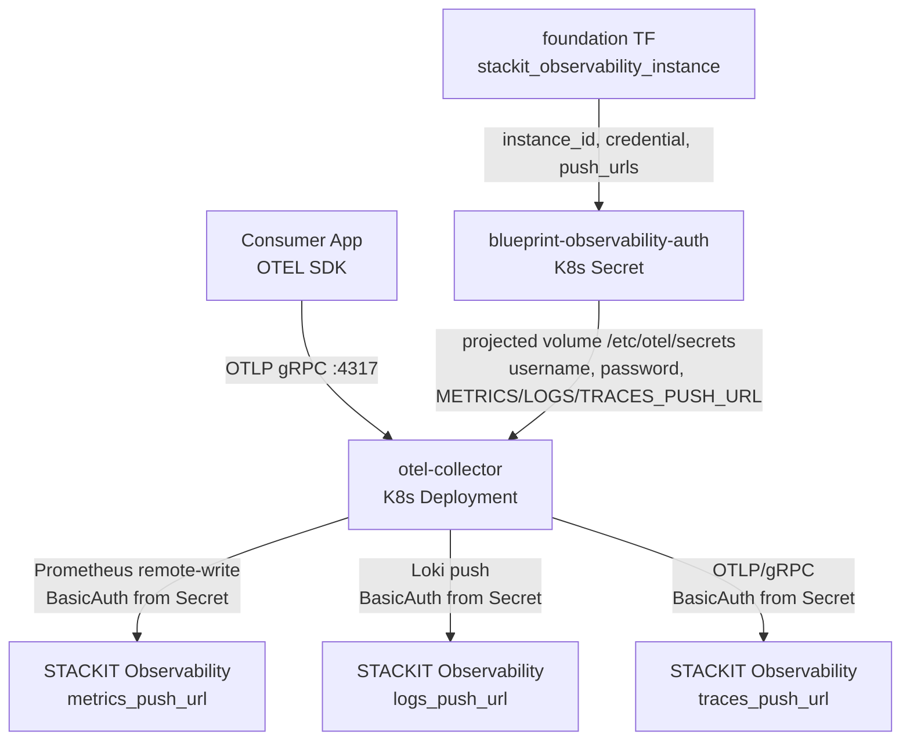
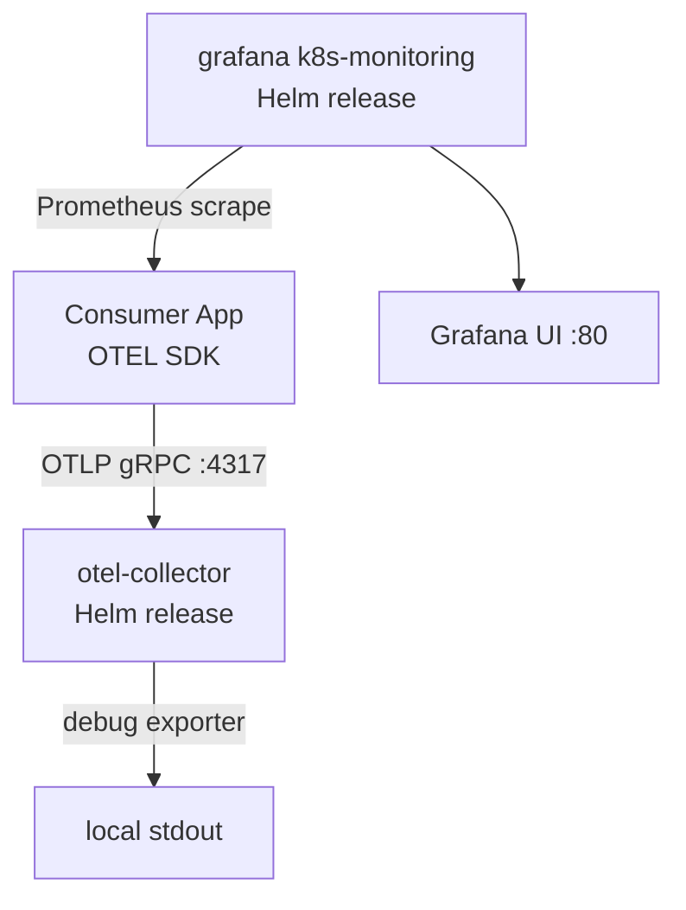
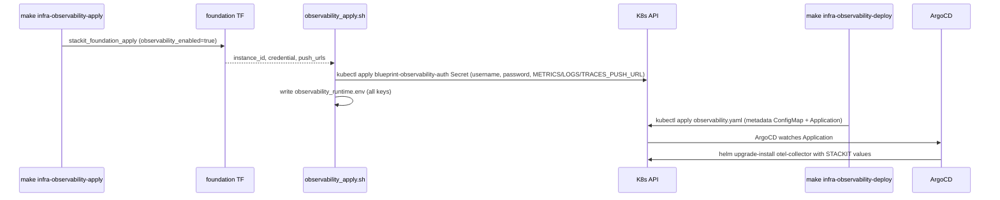

# Architecture

## Context
- Work item: issue-248-observability-module
- Owner: sbonoc
- Date: 2026-05-18

## Stack and Execution Model
- Backend stack profile: n/a — tooling/infrastructure-only change
- Frontend stack profile: n/a — tooling/infrastructure-only change
- Test automation profile: pytest
- Agent execution model: specialized-subagents-isolated-worktrees

## Problem Statement
- What needs to change and why: The STACKIT lane for the observability module has a dangling-endpoint bug — `observability_apply.sh` writes `OTEL_EXPORTER_OTLP_ENDPOINT=http://otel-collector.observability.svc.cluster.local:4317` to the runtime state file, but the otel-collector is never deployed on the STACKIT lane (only local lane deploys it via Helm). Consumer applications on STACKIT would push traces/metrics/logs to a non-existent in-cluster endpoint. Additionally, the foundation TF only exposes `observability_grafana_url` and instance/credential IDs — push URLs for logs, metrics, and traces are not surfaced to the shell layer or state file.
- Scope boundaries: Shell layer updates to `observability.sh`, `observability_apply.sh`, `observability_smoke.sh`, `observability_destroy.sh`; foundation TF output extension; new STACKIT otel-collector Helm values file; ArgoCD manifest updates for STACKIT environments (dev, stage, prod); module.contract.yaml update; unit tests; module README.
- Out of scope: Grafana k8s-monitoring on STACKIT lane (managed by STACKIT Observability), Faro browser telemetry endpoint, retention policy shell contract, standalone Loki/Prometheus/Tempo on STACKIT.

## Bounded Contexts and Responsibilities
- Context A — Provisioning (foundation TF + shell layer): Terraform provisions `stackit_observability_instance` + `stackit_observability_credential` on STACKIT. Shell helpers source push URLs and credentials from foundation outputs, write state file, and reconcile the `blueprint-observability-auth` K8s Secret.
- Context B — Deployment (ArgoCD + Helm): ArgoCD deploys the otel-collector Helm release on the STACKIT lane. The collector reads credentials and push URLs from files in `/etc/otel/secrets` (projected volume mount of `blueprint-observability-auth` K8s Secret) via the OTC file config provider. The deploy script applies the ArgoCD Application manifest; ArgoCD syncs the Helm release into the cluster.

## High-Level Component Design
- Domain layer: Observability module contract — defines inputs (instance name, retention), outputs (OTEL endpoint, push URLs, API key), and module identity.
- Application layer: Shell wrappers (`observability_apply.sh`, `observability_deploy.sh`, `observability_smoke.sh`, `observability_destroy.sh`) orchestrate the two-phase provisioning: (1) Terraform foundation apply, (2) ArgoCD manifest deploy. The `observability.sh` lib exposes deterministic helper functions for all computed values.
- Infrastructure adapters:
  - STACKIT lane: `stackit_observability_instance` + `stackit_observability_credential` via foundation TF; `blueprint-observability-auth` K8s Secret reconciled by shell; otel-collector via ArgoCD+Helm with `infra/cloud/stackit/helm/observability/otel-collector.values.yaml`.
  - Local lane: crossplane+Helm deploys grafana k8s-monitoring + otel-collector using `infra/local/helm/observability/{grafana,otel-collector}.values.yaml` (existing, unchanged).
- Presentation/API/workflow boundaries: `OTEL_EXPORTER_OTLP_ENDPOINT=http://otel-collector.observability.svc.cluster.local:4317` is the single consumer-facing output on both lanes. Consumers use standard OTEL SDK env vars with no lane-specific branching.

## Integration and Dependency Edges
- Upstream dependencies:
  - STACKIT lane: `stackit_observability_instance` (foundation TF); `stackit_observability_credential` (foundation TF); ArgoCD available; STACKIT SKE cluster (K8s target).
  - Local lane: Docker Desktop Kubernetes; Helm available; grafana/k8s-monitoring chart; open-telemetry/opentelemetry-collector chart.
- Downstream dependencies: Consumer applications that set `OTEL_EXPORTER_OTLP_ENDPOINT` to the otel-collector DNS. The collector fans out signals to STACKIT backends (STACKIT lane) or Grafana/Loki/Tempo (local lane).
- Data/API/event contracts touched: `blueprint/modules/observability/module.contract.yaml` — adds 4 outputs; `infra/cloud/stackit/terraform/foundation/outputs.tf` — adds 3 observability push URL outputs; runtime state file `artifacts/infra/observability_runtime.env` — adds `logs_endpoint`, `metrics_endpoint`, `traces_endpoint`, `api_key` keys.

## Signal Flow Diagrams

### STACKIT Lane (Option A — selected)

### Local Lane (existing, unchanged)

### Two-Phase Apply/Deploy Sequence (STACKIT lane)

## Non-Functional Architecture Notes
- Security: STACKIT credential password is delivered only via K8s Secret as read-only projected files mounted at `/etc/otel/secrets` (no env-var injection). Push URLs are non-sensitive and may appear in state file. `blueprint-observability-auth` Secret is removed on destroy.
- Observability: The otel-collector deployment itself MUST expose a health check endpoint (port 13133, `/`) for K8s readiness probes so ArgoCD health detection can confirm the deployment is healthy.
- Reliability and rollback: ArgoCD `syncPolicy.automated.selfHeal=true` continuously reconciles the collector. On destroy, the ArgoCD observability Application manifest is deleted first, then `observability_delete_runtime_secret()` removes `blueprint-observability-auth`, and finally `optional_module_destroy_foundation_contract` destroys the STACKIT instance and credential via foundation TF.
- Monitoring/alerting: Module smoke (`infra-observability-smoke`) validates `otel_endpoint` format and the presence of all required state keys. Full end-to-end signal delivery to STACKIT (that data actually arrives) is out of scope for the smoke check — that requires STACKIT console verification.

## Risks and Tradeoffs
- Risk 1 (Q-1 — resolved 2026-05-19): `stackit_observability_instance` in provider v0.88.0 exposes `metrics_push_url`, `logs_push_url`, `otlp_grpc_traces_url` as computed attributes (confirmed from provider source). No URL construction fallback needed. Decision recorded in PR #308 comment.
- Risk 2 (otel-collector values complexity): Configuring BasicAuth exporters in the OpenTelemetry Collector Helm chart requires careful projected Secret mount + `${file:/etc/otel/secrets/...}` wiring. Mitigation: follow the established consumer pattern; validated locally before STACKIT.
- Tradeoff 1: In-cluster otel-collector on STACKIT adds a Kubernetes workload (CPU/memory). This is acceptable given the collector is lightweight and the abstraction benefit (identical consumer contract on both lanes) outweighs the resource cost.
- Tradeoff 2: Push URL entries are bundled into `blueprint-observability-auth` Secret alongside the credential (username/password) by `observability_reconcile_runtime_secret()` after foundation TF outputs are available. The ArgoCD Application uses static inline Helm values; push URLs and credentials reach the collector exclusively via mounted Secret files read through `${file:/etc/otel/secrets/...}` from the single Secret. No separate ConfigMap is needed.
