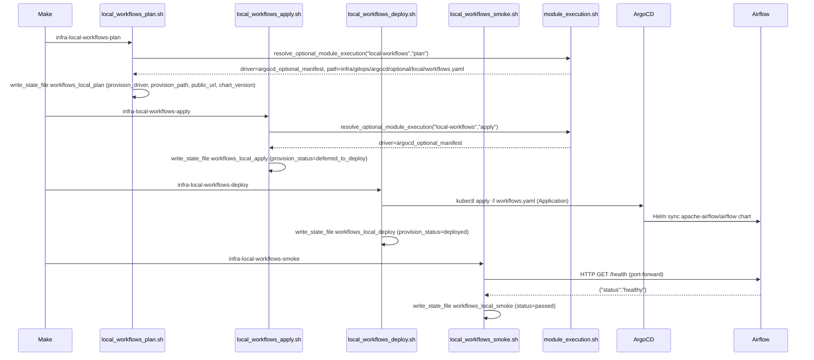
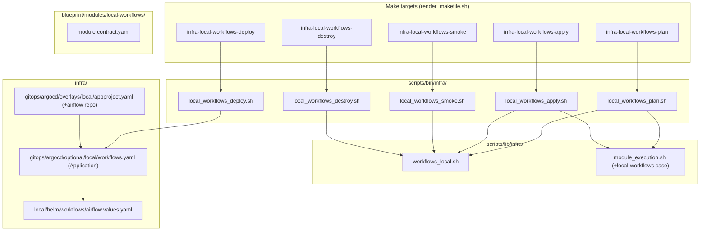

# Architecture

## Context
- Work item: 2026-05-20-issue-248-workflows-local-lane
- Owner: bonos
- Date: 2026-05-20

## Stack and Execution Model
- Backend stack profile: shell_plus_bash
- Frontend stack profile: none
- Test automation profile: pytest_static_analysis
- Agent execution model: specialized-subagents-isolated-worktrees

## Problem Statement
- What needs to change and why: PR #314 added the STACKIT lane for managed Airflow; the SDD-C-014 exception in that spec deferred a local lane. This work item adds Apache Airflow on Docker Desktop Kubernetes so engineers can develop and test DAGs without a STACKIT account.
- Scope boundaries: Shell scripts + lib, Helm values, ArgoCD Application manifest, contract YAML, contract tests, README update.
- Out of scope: STACKIT lane modifications, CeleryExecutor/KubernetesExecutor, production tuning, Python version coexistence strategy (separate backlog item).

## Bounded Contexts and Responsibilities
- Local lane scripts (`local_workflows_*.sh`): Guard on `WORKFLOWS_LOCAL_ENABLED`, call `workflows_local_init_env()`, route through `module_execution.sh`, write state files.
- `workflows_local.sh` lib: Env var validation, defaults, helper functions (public URL, chart version accessor).
- ArgoCD + Helm layer: Deploy `apache-airflow/airflow` chart to `data` namespace on Docker Desktop Kubernetes.
- git-sync sidecar: Pull DAGs from the configured git repository into the Airflow pod.
- Local Keycloak OIDC: Authenticate Airflow webserver users via Flask-AppBuilder OIDC (`webserverConfig.py` override in Helm values).

## High-Level Component Design
- Domain layer: none (infrastructure provisioning only)
- Application layer: Apache Airflow (webserver + scheduler + git-sync sidecar) deployed via Helm in `data` namespace
- Infrastructure adapters: `module_execution.sh` dispatch (`local-workflows:* → argocd_optional_manifest`); ArgoCD Application manifest; `appproject.yaml` sourceRepos extension
- Presentation/API/workflow boundaries: Airflow webserver HTTP on port 8080 (port-forwarded for local dev); smoke check via `/health` endpoint

## Integration and Dependency Edges
- Upstream dependencies: Docker Desktop Kubernetes (context: `docker-desktop`); ArgoCD in-cluster; local Keycloak realm with `airflow-local` OIDC client; DAG git repository with token access
- Downstream dependencies: none — local lane is a leaf module
- Data/API/event contracts touched: New `WORKFLOWS_LOCAL_*` env vars; new make targets via `render_makefile.sh`; new `module_execution.sh` dispatch case; `appproject.yaml` sourceRepos; `docs/platform/modules/workflows/README.md` Local Lane section

## Architecture Decision: module_execution.sh Dispatch (OPTION_A selected)

The local lane adds a `local-workflows:*` case to `module_execution.sh` returning `argocd_optional_manifest`, consistent with neo4j and langfuse. The STACKIT lane (`stackit_workflows_*.sh`) bypasses `module_execution.sh` — that pattern is not replicated here since `argocd_optional_manifest` has a direct analogue in the dispatch table and centralized routing is the established convention for ArgoCD-backed local modules.

## Diagram 1 — Provisioning Sequence

The sequence below shows the lifecycle of a local Airflow deployment from `make infra-local-workflows-plan` through smoke.

_Caption: Full local lane lifecycle — plan resolves ArgoCD manifest path; apply defers; deploy syncs Helm chart via ArgoCD; smoke confirms webserver health._

## Diagram 2 — Component Structure

The diagram below shows the new files and their relationships within the repository.

_Caption: New scripts source `workflows_local.sh` for env setup and `module_execution.sh` for driver dispatch; the ArgoCD Application references the Helm values file._

## Helm Chart Configuration

| Setting | Value | Rationale |
|---|---|---|
| Chart | `apache-airflow/airflow` | Official Apache Airflow Helm chart |
| Repo | `https://airflow.apache.org` | Official chart repo; must be added to `appproject.yaml` |
| Version | [NEEDS CLARIFICATION — Q-1] | Pin in `versions.sh` as `WORKFLOWS_LOCAL_AIRFLOW_HELM_CHART_VERSION_PIN` |
| Executor | `LocalExecutor` | No Redis dependency; appropriate for Docker Desktop Kubernetes |
| DAG sync | `dags.gitSync` sidecar | Parity with STACKIT lane DAG loading behavior |
| Namespace | `data` | Consistent with neo4j local lane |
| Helm release | `blueprint-workflows-local` | Namespaced to avoid collision |

## Non-Functional Architecture Notes
- Security: `WORKFLOWS_LOCAL_DAGS_REPO_TOKEN` and `WORKFLOWS_LOCAL_OIDC_CLIENT_SECRET` consumed via Kubernetes Secrets by the Airflow pod; never written to state files. State files are `.env` format with no sensitive keys.
- Observability: Local lane Airflow webserver logs available via `kubectl logs`; no Prometheus/Grafana integration required for local dev.
- Reliability and rollback: `local_workflows_destroy.sh` deletes the ArgoCD Application and removes state files. Re-run `make infra-local-workflows-plan && make infra-local-workflows-apply && make infra-local-workflows-deploy` to redeploy.
- Monitoring/alerting: Not applicable for local lane.

## Impact on Existing STACKIT Workflows Module
- `scripts/lib/infra/workflows.sh` is NOT modified; local lane functions live in the new `workflows_local.sh`.
- `blueprint/modules/workflows/module.contract.yaml` is NOT modified; the local lane has its own contract at `blueprint/modules/local-workflows/module.contract.yaml`.
- The SDD-C-014 exception recorded in `specs/2026-05-20-issue-248-workflows-module/spec.md` is resolved by this work item.

## Risks and Tradeoffs
- Risk 1: Docker Desktop Kubernetes resource pressure — Airflow with git-sync sidecar adds significant memory load. Mitigated by conservative resource limits in `airflow.values.yaml`.
- Risk 2: Airflow Helm chart breaking changes between versions — Mitigated by pinning chart version in `versions.sh` and gating upgrades through the standard version-bump process.
- Tradeoff 1: `LocalExecutor` vs. `CeleryExecutor` — `LocalExecutor` chosen for simplicity; sufficient for local DAG development. CeleryExecutor would require Redis which adds overhead.
- Tradeoff 2: `webserverConfig.py` OIDC vs. OAuth2-proxy — native Airflow Flask-AppBuilder OIDC chosen; avoids IAP module dependency and extra pod overhead.
