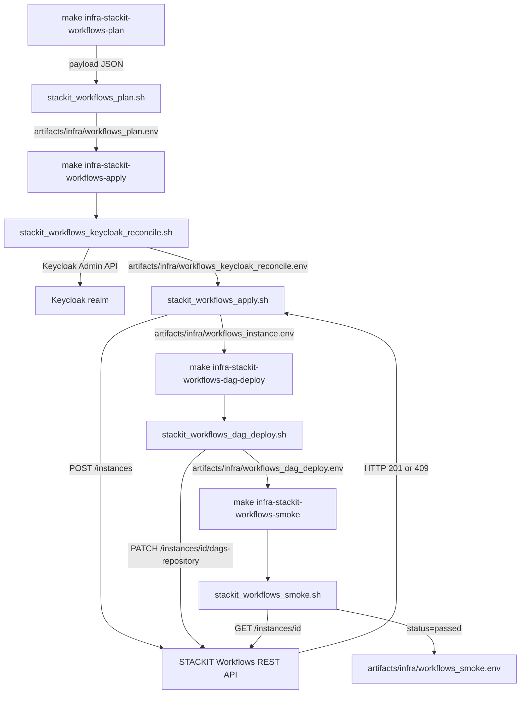
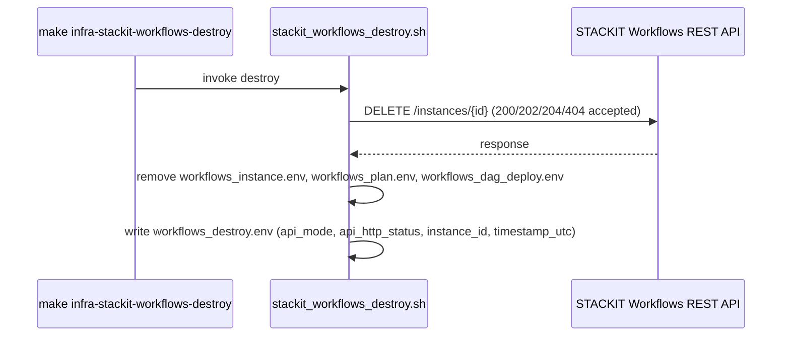
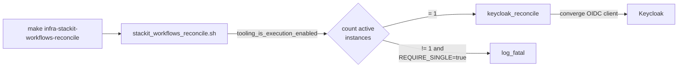

# Architecture

## Context
- Work item: issue-248-workflows-module
- Owner: sbonoc
- Date: 2026-05-20

## Stack and Execution Model
- Backend stack profile: bash_shell_contract — REST API (no Terraform provider resource)
- Frontend stack profile: n/a — tooling/infrastructure-only change
- Test automation profile: pytest_unit
- Agent execution model: automated

## Problem Statement
- What needs to change and why: The STACKIT Workflows module (managed Apache Airflow) is fully implemented at the shell layer — provisioning scripts, API helpers, Keycloak reconciliation, DAG deploy, smoke, destroy, make targets, module.contract.yaml, and ArgoCD ConfigMap all exist. However, there are zero automated tests (`tests/infra/modules/workflows/` contains only a README), the module is not registered in `test_pyramid_contract.json`, and the module README is a generated contract summary stub. This work item adds the missing test coverage and documentation to meet the SDD quality gate.
- Scope boundaries: Add `tests/infra/modules/workflows/test_contract.py` (≥ 15 assertions), register it in `test_pyramid_contract.json`, and update `docs/platform/modules/workflows/README.md` with full provisioning documentation. All shell scripts, API helpers, module.contract.yaml, and ArgoCD ConfigMap are unchanged.
- Out of scope: Terraform provider resource for workflows (none exists in v0.96.0), STACKIT TF provider upgrade (deferred per Q-1), ArgoCD Application (API-provisioned module — metadata ConfigMap only), local lane Airflow support (STACKIT-only by design; local lane is a separate future work item).

## Bounded Contexts and Responsibilities
- Context A — Provisioning (REST API contract): `stackit_workflows_plan.sh` generates the JSON payload and plan state. `stackit_workflows_apply.sh` calls the STACKIT Workflows REST API (`POST /projects/{id}/regions/{region}/instances`), handles HTTP 409 idempotency, and writes the instance state file. `stackit_workflows_reconcile.sh` enforces cardinality (single-instance constraint) and converges the Keycloak OIDC client.
- Context B — Keycloak OIDC (identity contract): `stackit_workflows_keycloak_reconcile.sh` upserts a confidential OIDC client in the configured Keycloak realm with roles `Admin,User,Viewer,Op`, the resolved `web_url` added to redirect URIs, and writes a reconcile state file.
- Context C — DAG Deployment (repository contract): `stackit_workflows_dag_deploy.sh` PATCHes the DAG repository on the existing instance via `/instances/{id}/dags-repository` and writes a deploy state file. `stackit_workflows_dag_parse_smoke.sh` validates that no `*dag*.py` files are misplaced under `apps/` (DAGs must live under repo-root `dags/`).
- Context D — Smoke and Observability: `stackit_workflows_smoke.sh` validates `health_status=Active` in the state file and, when `tooling_is_execution_enabled`, fetches live instance status from the API and verifies DAG repository configuration.
- Context E — Test and Documentation (this work item): `test_contract.py` asserts state file structures, security properties, shell helper behaviour, module contract YAML contents, and make target registration. `README.md` documents the full provisioning lifecycle.

## High-Level Component Design
- Domain layer: Workflows module contract (`module.contract.yaml`) — defines required env vars, Keycloak reconciliation contract, API request contract, outputs (instance_id, instance_fqdn, web_url, health_status), and cleanup contract.
- Application layer: Shell wrappers in `scripts/bin/infra/stackit_workflows_*.sh` orchestrate the multi-phase lifecycle: plan → apply (Keycloak reconcile + API create) → dag-deploy → smoke → destroy. Library helpers in `scripts/lib/infra/workflows.sh` and `scripts/lib/infra/workflows_api.sh` compute state, construct API payloads, and execute REST calls with proper Bearer auth and HTTP code validation.
- Infrastructure adapters:
  - STACKIT lane: STACKIT Workflows REST API (`https://workflows.api.stackit.cloud/v1alpha`) — HTTP POST/GET/PATCH/DELETE with Bearer token auth; instance state in `artifacts/infra/workflows_instance.env`; plan state in `artifacts/infra/workflows_plan.env`.
  - Keycloak lane: Keycloak Admin REST API — confidential OIDC client upsert with roles mapper; state in `artifacts/infra/workflows_keycloak_reconcile.env`.
  - ArgoCD metadata lane: ConfigMap at `infra/gitops/argocd/optional/${ENV}/workflows.yaml` marks the module as enabled in ArgoCD's view; no ArgoCD Application is deployed (Workflows is API-provisioned, not Helm-deployed).
- TF stub: `infra/cloud/stackit/terraform/modules/workflows/main.tf` is intentionally empty — no Terraform provider resource for `stackit_workflows_instance` exists as of provider v0.96.0 (latest). The REST API contract is the intentional provisioning path.
- Presentation/API/workflow boundaries: `STACKIT_WORKFLOWS_WEB_URL` and `STACKIT_WORKFLOWS_INSTANCE_FQDN` are the consumer-facing outputs. Consumers integrate Airflow via the web URL and configure DAG repository integration via the make targets.

## Integration and Dependency Edges
- Upstream dependencies:
  - STACKIT lane: STACKIT project access, STACKIT Secrets Manager (credentials), Keycloak OIDC realm, STACKIT Observability instance (`STACKIT_OBSERVABILITY_INSTANCE_ID`).
  - DAG repository: git-compatible host with HTTPS access (`.git` URL required), read credentials.
- Downstream dependencies: Consumer DAG authors point `STACKIT_WORKFLOWS_DAGS_REPO_URL` at their DAG repository. Consumer platform tooling reads `STACKIT_WORKFLOWS_WEB_URL` for integration links.
- Data/API/event contracts touched: `scripts/lib/quality/test_pyramid_contract.json` (add `tests/infra/modules/workflows/test_contract.py` under `unit` scope); `docs/platform/modules/workflows/README.md` (full write from stub to complete docs). `blueprint/modules/workflows/module.contract.yaml` is read-only in this work item — already complete.

## Signal Flow Diagrams

### Provisioning Flow (STACKIT lane)

### Destroy Flow (STACKIT lane)

### Reconcile Flow (single-instance guard)

## Non-Functional Architecture Notes
- Security: `STACKIT_WORKFLOWS_DAGS_REPO_TOKEN` and `STACKIT_WORKFLOWS_OIDC_CLIENT_SECRET` MUST NOT appear as keys in any `.env` state file. The DAG repository token is embedded in `artifacts/infra/workflows_request_payload.json` (a transient JSON artifact); it is passed to the API at apply time and is never written to any `.env` state file. `workflows_api_request()` receives the Bearer token from `STACKIT_SERVICE_ACCOUNT_TOKEN` (standard STACKIT auth env var) and does not log response bodies that may contain credentials.
- Observability: `stackit_workflows_smoke.sh` validates `health_status=Active` in the state file. When `tooling_is_execution_enabled`, it also fetches live status from the API. Full smoke state is written to `artifacts/infra/workflows_smoke.env`.
- Reliability and rollback: HTTP 409 on the create endpoint is handled idempotently — the apply script GETs the existing instance list, finds by display name, and continues. No duplicate instances are created. Destroy accepts 404 (already deleted) as success.
- Monitoring/alerting: Module smoke (`infra-stackit-workflows-smoke`) validates `health_status=Active` in the state file and live API status (when execution-enabled). Full end-to-end DAG execution validation is out of scope for smoke — that requires manual verification in the Airflow UI.

## Risks and Tradeoffs
- Risk 1 (Q-1 — deferred): STACKIT Terraform provider is pinned at v0.88.0; latest is v0.96.0. No functional impact on this work item (workflows uses REST API, not TF). Provider upgrade deferred to a separate work item. Decision recorded in spec.md Q-1.
- Risk 2 (REST API breaking changes): STACKIT Workflows API is at `v1alpha` — API shape may change. Mitigation: `workflows_api_request()` validates HTTP codes explicitly; `workflows_api_json_pick()` uses `jq` with explicit field paths; a schema change will fail fast at parse time with a clear error.
- Tradeoff 1 (REST API vs TF): No TF provider resource exists as of v0.96.0. The REST API contract pattern (`provision_driver=api_contract`) is the established blueprint alternative; `stackit_workflows_plan.sh` generates the TF-equivalent plan artifact for auditability.
- Tradeoff 2 (no local lane): STACKIT Workflows is a cloud-only managed Airflow service. No local equivalent is provided in this work item. Local Airflow via Helm (apache-airflow chart) is a plausible future extension but is explicitly out of scope here to keep blast radius minimal and deliver test coverage first.
