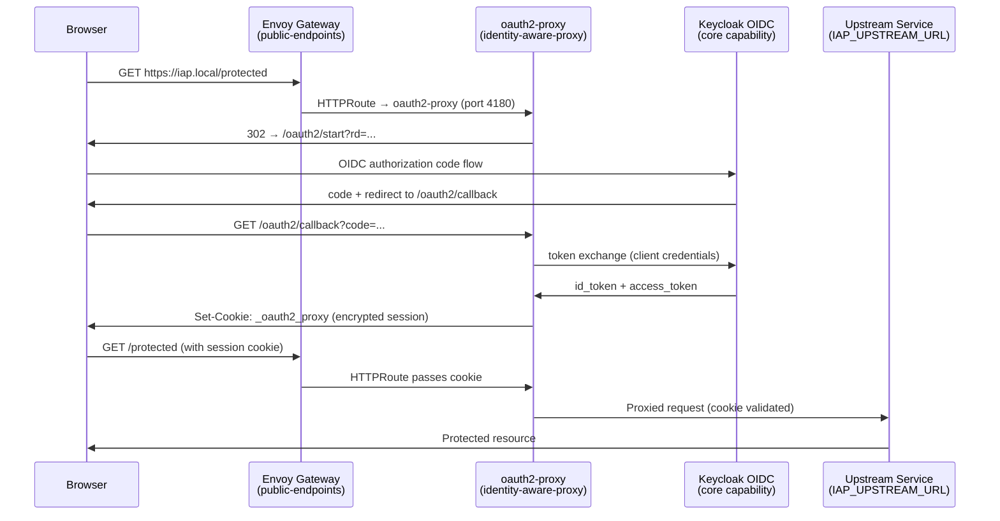

# Architecture

## Context
- Work item: `specs/2026-05-21-issue-248-identity-aware-proxy/`
- Owner: Platform Engineering
- Date: 2026-05-21

## Stack and Execution Model
- Backend stack profile: n/a — tooling/infrastructure-only change
- Frontend stack profile: n/a — tooling/infrastructure-only change
- Test automation profile: n/a — documentation-only deliverable
- Agent execution model: specialized-subagents-isolated-worktrees

## Problem Statement
- What needs to change and why: The `identity-aware-proxy` module was implemented in pre-SDD commits. All lifecycle scripts, library helpers, Helm values, and the module contract exist. The README is thin — it lacks the environment variable table, make target descriptions, provisioning lifecycle steps, security contract documentation, and teardown section. The bootstrap template mirror has the same gaps. Issue #248 cannot be closed with this remaining module lacking SDD compliance artifacts.
- Scope boundaries: README hardening for both the live README and its bootstrap template mirror. No implementation changes to any script, Helm value, Terraform module, or contract file.
- Out of scope: New module features, IAP policy changes, Keycloak realm automation, ArgoCD manifest changes.

## Bounded Contexts and Responsibilities

- **Platform blueprint context** — owns the `identity-aware-proxy` optional module contract, lifecycle scripts, Helm values scaffold, and documentation. This work item operates entirely within this context.
- **Consumer context** — consumes the module by setting `IDENTITY_AWARE_PROXY_ENABLED=true` and providing env vars; creates the Keycloak OIDC client and configures `IAP_UPSTREAM_URL` to point at their upstream service. Out of scope for this work item.

## High-Level Component Design

No new components. The existing architecture (unchanged by this PR):

Caption: Browser OIDC login flow through the shared Envoy Gateway — oauth2-proxy intercepts, authenticates via Keycloak, and proxies authenticated requests to the upstream service.

## Integration and Dependency Edges

- **Upstream dependencies:**
  - `public-endpoints` module — MUST be enabled and running; provides the shared Envoy Gateway (`PUBLIC_ENDPOINTS_GATEWAY_NAME` in namespace `PUBLIC_ENDPOINTS_NAMESPACE`) that the `HTTPRoute` attaches to.
  - Keycloak (core capability) — MUST be available; provides OIDC issuer URL, client ID, client secret.
  - ESO (STACKIT lane) — delivers `iap-runtime-credentials` Secret to the `security` namespace from the STACKIT Secret Store.
- **Downstream dependencies:** Upstream service at `IAP_UPSTREAM_URL` (consumer-owned).
- **Data/API/event contracts touched:** None — this PR changes documentation only.

## Non-Functional Architecture Notes

- **Security:** `IAP_COOKIE_SECRET` (16/24/32 bytes) and `KEYCLOAK_CLIENT_SECRET` are the two secrets in scope. Neither appears in any state file — `identity_aware_proxy_plan.sh` writes `keycloak_client_id` (non-secret) but NOT `keycloak_client_secret`. Credentials are delivered exclusively via Kubernetes Secret (`blueprint-iap-config` on local lane; `iap-runtime-credentials` via ESO on STACKIT lane).
- **Observability:** All lifecycle scripts emit `start_script_metric_trap` telemetry. Smoke validates the gateway route contract deterministically without runtime HTTP calls — consistent with the module's browser-session design (smoke cannot simulate a real OIDC browser flow).
- **Reliability and rollback:** `IDENTITY_AWARE_PROXY_ENABLED=false` guard exits 0 on all scripts. Destroy removes the ArgoCD Application (or Helm release), credential Secret, and state files — no partial state is left.
- **Monitoring/alerting:** Deferred to the observability module (out of scope for this PR).

## Risks and Tradeoffs

- Risk 1: Bootstrap template mirror drift — mitigated by running `make quality-docs-check-changed` as part of the validation gate (AC-002), which detects template/live README divergence automatically.
- Tradeoff 1: OPTION_B (incremental patch) preserves existing prose but means the README section order may differ from other module READMEs. Accepted — existing sections are accurate; enforcing a uniform section order would require rewriting correct content for no functional gain.
