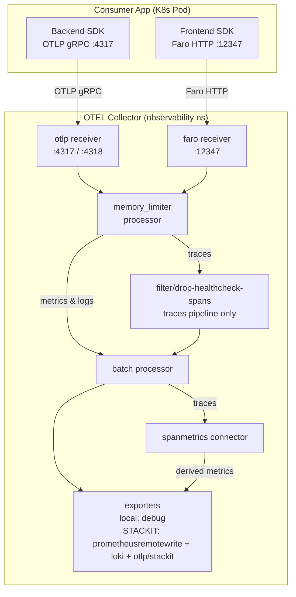
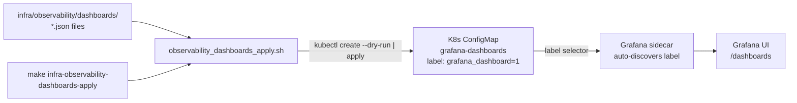

# Architecture

## Context
- Work item: 2026-05-26-issue-248-observability-enhancements
- Owner: bonos
- Date: 2026-05-26

## Bounded-Context Decisions

### Component: OTEL Collector (both lanes)

The in-cluster OTEL Collector is the single ingestion point for all telemetry signals — OTLP gRPC/HTTP (backend apps) and Faro HTTP (browser apps). This work item extends the existing collector configuration without changing the deployment topology:

- **Local lane:** Helm values file `infra/local/helm/observability/otel-collector.values.yaml`, deployed by Crossplane + Helm driver in `observability_apply.sh`.
- **STACKIT lane:** Baseline values file `infra/cloud/stackit/helm/observability/otel-collector.values.yaml` plus three ArgoCD Application inline values blocks (`dev/stage/prod`). ArgoCD manages the live Helm release.

All pipeline changes (Faro receiver, memory_limiter, filter, spanmetrics) are confined to these Helm values files. No Terraform, no shell library contract structure, and no ArgoCD Application topology changes.

### Component: shell library (`scripts/lib/infra/observability.sh`)

Two additive changes:
1. `observability_faro_endpoint()` — derives the Faro endpoint URL from existing env vars set by `observability_init_env` (`OTEL_COLLECTOR_SERVICE_DNS`, `FARO_COLLECT_PATH`). No new env var storage or secrets.
2. `observability_init_env()` — exports `FARO_ENDPOINT` via `set_default_env`. Consumer apps source this and gain the URL without lane-specific branching.

### Component: Dashboard provisioning scripts

Two new scripts under `scripts/bin/infra/`:
- `observability_dashboards_apply.sh` — reads `infra/observability/dashboards/*.json`, generates a labeled ConfigMap via `kubectl create configmap --dry-run=client | kubectl apply`. Idempotent; safe on retry.
- `observability_dashboards_destroy.sh` — deletes the ConfigMap; tolerates `NotFound`.

These scripts follow the existing `observability_{apply,destroy}.sh` pattern (source bootstrap.sh, read env vars, kubectl operations) and do not involve Terraform or ArgoCD.

### Integration Edges

- `FARO_ENDPOINT` flows from `observability_init_env` → consumer app's shell environment → frontend SDK configuration.
- Dashboard JSONs flow from `infra/observability/dashboards/` → ConfigMap (apply script) → Grafana sidecar auto-discovery → Grafana UI.
- `memory_limiter` and `filter` are entirely internal to the OTEL collector pipeline; no external contract change.
- `spanmetrics` produces derived Prometheus metrics from traces; on the local lane these feed the `debug` exporter (local lane has no Prometheus scrape target currently); on the STACKIT lane they route to `prometheusremotewrite`.

## Architecture Diagrams

### Diagram 1 — Faro telemetry signal flow (both lanes)

_Caption: Both OTLP and Faro inputs flow through the memory_limiter safety valve, then the healthcheck span filter (traces pipeline only), then batch export. The spanmetrics connector derives RED metrics from completed traces._

### Diagram 2 — Dashboard provisioning flow

_Caption: JSON files in the convention directory are packed into a labeled ConfigMap by the apply script. Grafana's k8s-monitoring sidecar discovers ConfigMaps with label `grafana_dashboard: "1"` and loads them into the Grafana dashboard list automatically._

## ADR Reference

`docs/blueprint/architecture/decisions/ADR-issue-248-observability-enhancements.md` (approved)

Key decisions documented there:
1. Dashboard provisioning via kubectl + convention directory (over Helm-embedded or Python script approach).
2. Faro CORS `allowed_origins: ["*"]` default (no security risk for telemetry-only receiver).
