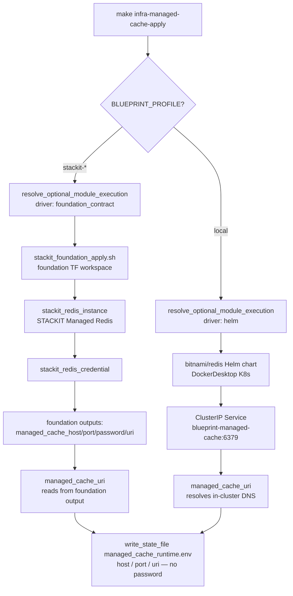
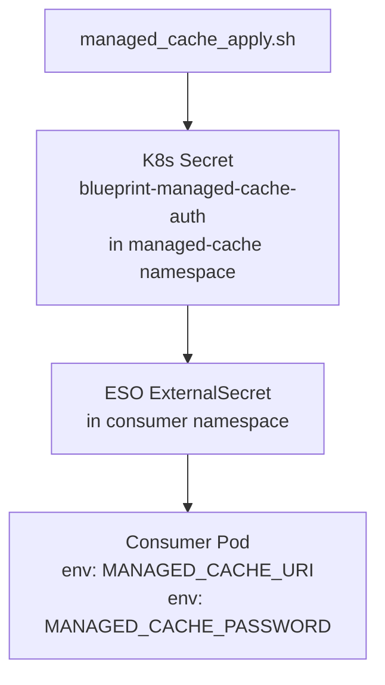

# Architecture

## Context
- Work item: issue-171-managed-cache
- Owner: sbonoc
- Date: 2026-05-27

## Stack and Execution Model
- Backend stack profile: n/a — tooling/infrastructure-only change
- Frontend stack profile: n/a — tooling/infrastructure-only change
- Test automation profile: pytest
- Agent execution model: specialized-subagents-isolated-worktrees

## Problem Statement
- What needs to change and why: No blueprint module exists for managed Redis/cache. Consumer use cases (session store, rate-limiting, idempotency cache, Postal email backing store) currently require bespoke per-consumer Redis wiring with no shared secret contract, no ESO integration, and no consistent env-var naming. A first-class `managed-cache` module eliminates this duplication and establishes a prerequisite for the `platform-email` module (issue #172).
- Scope boundaries: STACKIT Managed Redis provisioning (TF module via foundation contract) + bitnami/redis local lane + shell credential contract (`managed_cache_uri/host/port/password`) + make targets + module.contract.yaml + ESO-compatible state output. No UI changes.
- Out of scope: Redis Cluster/Sentinel HA, custom ACL users, Redis Pub/Sub contract, KMS envelope encryption of Redis credentials, bitnami local lane migration (issue #324 concern).

## Bounded Contexts and Responsibilities

- **managed-cache module** — owns: TF module (`infra/cloud/stackit/terraform/modules/managed-cache/`), Helm values (`infra/local/helm/managed-cache/values.yaml`), shell lib (`scripts/lib/infra/managed_cache.sh`), bin scripts, module contract, docs, tests.
- **foundation TF workspace** — owns: calling the managed-cache TF module when `managed_cache_enabled=true`; exporting `managed_cache_*` outputs consumed by the shell layer.
- **consumer workloads** — read credentials via `MANAGED_CACHE_URI` env var (delivered by ESO ExternalSecret from the K8s Secret created by the apply script) — no direct dependency on this module's internals.

## High-Level Component Design

- Domain layer: n/a (infrastructure module)
- Application layer: shell lib (`managed_cache.sh`) — exposes `managed_cache_uri()`, `managed_cache_host()`, `managed_cache_port()`, `managed_cache_password()` as the credential contract abstraction; isolates callers from lane differences.
- Infrastructure adapters:
  - STACKIT lane: `stackit_redis_instance` + `stackit_redis_credential` TF resources → foundation outputs → shell lib reads via `stackit_foundation_output_value_or_default`.
  - Local lane: bitnami/redis Helm chart → in-cluster ClusterIP service → shell lib resolves host as `blueprint-managed-cache.managed-cache.svc.cluster.local`.
- Presentation/API/workflow boundaries: `make infra-managed-cache-{plan,apply,smoke,destroy}` targets are the sole external interface.

## Integration and Dependency Edges

- Upstream dependencies: STACKIT project access (foundation TF); SKE cluster (STACKIT lane network ACL); Docker Desktop Kubernetes (local lane).
- Downstream dependencies: `platform-email` module (issue #172) consumes `MANAGED_CACHE_URI` as its Redis backing store.
- Data/API/event contracts touched: `managed_cache_runtime.env` state file (new); `blueprint/modules/managed-cache/module.contract.yaml` (new); `blueprint/contract.yaml` optional_modules entry (additive).

## Non-Functional Architecture Notes

- Security: Password MUST NOT be written to `managed_cache_runtime.env`. On STACKIT, `managed_cache_password()` reads from the sensitive foundation TF output at runtime only. Network ACL auto-aligns with SKE egress ranges (same policy as postgres). No etcd exposure for credentials beyond what the bitnami Helm chart creates on local lane (single-developer threat model, same exception as observability local lane).
- Observability: No additional in-repo instrumentation required. Redis connection failures surface via consumer application logs. STACKIT Managed Redis instance metrics are available in STACKIT Observability if the observability module is also enabled.
- Reliability and rollback: Rollback = `make infra-managed-cache-destroy` (STACKIT: destroys TF resources; local: `helm uninstall`). No data migration required since managed-cache is stateless from the blueprint's perspective (consumer data loss is expected on destroy — documented in README).
- Monitoring/alerting: Redis availability is consumer-owned. `make infra-managed-cache-smoke` validates URI scheme reachability only.

## Risks and Tradeoffs

- Risk 1: STACKIT Terraform resource name for Redis (`stackit_redis_instance`) is inferred from provider conventions but not yet verified against the live provider schema. Incorrect resource name blocks TF apply. Mitigation: verify via `terraform providers schema -json` before writing TF code (captured as Q-1 in spec.md).
- Risk 2: bitnami/redis local lane follows the same deprecation risk as bitnami/postgresql (issue #324). Mitigation: deferred to the same migration scope as #324; noted as a proposal in the spec.
- Tradeoff 1: Foundation-contract execution model (same as rabbitmq, opensearch) means the TF module is only invoked when `managed_cache_enabled=true` in the foundation workspace. This is the correct pattern for STACKIT but means local consumers must use the Helm path. Consistent with all other optional modules.

## Architecture Diagrams

### Provisioning Flow

_Caption: Provisioning flow for both lanes. Foundation-contract path (STACKIT) provisions via TF; Helm path (local) deploys bitnami/redis. Both lanes converge at the shell credential contract._

### Credential Delivery to Consumer Workloads

_Caption: Credential delivery from the apply script through ESO to consumer workloads. The K8s Secret is created by `managed_cache_reconcile_runtime_secret()`; ESO ExternalSecret is consumer-defined using the standard blueprint ExternalSecret pattern._
