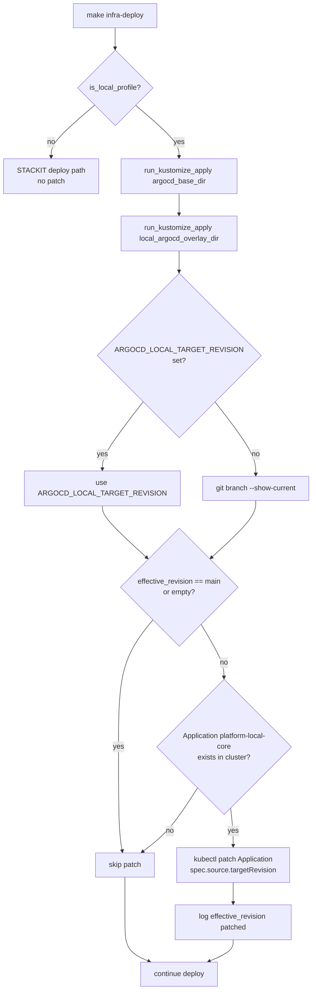
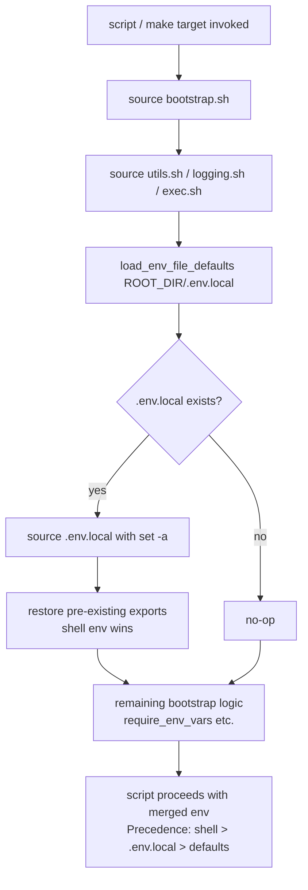

# Architecture

## Context
- Work item: issue-284-302-local-dx-improvements
- Owner: sbonoc
- Date: 2026-05-27

## Stack and Execution Model
- Backend stack profile: n/a — tooling/infrastructure-only change
- Frontend stack profile: n/a — tooling/infrastructure-only change
- Test automation profile: pytest
- Agent execution model: specialized-subagents-isolated-worktrees

## Problem Statement
- What needs to change and why: Two local developer experience gaps. (1) `deploy.sh` does not patch the ArgoCD Application `targetRevision` after applying the local overlay, so ArgoCD always syncs from `main` during feature-branch development. (2) `bootstrap.sh` never calls `load_env_file_defaults` on `.env.local`, so there is no standard gitignored override file for persistent local settings.
- Scope boundaries: Local profile only. No changes to STACKIT profiles, CI paths, or any manifest file. `deploy.sh` gains a post-apply conditional `kubectl patch`; `bootstrap.sh` gains one `load_env_file_defaults` call.
- Out of scope: Kustomize overlay patching (Option B), detached-HEAD branch tracking, multi-Application patching, secrets encryption for `.env.local`.

## Bounded Contexts and Responsibilities

- **bootstrap.sh** — owns: auto-loading `.env.local` as the lowest-priority env source (shell env wins). No new exports; delegates entirely to the existing `load_env_file_defaults` helper.
- **deploy.sh** — owns: orchestrating the local deploy path; after kustomize apply, conditionally patching the ArgoCD Application `targetRevision` to match the active branch.
- **Consumer developer** — owns: creating `.env.local` (optional); setting `ARGOCD_LOCAL_TARGET_REVISION` (optional); the blueprint takes responsibility for picking them up automatically.

## High-Level Component Design

- Domain layer: n/a (tooling layer)
- Application layer: `deploy.sh` post-apply patch logic; `bootstrap.sh` env-load call.
- Infrastructure adapters: `run_kubectl_with_active_access` (existing) for the `kubectl patch`; `load_env_file_defaults` (existing) for `.env.local` sourcing.
- Presentation/API/workflow boundaries: `make infra-deploy` is the external interface for #284. Every `make` target sourcing `bootstrap.sh` is the external interface for #302.

## Integration and Dependency Edges

- Upstream dependencies: `kubectl` + Docker Desktop k8s cluster (for #284 patch). No new dependencies for #302.
- Downstream dependencies: none.
- Data/API/event contracts touched: `ARGOCD_LOCAL_TARGET_REVISION` env var (new, optional); `.env.local` file convention (new, gitignored).

## Non-Functional Architecture Notes

- Security: Shell env wins over `.env.local` (NFR-SEC-001). `.env.local` is gitignored in both root and bootstrap template (NFR-SEC-002). The patch does not write credentials anywhere.
- Observability: `deploy.sh` logs the effective `targetRevision` when patching (FR-012). No other instrumentation needed.
- Reliability and rollback: Both changes are fully backwards-compatible. `.env.local` auto-load is a no-op when absent. The ArgoCD patch is skipped on `main`; if the cluster Application is missing the patch is also skipped.
- Monitoring/alerting: None — local DX only.

## Risks and Tradeoffs

- Risk 1: The `kubectl patch` in deploy.sh runs after kustomize apply. If the Application resource was not yet created by kustomize (first deploy race), the patch will silently skip (FR-010 guard). Subsequent deploys will patch correctly. Acceptable.
- Tradeoff 1: The local Application CRD diverges from the manifest on disk when not on `main`. This is intentional; the manifest is the canonical `main`-branch definition.

## Architecture Diagrams

### `deploy.sh` — Local Profile `ARGOCD_LOCAL_TARGET_REVISION` Patch Flow

_Caption: `deploy.sh` local profile patch flow. The patch is applied only when on a non-main branch, the Application exists, and the profile is local. All other paths skip silently._

### `bootstrap.sh` — Environment Resolution Precedence

_Caption: `bootstrap.sh` env resolution after the `.env.local` auto-load call. Shell environment always wins over `.env.local` values; `.env.local` wins over hard-coded defaults._
