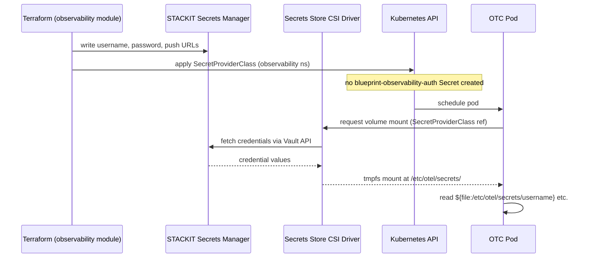
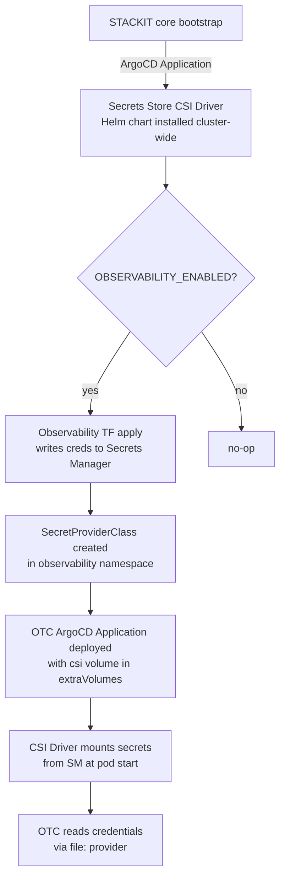

# Architecture

## Context
- Work item: issue-312-observability-csi-hardening
- Owner: bonos
- Date: 2026-05-27

## Stack and Execution Model
- Backend stack profile: n/a — tooling/infrastructure-only
- Frontend stack profile: n/a
- Test automation profile: pytest unit assertions on shell scripts and Helm values
- Agent execution model: specialized-subagents-isolated-worktrees

## Problem Statement
- What needs to change and why: The OTC pod on STACKIT lanes receives credentials via a K8s Secret (`blueprint-observability-auth`) mounted at `/etc/otel/secrets`. The Secret object is stored in etcd; if etcd is not encrypted at rest or cluster-admin access is compromised, all credentials are readable. The shell script `observability_reconcile_runtime_secret()` requires the operator to hold plaintext credentials during the apply step, and there is no audit trail for credential reads.
- Scope boundaries: STACKIT-lane OTC credential delivery only. Mount path (`/etc/otel/secrets`) and OTC `${file:...}` references are unchanged. Local lane is out of scope.
- Out of scope: local-lane changes; KMS encryption of stored secrets; automated rotation triggers; ESO-based approaches (ESO still creates K8s Secrets).

## Bounded Contexts and Responsibilities

- **Cluster bootstrap (new):** Secrets Store CSI Driver installed as an ArgoCD Application in the STACKIT core runtime layer. Owned by the platform blueprint, deployed before any optional module that requires CSI secret mounts.
- **Observability TF module (change):** After provisioning the STACKIT observability instance and credentials, writes the five credential values (`username`, `password`, `METRICS_PUSH_URL`, `LOGS_PUSH_URL`, `TRACES_PUSH_URL`) to STACKIT Secrets Manager using the Vault Terraform provider. The Secret paths follow a convention: `observability/<key>`.
- **Observability Helm values (change):** STACKIT OTC `extraVolumes` block switches from `secret` type to `csi` type referencing the `SecretProviderClass`. The mount path and OTC config references are unchanged.
- **SecretProviderClass (new):** Namespace-scoped to `observability`. Maps STACKIT Secrets Manager paths to the five mount files. Provisioned as part of the observability ArgoCD Application or as a standalone manifest in the observability ArgoCD app.
- **Observability shell layer (change):** STACKIT-profile branch of `apply.sh` no longer calls `observability_reconcile_runtime_secret()`. `destroy.sh` no longer calls `observability_delete_runtime_secret()`. Both functions remain in `observability.sh` for the local-lane path.

## High-Level Component Design

*Caption: Credential flow after this change — credentials go from STACKIT Secrets Manager directly to the OTC pod's tmpfs mount; etcd is not in the path.*

*Caption: Provisioning flow — CSI driver must be running before the OTC ArgoCD Application is deployed.*

## Integration and Dependency Edges
- Upstream dependencies: STACKIT Secrets Manager instance (must exist before TF writes credentials); Secrets Store CSI Driver (must be running before OTC pod schedules).
- Downstream dependencies: OTC pod; all three STACKIT push exporters depend on credentials being correctly mounted.
- Data/API/event contracts touched: `infra/cloud/stackit/helm/observability/otel-collector.values.yaml` (extraVolumes); STACKIT OTC ArgoCD manifests (dev/stage/prod); `blueprint/modules/observability/module.contract.yaml`; `scripts/lib/infra/observability.sh`; `scripts/bin/infra/observability_apply.sh`; `scripts/bin/infra/observability_destroy.sh`; `tests/infra/modules/observability/test_contract.py`.

## Non-Functional Architecture Notes
- Security: Credentials are delivered via tmpfs — not persisted to disk or etcd. The `SecretProviderClass` is namespace-scoped. STACKIT Secrets Manager access is audited. This satisfies NFR-SEC-001 through NFR-SEC-003.
- Observability: STACKIT Secrets Manager access logs provide the audit trail for every credential read. No additional in-repo instrumentation needed.
- Reliability and rollback: If the CSI driver is unavailable or Secrets Manager is unreachable at pod schedule time, the OTC pod will fail to start (CSI mount failure = pod stuck in `ContainerCreating`). Rollback: re-enable the K8s Secret path by reverting the `extraVolumes` block and re-running `make infra-observability-apply`.
- Monitoring/alerting: OTC pod `ContainerCreating` stuck state is surfaced by existing cluster health monitoring. No new alerting rules required.

## Risks and Tradeoffs
- Risk 1: STACKIT Secrets Manager Terraform provider may not support writing arbitrary secret values (it manages instances and users, not secret key-value pairs). Mitigation: use the Vault Terraform provider pointed at the Secrets Manager Vault-compatible API endpoint; this is the standard approach for Vault-compatible stores.
- Risk 2: Ordering — the CSI driver must be running before the observability ArgoCD Application is synced. Mitigation: declare the CSI driver Application as a sync-wave predecessor in ArgoCD or document as a hard prerequisite in the deploy runbook.
- Tradeoff 1: Adding the CSI driver as a cluster dependency increases the bootstrap surface area. The security benefit (etcd credential removal) justifies the additional component.
- Tradeoff 2: Credential rotation is asynchronous (CSI driver polls on an interval, default 2 minutes). Immediate rotation requires a pod restart — document this clearly in the README.
