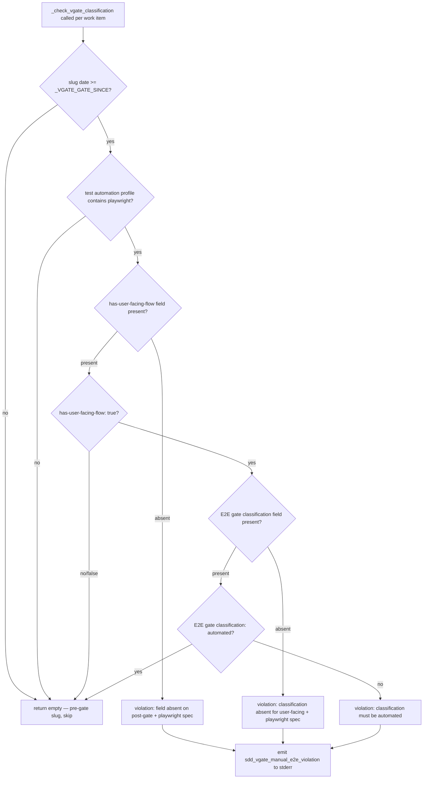
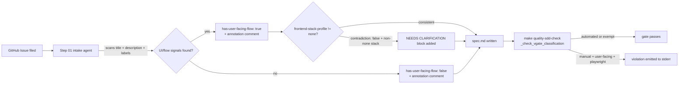

# Architecture

## Context
- Work item: 2026-06-01-issue-353-vgate-e2e-classification
- Owner: platform-team
- Date: 2026-06-01

## Stack and Execution Model
- Backend stack profile: python_scripting_plus_bash
- Frontend stack profile: none
- Test automation profile: pytest
- Agent execution model: single-agent

## Problem Statement
- What needs to change and why: `check_sdd_assets.py` has no check for E2E gate classification on user-facing flows. A consumer team can set `test automation profile: pytest_vitest_playwright_pact`, include a user-facing form or wizard in scope, and still classify the E2E gate as permanently `manual` — passing every quality check. This work item introduces two new Implementation Stack Profile fields (`has-user-facing-flow` and `E2E gate classification`) and a corresponding `_check_vgate_classification` function wired into `_validate_work_item_specs`, enforcing that user-facing flow work items with a playwright-capable profile carry an `automated` E2E gate classification.
- Scope boundaries: Blueprint tooling only — `check_sdd_assets.py`, spec templates, AGENTS.md. No consumer runtime code changes.
- Out of scope: Playwright test content or existence validation; retroactive enforcement on pre-gate specs; consumer repo audits.

## Bounded Contexts and Responsibilities
- Intake skill (`.agents/skills/blueprint-sdd-step01-intake/SKILL.md`): Shift-left control — infers `has-user-facing-flow` from issue signals at the earliest possible point. Annotates the inferred value in the spec and flags it in the intake report. Cross-checks `frontend-stack-profile` consistency. This is the primary defence against R-2 (silent false default).
- Quality gate tooling (`check_sdd_assets.py`): Owns `_check_vgate_classification`. Reads spec.md fields, applies the binary rule (`automated` passes; anything else is a violation when `has-user-facing-flow: true` + playwright profile), emits violations and metric to stderr. This is the enforcement layer — it catches the cases the intake inference missed or the author overrode.
- Spec templates (`.spec-kit/templates/blueprint/spec.md`, `.spec-kit/templates/consumer/spec.md`): Seed both new Implementation Stack Profile fields with inline definition comments carrying the signal list, so manual authors have the same checklist as the intake agent.
- Governance documentation (`AGENTS.md`): Documents the mandatory Playwright E2E artifact rule (three MUSTs) so authors understand what `has-user-facing-flow: true` commits them to at implementation time.

## High-Level Component Design
- Shift-left layer (step01 intake): `blueprint-sdd-step01-intake/SKILL.md` inference step — reads issue text, runs signal scan, writes `has-user-facing-flow` with annotation comment, cross-checks `frontend-stack-profile`. No code; agent-executed at intake time.
- Domain layer: Rule logic in `_check_vgate_classification(spec_text: str, slug: str) -> list[Violation]` — pure function, no I/O, returns Violation dataclass instances.
- Application layer: `_validate_work_item_specs` calls `_check_vgate_classification` per work item and collects violations. Metric emitted to stderr after all violations collected.
- Infrastructure adapters: Spec text read from filesystem (existing pattern in `check_sdd_assets.py`). No new I/O paths introduced.
- Presentation/API/workflow boundaries: `make quality-sdd-check` → `check_sdd_assets.py` (existing entry point, no changes to invocation interface).

## Integration and Dependency Edges
- Upstream dependencies: `check_sdd_assets.py` (existing), `.spec-kit/templates/blueprint/spec.md` (existing), `.spec-kit/templates/consumer/spec.md` (existing), `AGENTS.md` (existing).
- Downstream dependencies: `sync_consumer_init_sdd_assets.py` must be re-run after consumer template update to keep the init mirror at `scripts/templates/consumer/init/.spec-kit/templates/consumer/spec.md.tmpl` in sync.
- Data/API/event contracts touched: No API or event contracts. `make quality-sdd-check` CLI contract unchanged (same invocation, same exit code semantics).

## Non-Functional Architecture Notes
- Security: No external calls. Field parsing uses Python `re` stdlib only. No injection risk.
- Observability: Metric `sdd_vgate_manual_e2e_violation=<count>` emitted to stderr on any violation, consistent with the metric-emission pattern from issue #352. All violation messages include slug, field name, current value, and expected value.
- Reliability and rollback: Forward-only guard (`_VGATE_GATE_SINCE`) ensures no pre-existing spec is broken. Rollback = revert the commit to `check_sdd_assets.py`; gate behavior reverts immediately.
- Monitoring/alerting: Metric can be scraped from CI stderr; see issue #356 for the longer-term dedicated-sink recommendation.

## Risks and Tradeoffs
- Risk R-1: Pre-existing specs are caught retroactively if `_VGATE_GATE_SINCE` is set to the wrong date. Mitigation: set the constant to the merge date of this PR (2026-06-01 or later); AC-006/T-106 covers regression.
- Risk R-2 (largest failure mode): An author silently sets `has-user-facing-flow: false` on a work item that does have a user-facing flow, bypassing the entire V-gate enforcement. This is the highest-impact failure mode because the gate has no other trigger. Mitigations: (a) template seeding includes a definition comment naming "form, wizard, multi-step interaction" so author intent is explicit; (b) the template comment pairs `false` with a paired-justification requirement when `frontend-stack-profile != none`; (c) code review and the AGENTS.md mandatory-Playwright rule both surface the obligation; (d) a deferred-proposal frontend-stack-mismatch heuristic warning (see spec.md) provides a longer-term machine-side safety net.
- Risk R-3: Consumer init template mirror drifts from the consumer spec template after the field addition. Mitigation: the implementation plan explicitly runs `sync_consumer_init_sdd_assets.py`; existing sync test coverage will catch drift.
- Tradeoff T-1: Explicit `has-user-facing-flow` flag requires conscious author action vs. heuristic detection which is automatic. Chosen: explicit flag — deterministic, testable, consistent with `SPEC_READY_EXCEPTION` pattern. See ADR D-1.
- Tradeoff T-2: Binary classification (`automated` | `manual`) vs. a three-value design that included `manual-with-target`. Chosen: binary — the three-value design was rejected because `manual-with-target` reproduces the loophole (teams declare a far-future date and ship with zero coverage). See Q-3 rationale in spec.md and ADR D-3.

## Lineage and Pattern Reuse
- This work item is a direct successor to issue #352 (PR #355), which introduced the machine-enforcement pattern in `check_sdd_assets.py`: `_check_step03_complete_event`, `_SPEC_COMPLETE_GATE_SINCE`, and the `sdd_step03_missing_spec_complete` stderr metric.
- `_VGATE_GATE_SINCE` (this work item) mirrors `_SPEC_COMPLETE_GATE_SINCE` (issue #352) — same forward-only-guard semantics, same constant placement, same exemption logic.
- `sdd_vgate_manual_e2e_violation` (FR-008) mirrors `sdd_step03_missing_spec_complete` (#352 FR-013) — same stderr emission pattern, same metric-name convention (`sdd_<check-name>_<violation-type>`).
- Reviewers familiar with PR #355 should find this work item's diff in `check_sdd_assets.py` and the spec template field additions structurally identical in shape.

## Mermaid Diagram

Caption: Decision tree executed by `_check_vgate_classification` for each work item in the catalog. The playwright profile check runs first (before the flow flag), providing an early exemption for non-playwright profiles. Absent fields on post-gate + playwright specs are violations, not silent defaults. There is no deferred-automation path — only `automated` passes.

Caption: End-to-end V-gate lifecycle showing the two-layer defence. The step01 intake agent (shift-left) infers `has-user-facing-flow` from issue signals so authors must consciously override a signal-driven value. The quality gate (`_check_vgate_classification`) is the enforcement backstop that catches cases where the author overrode or skipped the inference.
