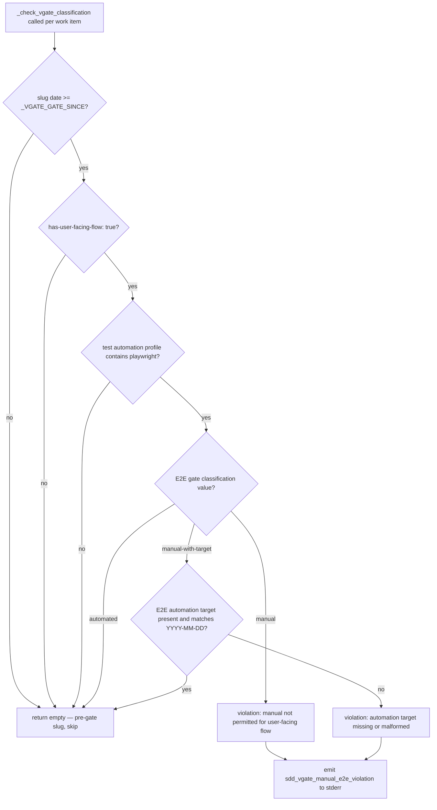

# Architecture

## Context
- Work item: 2026-06-01-issue-353-vgate-e2e-classification
- Owner: platform-team
- Date: 2026-06-01

## Stack and Execution Model
- Backend stack profile: python_scripting_plus_bash
- Frontend stack profile: none
- Test automation profile: pytest
- Agent execution model: single-agent

## Problem Statement
- What needs to change and why: `check_sdd_assets.py` has no check for E2E gate classification on user-facing flows. A consumer team can set `test automation profile: pytest_vitest_playwright_pact`, include a user-facing form or wizard in scope, and still classify the E2E gate as permanently `manual` — passing every quality check. This work item introduces a new spec-field triple (`has-user-facing-flow`, `E2E gate classification`, `E2E automation target`) and a corresponding `_check_vgate_classification` function wired into `_validate_work_item_specs`, enforcing that user-facing flow work items carry a time-bounded or automated E2E gate.
- Scope boundaries: Blueprint tooling only — `check_sdd_assets.py`, spec templates, AGENTS.md. No consumer runtime code changes.
- Out of scope: Playwright test content or existence validation; retroactive enforcement on pre-gate specs; consumer repo audits.

## Bounded Contexts and Responsibilities
- Quality gate tooling (`check_sdd_assets.py`): Owns the `_check_vgate_classification` function. Reads spec.md fields, applies the rule, emits violations and metric to stderr.
- Spec templates (`.spec-kit/templates/blueprint/spec.md`, `.spec-kit/templates/consumer/spec.md`): Seed the three new Implementation Stack Profile fields for every new work item scaffold.
- Governance documentation (`AGENTS.md`): Documents the mandatory Playwright E2E artifact rule so authors understand what `has-user-facing-flow: true` commits them to.

## High-Level Component Design
- Domain layer: Rule logic in `_check_vgate_classification(spec_text: str, slug: str) -> list[str]` — pure function, no I/O, returns violation strings.
- Application layer: `_validate_work_item_specs` calls `_check_vgate_classification` per work item and collects violations. Metric emitted to stderr after all violations collected.
- Infrastructure adapters: Spec text read from filesystem (existing pattern in `check_sdd_assets.py`). No new I/O paths introduced.
- Presentation/API/workflow boundaries: `make quality-sdd-check` → `check_sdd_assets.py` (existing entry point, no changes to invocation interface).

## Integration and Dependency Edges
- Upstream dependencies: `check_sdd_assets.py` (existing), `.spec-kit/templates/blueprint/spec.md` (existing), `.spec-kit/templates/consumer/spec.md` (existing), `AGENTS.md` (existing).
- Downstream dependencies: `sync_consumer_init_sdd_assets.py` must be re-run after consumer template update to keep the init mirror at `scripts/templates/consumer/init/.spec-kit/templates/consumer/spec.md.tmpl` in sync.
- Data/API/event contracts touched: No API or event contracts. `make quality-sdd-check` CLI contract unchanged (same invocation, same exit code semantics).

## Non-Functional Architecture Notes
- Security: No external calls. Field parsing uses Python `re` stdlib only. No injection risk.
- Observability: Metric `sdd_vgate_manual_e2e_violation=<count>` emitted to stderr on any violation, consistent with the metric-emission pattern from issue #352. All violation messages include slug, field name, current value, and expected value.
- Reliability and rollback: Forward-only guard (`_VGATE_GATE_SINCE`) ensures no pre-existing spec is broken. Rollback = revert the commit to `check_sdd_assets.py`; gate behavior reverts immediately.
- Monitoring/alerting: Metric can be scraped from CI stderr; see issue #356 for the longer-term dedicated-sink recommendation.

## Risks and Tradeoffs
- Risk 1: Authors forget to set `has-user-facing-flow: true` for a work item that has a user-facing flow, bypassing the gate silently. Mitigation: the gate catches the case where it IS set to `true` with `manual` — the risk is false negatives (missed opt-in), which is bounded by code review. A follow-up heuristic check (deferred proposal) could catch this.
- Tradeoff 1: Explicit flag (`has-user-facing-flow`) requires conscious author action vs. heuristic detection which is automatic. Chosen: explicit flag — deterministic, testable, consistent with `SPEC_READY_EXCEPTION` pattern. See ADR D-1.

## Mermaid Diagram

Caption: Decision tree executed by `_check_vgate_classification` for each work item in the catalog. The forward-only guard and the profile/flag conditions provide three independent exemption exits before the classification rule is evaluated.
