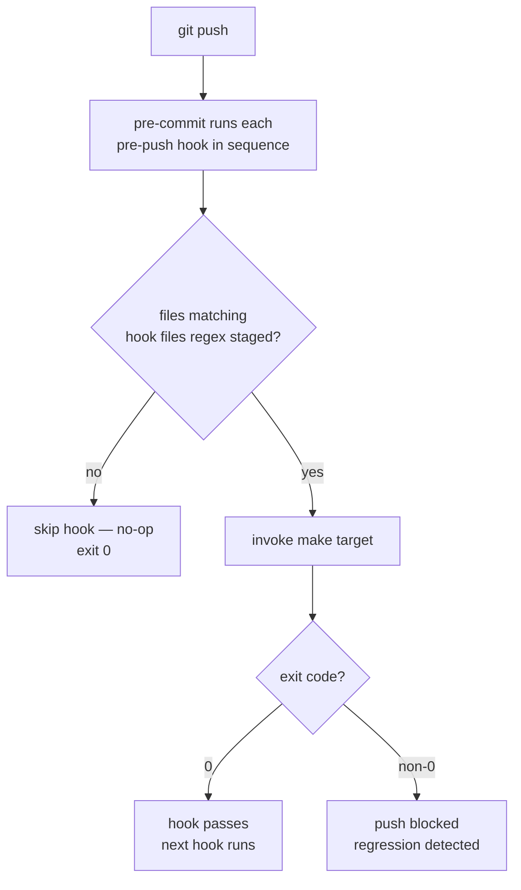

# Architecture

## Context
- Work item: 2026-06-01-issue-358-touchpoints-contracts-pre-push
- Owner: platform-team
- Date: 2026-06-01

## Stack and Execution Model
- Backend stack profile: none
- Frontend stack profile: none
- Test automation profile: pytest
- Agent execution model: specialized-subagents-isolated-worktrees

## Problem Statement
- What needs to change and why: `scripts/templates/blueprint/bootstrap/.pre-commit-config.yaml` must gain five pre-push hooks (`touchpoints-test-unit-pre-push`, `touchpoints-test-contracts-pre-push`, `backend-test-unit-pre-push`, `backend-test-contracts-pre-push`, `touchpoints-test-integration-pre-push`). Issue #358 was filed from the `sbonoc/dhe-marketplace` consumer repo, where consumer-local pre-push hooks carry documented postmortems (PR #75, PR #78). Without them in the template, new consumers silently miss these shift-left gates.
- Scope boundaries: The change is confined to a single YAML template file. No runtime code, make targets, or contract.yaml fields are added or modified.
- Out of scope: The five invoked make targets (already correct in `make/platform.mk`); `blueprint/contract.yaml`.

## Bounded Contexts and Responsibilities
- Blueprint template context: owns `scripts/templates/blueprint/bootstrap/.pre-commit-config.yaml`; seeded into consumer repos during `make blueprint-init` or upgraded via the blueprint upgrade flow; blueprint maintainers are responsible for the hook definition and its field values.
- Consumer repo context: after template upgrade, the consumer `.pre-commit-config.yaml` gains the hook; the consumer is responsible for having `make touchpoints-test-contracts` produce a meaningful exit code; if the make target or the `tests/contracts/` directory is absent the hook is a no-op.

## High-Level Component Design
- Domain layer: N/A — no domain model changes.
- Application layer: N/A — no application code changes.
- Infrastructure adapters: N/A — no infrastructure changes.
- Presentation/API/workflow boundaries: pre-commit hook pipeline — `git push` → pre-commit runs each hook in sequence → file-pattern check per hook → if matching files: invoke make target → pass/fail; if no matching files: skip.

## Integration and Dependency Edges
- Upstream dependencies: `make touchpoints-test-unit`, `make touchpoints-test-contracts`, `make backend-test-unit`, `make backend-test-contracts`, `make touchpoints-test-integration` targets in consumer `make/platform.mk` (all already defined; no change required).
- Downstream dependencies: consumer CI — the same lanes run in CI for gate symmetry; no new CI job is added by this change.
- Data/API/event contracts touched: none.

## Non-Functional Architecture Notes
- Security: no credential or secret surface; the hook invokes a local make target only.
- Observability: no log, metric, or trace path; hook output is terminal-only.
- Reliability and rollback: if the hook causes unexpected failures, consumers can temporarily comment it out in their local `.pre-commit-config.yaml` while investigating; the blueprint template is the source of truth and can be reverted via a blueprint patch release.
- Monitoring/alerting: none; hook failures surface as a blocked `git push` on the developer machine.

## Risks and Tradeoffs
- Risk 1: Any of the five make targets may not exit 0 cleanly when the relevant test directory is absent. This MUST be verified during implementation (T-004/T-106). If a target does not handle the absent-directory case, a guard MUST be added before the hook is shipped.
- Risk 2: `backend-test-unit-pre-push` runs pytest on Python file changes; on large test suites this adds more push latency than the Vitest hooks. The file-scoped trigger limits invocations to backend source changes; the postmortem evidence (PR #78) justifies the tradeoff.
- Tradeoff 1: File-scoped triggers (`always_run: false`) mean a regression injected via a dependency update (where no source file is touched) is not caught by any of these gates. Accepted for push-latency symmetry with other template hooks.

## Diagrams

### Pre-push hook execution flow (per hook)

Caption: Each of the five hooks follows this flow independently. The `always_run: false` + file-glob pattern keeps push latency minimal when unrelated files are staged.

Hooks added (in template order):

| Hook ID | Make target | Files scope |
|---|---|---|
| `touchpoints-test-unit-pre-push` | `make touchpoints-test-unit` | `^apps/touchpoints/.*\.(ts\|vue\|tsx)$` |
| `touchpoints-test-contracts-pre-push` | `make touchpoints-test-contracts` | `^(apps/touchpoints/.*\.(ts\|vue\|tsx)\|apps/packages/api-client/src/.*\.ts\|tests/touchpoints/contracts/.*\.py)$` |
| `backend-test-unit-pre-push` | `make backend-test-unit` | `^(apps/backend/\|tests/backend/).*\.py$` |
| `backend-test-contracts-pre-push` | `make backend-test-contracts` | `^(apps/backend/\|tests/backend/).*\.py$` |
| `touchpoints-test-integration-pre-push` | `make touchpoints-test-integration` | `^(apps/touchpoints/.*\.(ts\|vue\|tsx)\|apps/packages/api-client/src/.*\.ts)$` |
