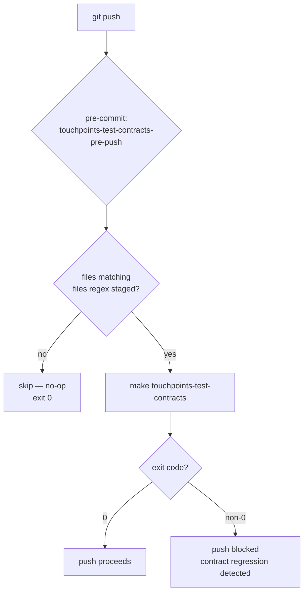

# Architecture

## Context
- Work item: 2026-06-01-issue-358-touchpoints-contracts-pre-push
- Owner: platform-team
- Date: 2026-06-01

## Stack and Execution Model
- Backend stack profile: none
- Frontend stack profile: none
- Test automation profile: pytest
- Agent execution model: specialized-subagents-isolated-worktrees

## Problem Statement
- What needs to change and why: `scripts/templates/blueprint/bootstrap/.pre-commit-config.yaml` must gain a `touchpoints-test-contracts-pre-push` hook. Without it, two regression classes (broken Pact interactions and FFI-timing failures on Linux x86_64 CI) are invisible until CI fails on the remote branch. The unit lane that already has a hook does not start a Pact mock server and cannot catch either class.
- Scope boundaries: The change is confined to a single YAML template file. No runtime code, make targets, or contract.yaml fields are added or modified.
- Out of scope: The `touchpoints-test-contracts` make target implementation; `blueprint/contract.yaml`; backend contract test hook; `touchpoints-test-unit-pre-push` hook (not currently present in the template).

## Bounded Contexts and Responsibilities
- Blueprint template context: owns `scripts/templates/blueprint/bootstrap/.pre-commit-config.yaml`; seeded into consumer repos during `make blueprint-init` or upgraded via the blueprint upgrade flow; blueprint maintainers are responsible for the hook definition and its field values.
- Consumer repo context: after template upgrade, the consumer `.pre-commit-config.yaml` gains the hook; the consumer is responsible for having `make touchpoints-test-contracts` produce a meaningful exit code; if the make target or the `tests/contracts/` directory is absent the hook is a no-op.

## High-Level Component Design
- Domain layer: N/A — no domain model changes.
- Application layer: N/A — no application code changes.
- Infrastructure adapters: N/A — no infrastructure changes.
- Presentation/API/workflow boundaries: pre-commit hook pipeline — `git push` → pre-commit runs `touchpoints-test-contracts-pre-push` hook → file-pattern check → if matching files: `make touchpoints-test-contracts` → pass/fail; if no matching files: skip.

## Integration and Dependency Edges
- Upstream dependencies: `make touchpoints-test-contracts` target in consumer `make/platform.mk` (already defined; no change required).
- Downstream dependencies: consumer CI — if the hook passes locally, the same lane can be run in CI for gate symmetry; no new CI job is added by this change.
- Data/API/event contracts touched: none.

## Non-Functional Architecture Notes
- Security: no credential or secret surface; the hook invokes a local make target only.
- Observability: no log, metric, or trace path; hook output is terminal-only.
- Reliability and rollback: if the hook causes unexpected failures, consumers can temporarily comment it out in their local `.pre-commit-config.yaml` while investigating; the blueprint template is the source of truth and can be reverted via a blueprint patch release.
- Monitoring/alerting: none; hook failures surface as a blocked `git push` on the developer machine.

## Risks and Tradeoffs
- Risk 1: `make touchpoints-test-contracts` may not exit 0 cleanly when the `tests/contracts/` directory is absent in a consumer repo. The issue asserts it does; this MUST be verified during implementation (T-103). If the make target does not handle the absent-directory case, a wrapper or guard MUST be added in the make target before the hook is shipped.
- Tradeoff 1: File-scoped trigger (`always_run: false`) means a broken matcher injected via a dependency update (where no touchpoints source file is touched) will not be caught by this gate. An `always_run: true` alternative would catch this at the cost of running contract tests on every push. OPTION_A (file-scoped) is selected for push-latency symmetry with other template hooks; the dependency-update gap is an accepted tradeoff.

## Diagrams

### Pre-push hook execution flow

Caption: Pre-push hook execution path. File-pattern check (`always_run: false`) ensures the hook is skipped for pushes that do not touch touchpoints or api-client source files.
