# Architecture

## Context
- Work item: issue #360 — author 10 factory personas + 10 SDD/factory skill runbooks (Child A of #333)
- Owner: Software Engineer (with Architecture sign-off pending)
- Date: 2026-06-02

## Stack and Execution Model
- Backend stack profile: python_plus_fastapi_pydantic_v2 (no runtime change; profile inherited from repo default)
- Frontend stack profile: vue_router_pinia_onyx (N/A for this scope; declared per SDD-C-006)
- Test automation profile: pytest_vitest_playwright_pact (this work item adds pytest checks only)
- Agent execution model: specialized-subagents-isolated-worktrees

## Problem Statement
- What needs to change and why: Phase 0 pinned the persona/skill contract (`ADR-issue-337-persona-skill-contract.md`) and the Contract C8 consumer-shipped surface (#339). The autonomous factory now needs concrete persona files and the 10 new skill runbooks that personas will invoke during SDD execution. Without these files the factory orchestrator (Child B, `#361`) has nothing to dispatch.
- Scope boundaries: pure governance and skill-runbook authoring under `.agents/personas/` and `.agents/skills/`; an enumeration update in `docs/blueprint/autonomous-factory/design-contracts.md` § Contract C8 § Category (c); a new ADR documenting the persona roster; new pytest checks that validate the authored files.
- Out of scope: any runtime service, orchestrator code, OpenHands integration, RabbitMQ/C7 emission, jsonschema runtime validator, slash-command table edits for new skills, retroactive schema additions to existing skills. See `## Explicit Exclusions` in `spec.md`.

## Bounded Contexts and Responsibilities
- Context A — `.agents/personas/` (persona authoring): owns the 10 new persona `.md` files following the template contract from the issue body and from `ADR-issue-337-persona-skill-contract.md`. Pure content; no behaviour.
- Context B — `.agents/skills/` (skill-runbook authoring): owns the 10 new skill directories, each with a `SKILL.md` runbook and a `## Required Output Schema` block. Pure content; no behaviour.
- Context C — `docs/blueprint/autonomous-factory/design-contracts.md` § Contract C8 (governance docs): updated to enumerate each of the 20 new C8 surface items. Pure docs.
- Context D — `tests/blueprint/personas_skills/` (validation): owns the pytest checks T-101…T-107 that enforce FR-001…FR-016 and AC-001…AC-013. Tests run under `make quality-sdd-check`.

## High-Level Component Design
- Domain layer: n/a (no runtime domain).
- Application layer: n/a.
- Infrastructure adapters: n/a.
- Presentation / API / workflow boundaries: the persona/skill files are consumed by the autonomous factory orchestrator (Child B) and by Claude Code locally via the existing skill-discovery mechanism (no change to that mechanism). The Contract C8 enumeration is consumed by the existing `template_sync_allowlist` machinery in `blueprint/contract.yaml`.

```mermaid
flowchart TD
    subgraph "Implementer personas (6)"
        PO["po-analyst.md"]
        ARCH["architect.md"]
        TL["tech-lead.md"]
        IMP["implementer.md"]
        QA["devsecops-qa.md"]
        DOC["doc-keeper.md"]
    end

    subgraph "Reviewer personas (4) — agent-pr-review phase"
        SR["security-reviewer.md"]
        AR["architecture-reviewer.md"]
        CR["contract-reviewer.md"]
        TCR["test-coverage-reviewer.md"]
    end

    subgraph "Existing SDD step skills (7) — reused, not authored here"
        S01["blueprint-sdd-step01-intake"]
        S02["blueprint-sdd-step02-resolve-questions"]
        S03["blueprint-sdd-step03-spec-complete"]
        S04["blueprint-sdd-step04-plan-slicer"]
        S05["blueprint-sdd-step05-implement"]
        S06["blueprint-sdd-step06-document-sync"]
        S07["blueprint-sdd-step07-pr-packager"]
    end

    subgraph "New skills (10) — authored by this work item"
        N1["blueprint-ticket-triage-size"]
        N2["blueprint-ticket-decompose-light"]
        N3["blueprint-agent-secret-scan"]
        N4["blueprint-agent-handoff"]
        N5["blueprint-spec-revision-handoff"]
        N6["blueprint-spec-review-prep"]
        N7["blueprint-human-review-prep"]
        N8["blueprint-sdd-step08-agent-pr-review"]
        N9["blueprint-pr-review-respond"]
        N10["blueprint-agent-stop-cleanup"]
    end

    PO --> S01
    PO --> S02
    PO --> N6
    ARCH --> S03
    TL --> N1
    TL --> N2
    TL --> S04
    IMP --> S05
    IMP --> N9
    QA --> S06
    QA --> S07
    QA --> N7
    DOC --> S06

    SR --> N8
    AR --> N8
    CR --> N8
    TCR --> N8

    PO -.handoff via.-> N4
    ARCH -.handoff via.-> N4
    TL -.handoff via.-> N4
    IMP -.handoff via.-> N4
    QA -.handoff via.-> N4
    DOC -.handoff via.-> N4

    PO -.revision via.-> N5
    ARCH -.revision via.-> N5

    PO -.stop via.-> N10
    ARCH -.stop via.-> N10
    TL -.stop via.-> N10
    IMP -.stop via.-> N10
    QA -.stop via.-> N10
    DOC -.stop via.-> N10
    SR -.stop via.-> N10
    AR -.stop via.-> N10
    CR -.stop via.-> N10
    TCR -.stop via.-> N10
```

## Integration and Dependency Edges
- Upstream dependencies:
  - `ADR-issue-337-persona-skill-contract.md` — clauses 1–4 (skills are verbs; personas are nouns; personas invoke skills; no AI persona maps to a human sign-off role).
  - `ADR-issue-337-light-decomposition-policy.md` — Tech Lead DoD references the max-fan-out value.
  - `ADR-issue-337-triage-size-threshold.md` — referenced by the `blueprint-ticket-triage-size` SKILL.md.
  - `ADR-issue-337-reviewer-model-heterogeneity.md` — reviewer-persona front-matter notes the heterogeneity convention; runtime enforcement is Child B.
  - `ADR-issue-337-reject-rerun-cap.md` — referenced by `blueprint-pr-review-respond` SKILL.md.
  - `docs/blueprint/autonomous-factory/design-contracts.md` § Contract C3 (persona↔microagent identical convention), § Contract C7 (lifecycle event schema), § Contract C8 (consumer-shipped surface), § Extensibility tier dimension, § Consumer-extension discovery convention, § Upstream-candidate front-matter convention.
- Downstream dependencies:
  - Child B (`#361`) orchestrator runtime — consumes the persona files for dispatch and the skill `## Required Output Schema` blocks for jsonschema validation.
  - `#342` (Phase 1 factory upgrade process) — consumes the `blueprint-version` front-matter for drift detection.
  - `#338` (Phase 3 data feed) — consumes the persisted triage/decomposition outputs declared in the `## Required Output Schema` of `blueprint-ticket-triage-size` and `blueprint-ticket-decompose-light`. Persistence itself is owned by Child B.
- Data / API / event contracts touched: none directly. The C7 schema is sealed and unchanged; NFR-OBS-001 only documents which `phase` enum value each persona/skill emits, the schema itself is untouched.

## Non-Functional Architecture Notes
- Security: NFR-SEC-001 — no secrets in authored content; baseline secret-pattern scan in T-103 (AC-006). `blueprint-agent-secret-scan` is the runtime enforcement skill for future persona executions.
- Observability: NFR-OBS-001 — every persona declares its emitted C7 `phase` enum value(s); every new skill declares the `phase` emitted on completion. Produces a static persona→phase and skill→phase audit map.
- Reliability and rollback: content-only commit; rollback is `git revert <commit>`. No data migration, no schema change.
- Monitoring / alerting: n/a (no runtime).

## Risks and Tradeoffs
- Risk 1: persona content drifts from the explicit FR phrases over time, breaking T-104/T-105/T-106 mechanically. Mitigation: the tests grep on exact phrases anchored to the FR text; any future edit that changes those phrases must update the spec and the tests together (visible in PR diff).
- Risk 2: Child B's orchestrator may discover gaps in the `## Required Output Schema` blocks when it begins jsonschema validation. Mitigation: OQ-2 leaves the door open for a uniform retrofit pass when Child B lands; schemas authored here use draft-07 conservatively to minimise risk.
- Tradeoff 1: bundling all 20 files in one PR raises review surface but preserves FR-011 (every `## Skills Invoked` reference resolves). The cost is acceptable because each file follows a fixed template.
- Tradeoff 2: declaring NFR-A11Y-001 as N/A is correct for this docs-only ticket but means no a11y test gate runs; if any of the persona content becomes consumer-facing UI later, NFR-A11Y-001 will need re-evaluation.
