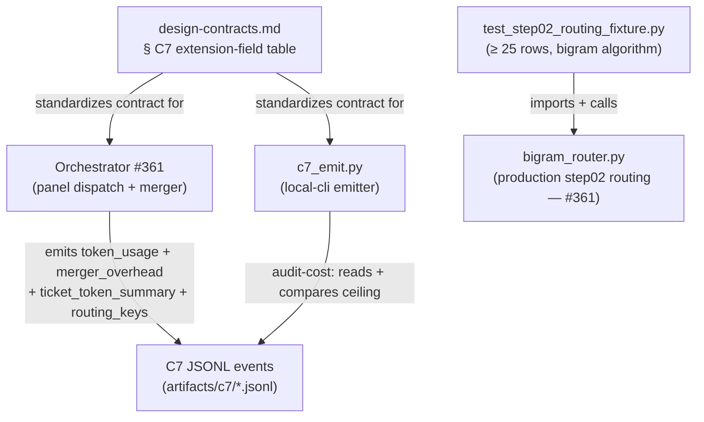
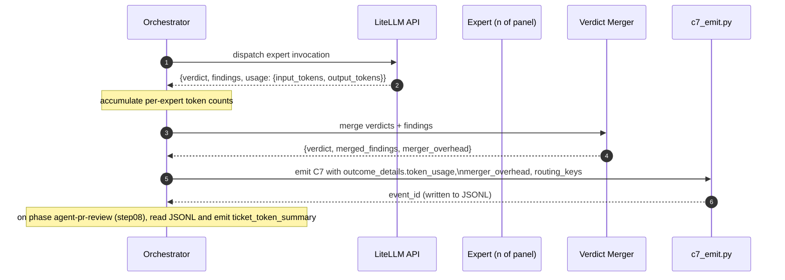

# Architecture

## Context
- Work item: issue #368 — factory cost telemetry + step02 routing-quality fixture (post-#364 follow-up)
- Owner: bonos
- Date: 2026-06-17

## Stack and Execution Model
- Backend stack profile: python_plus_fastapi_pydantic_v2
- Frontend stack profile: none
- Test automation profile: pytest_vitest_playwright_pact
- Agent execution model: specialized-subagents-isolated-worktrees

## Problem Statement
- What needs to change and why: Two operational risks from #364 were held out of scope pending runtime telemetry from the #361 orchestrator. (1) The ~36 expert-step instantiations per ticket introduce material token cost that is currently invisible — without a measurement plan the first autonomous run is also the first cost signal. (2) The bigram-overlap routing algorithm for step02 was chosen for determinism but may underperform on question shapes that lack bigram overlap with expert trigger phrases (e.g., "rate limiter" does not bigram-match `security-paranoid` or `performance-cost-aware` trigger phrases). This work adds the observability surface (telemetry extension fields) and the quality gate (routing fixture) before the first autonomous run.
- Scope boundaries: All deliverables land in #361's implementation workspace. Design-contracts § C7 gains three new standardized extension-field rows (additive, non-breaking). `c7_emit.py` gains one new CLI sub-command.
- Out of scope: Embedding-match router implementation; cost telemetry UI; prompt-cache discipline.

## Bounded Contexts and Responsibilities
- Context A — Orchestrator (#361): owns C7 envelope construction, panel dispatch, verdict merger, and token-usage accumulation. Emits `outcome_details.token_usage`, `outcome_details.merger_overhead`, `outcome_details.ticket_token_summary`, and widens `outcome_details.routing_keys` scope to all panel-dispatched phases. The `ticket_token_summary` roll-up source differs by emitter path: the **orchestrator** maintains a per-ticket in-process token accumulator across phase boundaries (the orchestrator writes to the durable bus, not to `artifacts/c7/*.jsonl`, so JSONL read-back is not available on the orchestrator path); the **local-cli** reads all prior phase events from `artifacts/c7/<slug>.jsonl` at step08 emit time. Both paths produce the same aggregation semantics: sum per-expert token counts across all panel-dispatched phases, treating sentinel -1 as 0.
- Context B — C7 Emit helper (`scripts/bin/sdd/c7_emit.py`): gains `audit-cost` sub-command that reads persisted C7 events for a ticket_id, computes aggregated token cost against the declared ceiling, and exits non-zero if exceeded. Callable standalone (CLI) and from CI.
- Context C — Routing fixture (`tests/blueprint/orchestrator/test_step02_routing_fixture.py`): parametrized pytest module; executes the production bigram-routing function against ≥ 25 curated question/expert-set pairs; exposes `EMBEDDING_UPGRADE_THRESHOLD = 0.20` and a docstring describing the unblock trigger.
- Context D — Design-contracts § C7 (docs layer): extension-field vocabulary table updated with three new rows and `routing_keys` scope corrected; additive change, backward-compatible.

## High-Level Component Design

Caption: Component dependency graph — design-contracts is the normative source; orchestrator and audit CLI produce/consume C7 events; routing fixture calls the production router directly.

- Domain layer: C7 event schema (design-contracts § C7), budget ceiling constant (FR-004 configuration), routing algorithm (ADR-issue-364 § 4.2).
- Application layer: orchestrator panel merger (adds token accumulation), `c7_emit.py audit-cost` sub-command, routing fixture parametrize table.
- Infrastructure adapters: LiteLLM API response `usage` block (source of per-expert token counts); C7 JSONL files (source for audit-cost reads).
- Presentation/API/workflow boundaries: none (no user-facing flow); CI integration via `c7_emit.py audit-cost` exit code.

## Integration and Dependency Edges

Caption: Per-phase token-usage flow — orchestrator accumulates LiteLLM usage blocks per expert and writes them as C7 extension fields via the local-cli emitter.

- Upstream dependencies: #361 orchestrator runtime (ships production bigram router and LiteLLM dispatch); LiteLLM API `usage` response field.
- Downstream dependencies: C7 ingest (#350) — receives new extension fields; existing subscribers MUST tolerate them per the additive contract.
- Data/API/event contracts touched: design-contracts § C7 extension-field vocabulary (additive); `c7_emit.py` CLI surface (new sub-command); `test_step02_routing_fixture.py` (new test file under #361).

## Non-Functional Architecture Notes
- Security: Token-count extension fields MUST NOT carry prompt content or PII — only integer counters, routing keys, and slug identifiers (NFR-SEC-001). The audit predicate reads persisted JSONL; no new network surface.
- Observability: The `ticket_token_summary` roll-up on step08 makes per-ticket cost queryable from a single event (NFR-OBS-001). Per-phase token counts make per-step cost attributable without joins.
- Reliability and rollback: Unavailable LiteLLM usage blocks are handled with sentinel values (-1) so panel emission never fails on missing telemetry (NFR-REL-001). Rollback: design-contracts amendment is additive; reverting it is a one-line table deletion with no subscriber breakage.
- Monitoring/alerting: `c7_emit.py audit-cost` exits non-zero on ceiling breach, enabling CI alerting without a dashboard. First-run telemetry drives ceiling calibration.

## Risks and Tradeoffs
- Risk 1 — Placeholder cost ceiling (FR-004): shipping with a placeholder ceiling (Option A in the Q-1 open question) means the predicate may fire on the first real run even if cost is acceptable. Mitigation: ceiling is a Python constant, not a schema field; updating it is a one-liner chore commit after measuring actuals.
- Tradeoff 1 — Step08 accumulator state: rolling up token counts across all prior phase events requires the orchestrator to maintain per-ticket state. This couples the step08 emission to historical event reads. Justified by NFR-OBS-001 (single-event queryability without joins); alternative (query-time join) would push complexity to dashboard consumers.
