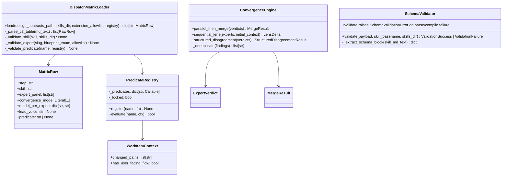
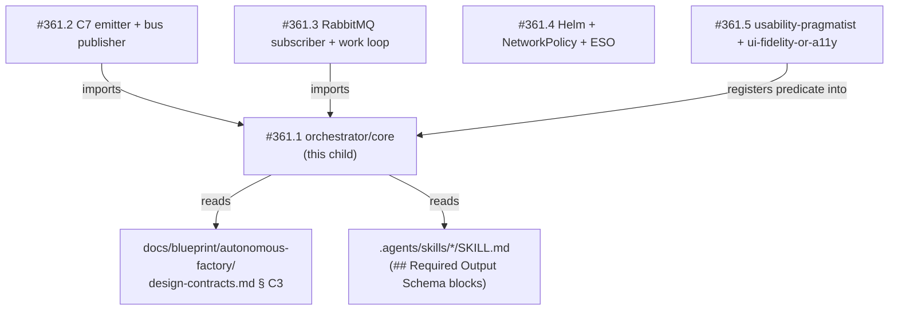

# Architecture

## Context
- Work item: issue #373 — orchestrator core (dispatch matrix loader + convergence engine + schema validator + predicate-registry mechanism; Child 1 of #361)
- Owner: @sbonoc/factory-context-factory
- Date: 2026-06-29

## Stack and Execution Model
- Backend stack profile: python_plus_fastapi_pydantic_v2
- Frontend stack profile: none
- Test automation profile: pytest_vitest_playwright_pact
- Agent execution model: specialized-subagents-isolated-worktrees

## Problem Statement
- What needs to change and why: The orchestrator service (#361) needs a pure-Python domain/application core with zero runtime I/O so that the dispatch matrix (C3), convergence engine (ADR-issue-364 § 5), skill-output schema validation, and conditional-dispatch predicate registry can be unit-tested in isolation before any infrastructure child ships. Today none of these components exist; the parent spec (#361) decomposed them into this child as the critical-path deliverable.
- Scope boundaries: Python module at `scripts/lib/factory/orchestrator/core/`. Reads two file categories only: (1) `docs/blueprint/autonomous-factory/design-contracts.md` for the C3 matrix, (2) `.agents/skills/*/SKILL.md` for schema blocks. No network, no env-secret access.
- Out of scope: C7 emission, RabbitMQ subscriber, OpenHands API client, Helm chart, `usability-pragmatist` predicate implementation.

## Bounded Contexts and Responsibilities

- **Domain layer — dispatch matrix loader**: Parses `docs/blueprint/autonomous-factory/design-contracts.md` § C3 into `MatrixRow` Pydantic v2 models. Validates skill basenames, expert slugs, and predicate names at parse time. Raises `DispatchMatrixError` on any validation failure; returns nothing on partial success.
- **Domain layer — convergence engine**: Pure function object implementing `parallel_then_merge`, `sequential_lens`, and `structured_disagreement` per ADR-issue-364 § 5. Accepts typed `ExpertVerdict` inputs; returns typed result objects (`MergeResult`, `LensDelta`, `StructuredDisagreementResult`). No global state.
- **Domain layer — schema validator**: Extracts YAML JSON Schema from `## Required Output Schema` fenced block in a skill's `SKILL.md`, compiles it, and validates a caller-supplied payload. Returns `ValidationSuccess` or `ValidationFailure`; raises `SchemaValidationError` for parse/compile errors. No writes, no side effects.
- **Domain layer — predicate registry**: In-process dict-based registry for named `Callable[[WorkItemContext], bool]` predicates. Ships `always_true` and `always_false` as built-ins. Immutable after first `evaluate` call. Callers register real predicates before passing the registry to the loader.

## High-Level Component Design

Caption: Component structure for the pure-Python orchestrator core module. No arrows cross the module boundary — all I/O is delegated to callers.

- Domain layer: `DispatchMatrixLoader`, `ConvergenceEngine`, `SchemaValidator`, `PredicateRegistry`, `WorkItemContext`, `MatrixRow`, `ExpertVerdict`, `MergeResult`, `ValidationFailure`, `ValidationSuccess`
- Application layer: `__init__.py` re-exports; no application service objects in this child — the application service is #361.3
- Infrastructure adapters: None in this child — file reads are simple `pathlib.Path.read_text()` calls scoped to two allowed path categories (no abstraction layer needed)
- Presentation/API/workflow boundaries: None — this module is imported by siblings; it has no HTTP or CLI surface

## Integration and Dependency Edges

Caption: Data-flow edges for #361.1 core module. #361.2 and #361.3 import the module; #361.5 registers the `ui-fidelity-or-a11y` callable; the module reads two file categories.

- Upstream dependencies: `docs/blueprint/autonomous-factory/design-contracts.md` § C3 (consumed read-only); `.agents/skills/*/SKILL.md` files (consumed read-only; authorised by #360)
- Downstream dependencies: None — this is the innermost layer
- Data/API/event contracts touched: None authored or changed here. C3 is consumed read-only. C7 emission is #361.2 scope.

## Non-Functional Architecture Notes

- Security: No credential access, no network calls, no env-secret reads (NFR-SEC-001). File access is restricted to `design-contracts.md` and `SKILL.md` paths. No subprocess calls.
- Observability: All observable signals exposed via typed exception objects with `detail` + `context` fields. No logging side effects (NFR-OBS-001). Caller (#361.2) owns all log/metric emission.
- Reliability and rollback: The loader validates the full matrix before returning any result — fail-fast at startup, not at dispatch time. The validator is idempotent. The predicate registry is immutable after first evaluate call (NFR-REL-001).
- Monitoring/alerting: N/A at this layer — Prometheus metrics are scoped to the application service (#361.3) and parent NFR-OBS-001 coverage.

## Risks and Tradeoffs

- Risk 1: C3 markdown table format drift — if someone hand-edits `design-contracts.md` § C3 and breaks the table header or alignment, the loader parse fails at startup. Mitigation: the loader extracts rows using the header string `| SDD step | Skill | Experts consulted | Lead voice | Convergence mode |` as anchor; a test fixture asserts this header is present in the live `design-contracts.md` at test time, surfacing drift before PR merge.
- Risk 2: `## Required Output Schema` block absent from a SKILL.md — if a new skill ships without the fenced block (canonically authored by #360 but future skills might miss it), the schema validator raises `SchemaValidationError` with a parse error rather than a validation error. Mitigation: the error message distinguishes parse failure (`schema-block-missing`) from validation failure (`schema-validation-failed`) so operators can route to the skill author.
- Tradeoff 1: Naive string-equality deduplication vs embedding-based — string equality is fast and deterministic but will miss semantically identical findings worded differently. Accepted at v1 per ADR-issue-364 § 11; the backlog proposal targets this upgrade once real traffic data is available.
